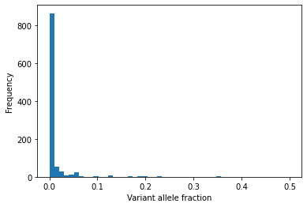

# Simulating Biopsies

This guide describes how to simulate the effects of biopsies and DNA sequencing on the observed clone sizes.   

This only works for the 2D algorithms (Moran2D and WF2D)


## Counting mutant cells

Here is a simple simulation of neutral competition on a 10x10 grid
Start with 100 single-cell clones, each with their own clone_id

```python
import numpy as np
from clone_competition_simulation import Parameters, TimeParameters, PopulationParameters

np.random.seed(0)
p = Parameters(
    algorithm='Moran2D', 
    times=TimeParameters(max_time=10, division_rate=1),
    population=PopulationParameters(initial_grid=np.arange(100).reshape(10, 10), 
                                    cell_in_own_neighbourhood=False)
)
s = p.get_simulator()
s.run_sim()

# The final clone ids on the grid
print(s.grid_results[-1])
```

    [[18, 18, 18,  2,  2,  2, 15, 15, 24, 24],
     [24, 24, 18,  2,  2,  2,  2, 15, 18, 24],
     [24, 24, 54, 63, 63, 63, 63, 63, 50, 24],
     [18, 15, 54, 54, 63, 63, 63, 63, 63, 18],
     [24, 24, 54, 54, 15, 63, 63, 24, 59, 24],
     [24, 24, 24, 24, 54, 63, 63, 63, 59, 59],
     [59, 15, 59, 59, 24, 15, 63, 59, 59, 59],
     [59, 15, 59, 15, 15, 59, 63, 59, 59, 18],
     [18, 15, 15, 71, 71, 71, 18, 18, 59, 18],
     [18, 18, 71, 18, 71,  2, 18, 15, 86, 24]]

-------

To count the number of cells per clone in the whole grid, use the function 
`biopsy_sample` with `biopsy=None`

```python
from clone_competition_simulation import biopsy_sample

print(biopsy_sample(s.grid_results[-1], s, biopsy=None, remove_initial_clones=False))
```

    defaultdict(int,
                {2: 8,
                 15: 13,
                 18: 16,
                 24: 18,
                 50: 1,
                 54: 6,
                 59: 15,
                 63: 17,
                 71: 5,
                 86: 1})

------

To take a "biopsy" from the grid, define the biopsy location and dimensions.  
The biopsies must be rectangular.  

```python
from clone_competition_simulation import Biopsy

biopsy = Biopsy(
    origin=(3, 4),  # The grid coordinates of the first corner of the biopsy
    shape=(5, 3)  # The lengths of the sides of the biopsy
)

# These are the cells in the biopsy. 
# Equivalent to
# s.grid_results[-1][biopsy['biopsy_origin'][0]:biopsy['biopsy_origin'][0]+biopsy['biopsy_shape'][0], 
#                    biopsy['biopsy_origin'][1]:biopsy['biopsy_origin'][1]+biopsy['biopsy_shape'][1]]
print(s.grid_results[-1][3:3+5, 4:4+3])
```

    [[63, 63, 63],
     [15, 63, 63],
     [54, 63, 63],
     [24, 15, 63],
     [15, 59, 63]])

------
Get a cell count for all of the clones in the biopsy.


```python

print(biopsy_sample(s.grid_results[-1], s, biopsy=biopsy, remove_initial_clones=False))
```

    defaultdict(int, {15: 3, 24: 1, 54: 1, 59: 1, 63: 9})

------

Where there are mutations, and potentially multiple mutations in each cell, 
the `biopsy_sample` function becomes more useful.  


Run a simulation with some ongoing mutation

```python
from clone_competition_simulation import Gene, MutationGenerator, NormalDist, FitnessParameters

mut_gen = MutationGenerator(
    genes=[Gene(name="Gene1", mutation_distribution=NormalDist(0.1), synonymous_proportion=0.5)],
)

np.random.seed(0)
p = Parameters(
    algorithm='Moran2D',
    times=TimeParameters(max_time=10, division_rate=1),
    population=PopulationParameters(initial_cells=100, 
                                    cell_in_own_neighbourhood=False), 
    fitness=FitnessParameters(
        mutation_rates=0.1, 
        mutation_generator=mut_gen
    )
)
s = p.get_simulator()
s.run_sim()

# The final clone ids on the grid
s.grid_results[-1]
```

    [[ 99,   0,   0, 103, 100,   0,   0,  86, 109,   0],
     [  0,  89,  89,   0, 103,   0,   0,   0,   0,   0],
     [ 12,  12, 106, 106,   0,   0,   0,   0,   0,  56],
     [ 79,  12,   0,  62,   0,   0,   0,   0,  79,  79],
     [ 12,  12,  12,  56,   0,   0, 111,   0,   0,  97],
     [ 56, 101,  56,  56,  93,  26,   0,  79,   0, 101],
     [101,   0,  21,  21,  26,   0,   0,   0, 108,   0],
     [  0,  21,   0,  21,   0,   0,   0,   0, 104,   0],
     [  0,  36,  21,   0, 100,  98,   0,   0,   0,   0],
     [ 36,   0, 110,   0, 100,   0,   0, 112,   0,  99]]

-------
Use the same biopsy as before. It extracts these cells from the grid:

```python
print(s.grid_results[-1][3:3+5, 4:4+3])
```
    [[  0,   0,   0],
     [  0,   0, 111],
     [ 93,  26,   0],
     [ 26,   0,   0],
     [  0,   0,   0]]

And returns these mutant cell counts:

```python
print(biopsy_sample(s.grid_results[-1], s, biopsy, remove_initial_clones=False))
```

    defaultdict(int, {0: 15, 26: 2, 21: 2, 93: 1, 30: 1, 29: 1, 111: 1})

Notice that now the cell counts per clone do not match the numbers in the grid.   
This is because clones (and their mutations) are inherited by any subclones (which have a different clone_id).  

-------

Firstly, the clone with id=0 has 15 cells according to the function, but only 11 in the biopsy. 
This is because clone_id 0 marks the clones that existed at the start of the simulation. 
All subsequent mutations are descendants of that clone, meaning that all 15 cells in the biopsy belong to clone_id 0 (and its subclones). 

We can exclude any initial clones from the counts (this is the default behaviour).  
Now the count for clone_id=0 is gone. 

```python
print(biopsy_sample(s.grid_results[-1], s, biopsy))
```

    defaultdict(int, {26: 2, 21: 2, 93: 1, 30: 1, 29: 1, 111: 1})

-----

There is still the question of the clones with ids 21, 30 and 29.  
According to the function, these clones are present in the grid, but those numbers are not there.  

To see why, we can look at the descendants/subclones of those clones. 

```python
for clone_id in [21, 29, 30]:
    print(f"Descendants of clone {clone_id}: {s.get_clone_descendants(clone_id)}")
```
    Descendants of clone 21: [21, 26, 37, 62, 60, 68, 81]
    Descendants of clone 29: [29, 30, 38, 43, 44, 48, 53, 55, 63, 72, 93, 96]
    Descendants of clone 30: [30, 38, 43, 44, 48, 53, 55, 63, 72, 93, 96]

Clone 26 is a descendant of clone 21.  
Clone 93 is a descendant of both clone 30 and clone 29.


So the mutations that originally formed the clones 21, 29 and 30 were inherited by subsequent 
(sub)clones and survive to the end. The function is counting the number of cells in the biopsy 
that contain each mutation. 

## Simulating sequencing

Usually the DNA sequencing cannot accurately measure the number of cells containing each mutation.  
Instead, it randomly samples DNA reads from a tissue sample, and the proportion of the sample 
containing the mutation is estimated based on the fraction of sampled reads that are mutant.   

--------

Running a larger simulation (using with WF2D because it is much faster). 

Get the exact mutant cell counts from the end of the simulation.  

```python
from clone_competition_simulation import FixedValue

mut_gen = MutationGenerator(
    genes=[
        Gene(name='Gene1', mutation_distribution=FixedValue(1.2), synonymous_proportion=0.5), 
        Gene(name='Gene2', mutation_distribution=FixedValue(1.4), synonymous_proportion=0.5), 
        Gene(name='Gene3', mutation_distribution=FixedValue(0.7), synonymous_proportion=0.5)
    ], 
    combine_mutations='add'
)

np.random.seed(0)
p = Parameters(
    algorithm='WF2D',
    times=TimeParameters(max_time=200, division_rate=1),
    population=PopulationParameters(initial_cells=10000, 
                                    cell_in_own_neighbourhood=False), 
    fitness=FitnessParameters(
        mutation_rates=0.01, 
        mutation_generator=mut_gen
    )
)
s = p.get_simulator()
s.run_sim()

# This function tells us the exact cell counts for each mutation in the grid
exact_counts = biopsy_sample(s.grid_results[-1], s, biopsy=None)
print(exact_counts)
```

    defaultdict(int,
                {8327: 437,
                 7410: 1634,
                 6889: 1634,
                 6419: 1634,
                 4540: 1634,
                 3353: 1634,
                 2773: 1944,
                 1589: 1944,
                 1061: 1944,
                 8521: 396,
                 7216: 478,
                 4654: 551,
                 4254: 551,
                 3563: 928,
                 2785: 966,
                 ...})


This includes a large number of small clones, some with just a few cells

```python
import matplotlib.pyplot as plt

plt.hist(exact_counts.values(), bins=np.arange(0, max(exact_counts.values())+1, 50));
plt.ylabel('Frequency')
plt.xlabel('Cell count')
plt.show()
```
    


-----
To convert the mutant cell counts to variant allele frequency use the `get_vafs_for_all_biopsies` function.  
This divides the cell number by the total cells in the grid.  

```python
from clone_competition_simulation import get_vafs_for_all_biopsies

vafs = get_vafs_for_all_biopsies(s, biopsies=None, heterozygous=False)
vafs
```

<div>
<style scoped>
    .dataframe tbody tr th:only-of-type {
        vertical-align: middle;
    }

    .dataframe tbody tr th {
        vertical-align: top;
    }

    .dataframe thead th {
        text-align: right;
    }
</style>
<table border="1" class="dataframe">
  <thead>
    <tr style="text-align: right;">
      <th></th>
      <th>sample</th>
      <th>vaf</th>
      <th>gene</th>
      <th>clone_id</th>
      <th>ns</th>
    </tr>
  </thead>
  <tbody>
    <tr>
      <th>0</th>
      <td>0</td>
      <td>0.0437</td>
      <td>Gene1</td>
      <td>8327</td>
      <td>True</td>
    </tr>
    <tr>
      <th>1</th>
      <td>0</td>
      <td>0.1634</td>
      <td>Gene2</td>
      <td>7410</td>
      <td>True</td>
    </tr>
    <tr>
      <th>2</th>
      <td>0</td>
      <td>0.1634</td>
      <td>Gene1</td>
      <td>6889</td>
      <td>True</td>
    </tr>
    <tr>
      <th>3</th>
      <td>0</td>
      <td>0.1634</td>
      <td>Gene1</td>
      <td>6419</td>
      <td>True</td>
    </tr>
    <tr>
      <th>4</th>
      <td>0</td>
      <td>0.1634</td>
      <td>Gene1</td>
      <td>4540</td>
      <td>True</td>
    </tr>
    <tr>
      <th>...</th>
      <td>...</td>
      <td>...</td>
      <td>...</td>
      <td>...</td>
      <td>...</td>
    </tr>
    <tr>
      <th>1020</th>
      <td>0</td>
      <td>0.0004</td>
      <td>Gene1</td>
      <td>20000</td>
      <td>False</td>
    </tr>
    <tr>
      <th>1021</th>
      <td>0</td>
      <td>0.0003</td>
      <td>Gene2</td>
      <td>20001</td>
      <td>True</td>
    </tr>
    <tr>
      <th>1022</th>
      <td>0</td>
      <td>0.0001</td>
      <td>Gene1</td>
      <td>20003</td>
      <td>False</td>
    </tr>
    <tr>
      <th>1023</th>
      <td>0</td>
      <td>0.0001</td>
      <td>Gene3</td>
      <td>20004</td>
      <td>True</td>
    </tr>
    <tr>
      <th>1024</th>
      <td>0</td>
      <td>0.0001</td>
      <td>Gene3</td>
      <td>20005</td>
      <td>True</td>
    </tr>
  </tbody>
</table>
<p>1025 rows × 5 columns</p>
</div>

-------
Most clones in this case are a tiny fraction of the tissue size.   
They would not be detected by most sequencing methods.  

```python
plt.hist(vafs['vaf'], 
         bins=np.linspace(0, 0.5, 50));
plt.xlabel('Variant allele fraction')
plt.ylabel('Frequency')
plt.show()
```
    


--------
We can also simulate DNA sequencing using get_vafs_for_all_biopsies.
To get vafs for the entire grid, run get_vafs_for_all_biopsies with biopsies=None

Define the sequencing coverage and a minimum number of "reads" required for a mutation to be detected.  
Here we assume 100x coverage and a minimum detection limit of 5 reads.

```python
sequenced_vafs = get_vafs_for_all_biopsies(s, biopsies=None, detection_limit=5, coverage=100)
print(sequenced_vafs)
```

<div>
<table border="1" class="dataframe">
  <thead>
    <tr style="text-align: right;">
      <th></th>
      <th>sample</th>
      <th>vaf</th>
      <th>gene</th>
      <th>clone_id</th>
      <th>ns</th>
    </tr>
  </thead>
  <tbody>
    <tr>
      <th>0</th>
      <td>0</td>
      <td>0.11</td>
      <td>Gene2</td>
      <td>7410</td>
      <td>True</td>
    </tr>
    <tr>
      <th>1</th>
      <td>0</td>
      <td>0.07</td>
      <td>Gene1</td>
      <td>6889</td>
      <td>True</td>
    </tr>
    <tr>
      <th>2</th>
      <td>0</td>
      <td>0.06</td>
      <td>Gene1</td>
      <td>6419</td>
      <td>True</td>
    </tr>
    <tr>
      <th>3</th>
      <td>0</td>
      <td>0.11</td>
      <td>Gene1</td>
      <td>4540</td>
      <td>True</td>
    </tr>
    <tr>
      <th>4</th>
      <td>0</td>
      <td>0.06</td>
      <td>Gene2</td>
      <td>3353</td>
      <td>True</td>
    </tr>
    <tr>
      <th>5</th>
      <td>0</td>
      <td>0.12</td>
      <td>Gene2</td>
      <td>2773</td>
      <td>True</td>
    </tr>
    <tr>
      <th>6</th>
      <td>0</td>
      <td>0.09</td>
      <td>Gene2</td>
      <td>1589</td>
      <td>True</td>
    </tr>
    <tr>
      <th>7</th>
      <td>0</td>
      <td>0.07</td>
      <td>Gene1</td>
      <td>1061</td>
      <td>True</td>
    </tr>
    <tr>
      <th>8</th>
      <td>0</td>
      <td>0.07</td>
      <td>Gene1</td>
      <td>3563</td>
      <td>True</td>
    </tr>
    <tr>
      <th>9</th>
      <td>0</td>
      <td>0.23</td>
      <td>Gene2</td>
      <td>3047</td>
      <td>True</td>
    </tr>
    <tr>
      <th>10</th>
      <td>0</td>
      <td>0.17</td>
      <td>Gene2</td>
      <td>2827</td>
      <td>True</td>
    </tr>
    <tr>
      <th>11</th>
      <td>0</td>
      <td>0.16</td>
      <td>Gene2</td>
      <td>752</td>
      <td>True</td>
    </tr>
    <tr>
      <th>12</th>
      <td>0</td>
      <td>0.20</td>
      <td>Gene2</td>
      <td>547</td>
      <td>True</td>
    </tr>
    <tr>
      <th>13</th>
      <td>0</td>
      <td>0.08</td>
      <td>Gene2</td>
      <td>5992</td>
      <td>True</td>
    </tr>
    <tr>
      <th>14</th>
      <td>0</td>
      <td>0.08</td>
      <td>Gene2</td>
      <td>5666</td>
      <td>True</td>
    </tr>
    <tr>
      <th>15</th>
      <td>0</td>
      <td>0.05</td>
      <td>Gene2</td>
      <td>7859</td>
      <td>True</td>
    </tr>
    <tr>
      <th>16</th>
      <td>0</td>
      <td>0.05</td>
      <td>Gene2</td>
      <td>4158</td>
      <td>True</td>
    </tr>
    <tr>
      <th>17</th>
      <td>0</td>
      <td>0.07</td>
      <td>Gene2</td>
      <td>2410</td>
      <td>True</td>
    </tr>
    <tr>
      <th>18</th>
      <td>0</td>
      <td>0.09</td>
      <td>Gene2</td>
      <td>2408</td>
      <td>True</td>
    </tr>
    <tr>
      <th>19</th>
      <td>0</td>
      <td>0.06</td>
      <td>Gene2</td>
      <td>1284</td>
      <td>True</td>
    </tr>
    <tr>
      <th>20</th>
      <td>0</td>
      <td>0.06</td>
      <td>Gene2</td>
      <td>385</td>
      <td>True</td>
    </tr>
    <tr>
      <th>21</th>
      <td>0</td>
      <td>0.05</td>
      <td>Gene1</td>
      <td>7386</td>
      <td>True</td>
    </tr>
    <tr>
      <th>22</th>
      <td>0</td>
      <td>0.06</td>
      <td>Gene2</td>
      <td>6655</td>
      <td>False</td>
    </tr>
    <tr>
      <th>23</th>
      <td>0</td>
      <td>0.05</td>
      <td>Gene2</td>
      <td>11002</td>
      <td>True</td>
    </tr>
    <tr>
      <th>24</th>
      <td>0</td>
      <td>0.05</td>
      <td>Gene2</td>
      <td>11874</td>
      <td>True</td>
    </tr>
    <tr>
      <th>25</th>
      <td>0</td>
      <td>0.05</td>
      <td>Gene1</td>
      <td>8646</td>
      <td>True</td>
    </tr>
    <tr>
      <th>26</th>
      <td>0</td>
      <td>0.06</td>
      <td>Gene1</td>
      <td>7034</td>
      <td>True</td>
    </tr>
    <tr>
      <th>27</th>
      <td>0</td>
      <td>0.06</td>
      <td>Gene2</td>
      <td>1105</td>
      <td>True</td>
    </tr>
    <tr>
      <th>28</th>
      <td>0</td>
      <td>0.05</td>
      <td>Gene2</td>
      <td>12877</td>
      <td>True</td>
    </tr>
  </tbody>
</table>
</div>

The results are the VAFs of the detected clones.  
The clones are by default assumed to be heterozygous (see below).  
These will be noisy, since there is random chance whether a "read" contains the mutation or not. 
The smallest VAFs are now around 5% (5 reads out of the coverage of 100).

--------
We can also simulate sequencing of a biopsy taken from the grid


```python

biopsy = Biopsy(origin=(30, 40),  shape=(50, 30))

print(get_vafs_for_all_biopsies(s, biopsies=[biopsy], detection_limit=5, coverage=100, heterozygous=False))
```

<div>
<table border="1" class="dataframe">
  <thead>
    <tr style="text-align: right;">
      <th></th>
      <th>sample</th>
      <th>vaf</th>
      <th>gene</th>
      <th>clone_id</th>
      <th>ns</th>
    </tr>
  </thead>
  <tbody>
    <tr>
      <th>0</th>
      <td>0</td>
      <td>0.23</td>
      <td>Gene1</td>
      <td>8327</td>
      <td>True</td>
    </tr>
    <tr>
      <th>1</th>
      <td>0</td>
      <td>0.35</td>
      <td>Gene2</td>
      <td>7410</td>
      <td>True</td>
    </tr>
    <tr>
      <th>2</th>
      <td>0</td>
      <td>0.35</td>
      <td>Gene1</td>
      <td>6889</td>
      <td>True</td>
    </tr>
    <tr>
      <th>3</th>
      <td>0</td>
      <td>0.39</td>
      <td>Gene1</td>
      <td>6419</td>
      <td>True</td>
    </tr>
    <tr>
      <th>4</th>
      <td>0</td>
      <td>0.32</td>
      <td>Gene1</td>
      <td>4540</td>
      <td>True</td>
    </tr>
    <tr>
      <th>5</th>
      <td>0</td>
      <td>0.40</td>
      <td>Gene2</td>
      <td>3353</td>
      <td>True</td>
    </tr>
    <tr>
      <th>6</th>
      <td>0</td>
      <td>0.53</td>
      <td>Gene2</td>
      <td>2773</td>
      <td>True</td>
    </tr>
    <tr>
      <th>7</th>
      <td>0</td>
      <td>0.51</td>
      <td>Gene2</td>
      <td>1589</td>
      <td>True</td>
    </tr>
    <tr>
      <th>8</th>
      <td>0</td>
      <td>0.46</td>
      <td>Gene1</td>
      <td>1061</td>
      <td>True</td>
    </tr>
    <tr>
      <th>9</th>
      <td>0</td>
      <td>0.20</td>
      <td>Gene2</td>
      <td>8610</td>
      <td>True</td>
    </tr>
    <tr>
      <th>10</th>
      <td>0</td>
      <td>0.28</td>
      <td>Gene2</td>
      <td>5992</td>
      <td>True</td>
    </tr>
    <tr>
      <th>11</th>
      <td>0</td>
      <td>0.27</td>
      <td>Gene2</td>
      <td>5666</td>
      <td>True</td>
    </tr>
    <tr>
      <th>12</th>
      <td>0</td>
      <td>0.37</td>
      <td>Gene2</td>
      <td>3047</td>
      <td>True</td>
    </tr>
    <tr>
      <th>13</th>
      <td>0</td>
      <td>0.42</td>
      <td>Gene2</td>
      <td>2827</td>
      <td>True</td>
    </tr>
    <tr>
      <th>14</th>
      <td>0</td>
      <td>0.37</td>
      <td>Gene2</td>
      <td>752</td>
      <td>True</td>
    </tr>
    <tr>
      <th>15</th>
      <td>0</td>
      <td>0.35</td>
      <td>Gene2</td>
      <td>547</td>
      <td>True</td>
    </tr>
    <tr>
      <th>16</th>
      <td>0</td>
      <td>0.20</td>
      <td>Gene1</td>
      <td>10103</td>
      <td>True</td>
    </tr>
    <tr>
      <th>17</th>
      <td>0</td>
      <td>0.11</td>
      <td>Gene2</td>
      <td>11002</td>
      <td>True</td>
    </tr>
    <tr>
      <th>18</th>
      <td>0</td>
      <td>0.07</td>
      <td>Gene2</td>
      <td>10494</td>
      <td>True</td>
    </tr>
    <tr>
      <th>19</th>
      <td>0</td>
      <td>0.22</td>
      <td>Gene1</td>
      <td>9170</td>
      <td>True</td>
    </tr>
    <tr>
      <th>20</th>
      <td>0</td>
      <td>0.12</td>
      <td>Gene1</td>
      <td>7386</td>
      <td>True</td>
    </tr>
    <tr>
      <th>21</th>
      <td>0</td>
      <td>0.09</td>
      <td>Gene2</td>
      <td>6655</td>
      <td>False</td>
    </tr>
    <tr>
      <th>22</th>
      <td>0</td>
      <td>0.16</td>
      <td>Gene2</td>
      <td>11702</td>
      <td>True</td>
    </tr>
    <tr>
      <th>23</th>
      <td>0</td>
      <td>0.17</td>
      <td>Gene2</td>
      <td>8874</td>
      <td>True</td>
    </tr>
    <tr>
      <th>24</th>
      <td>0</td>
      <td>0.13</td>
      <td>Gene2</td>
      <td>5578</td>
      <td>True</td>
    </tr>
    <tr>
      <th>25</th>
      <td>0</td>
      <td>0.13</td>
      <td>Gene2</td>
      <td>11935</td>
      <td>True</td>
    </tr>
    <tr>
      <th>26</th>
      <td>0</td>
      <td>0.08</td>
      <td>Gene2</td>
      <td>9199</td>
      <td>True</td>
    </tr>
    <tr>
      <th>27</th>
      <td>0</td>
      <td>0.13</td>
      <td>Gene2</td>
      <td>7809</td>
      <td>True</td>
    </tr>
    <tr>
      <th>28</th>
      <td>0</td>
      <td>0.09</td>
      <td>Gene2</td>
      <td>3765</td>
      <td>True</td>
    </tr>
    <tr>
      <th>29</th>
      <td>0</td>
      <td>0.07</td>
      <td>Gene1</td>
      <td>7034</td>
      <td>True</td>
    </tr>
    <tr>
      <th>30</th>
      <td>0</td>
      <td>0.05</td>
      <td>Gene2</td>
      <td>1106</td>
      <td>True</td>
    </tr>
    <tr>
      <th>31</th>
      <td>0</td>
      <td>0.12</td>
      <td>Gene2</td>
      <td>12839</td>
      <td>True</td>
    </tr>
    <tr>
      <th>32</th>
      <td>0</td>
      <td>0.08</td>
      <td>Gene2</td>
      <td>13010</td>
      <td>True</td>
    </tr>
    <tr>
      <th>33</th>
      <td>0</td>
      <td>0.06</td>
      <td>Gene2</td>
      <td>13604</td>
      <td>True</td>
    </tr>
    <tr>
      <th>34</th>
      <td>0</td>
      <td>0.05</td>
      <td>Gene2</td>
      <td>10816</td>
      <td>True</td>
    </tr>
    <tr>
      <th>35</th>
      <td>0</td>
      <td>0.07</td>
      <td>Gene2</td>
      <td>13818</td>
      <td>True</td>
    </tr>
    <tr>
      <th>36</th>
      <td>0</td>
      <td>0.08</td>
      <td>Gene2</td>
      <td>14463</td>
      <td>True</td>
    </tr>
    <tr>
      <th>37</th>
      <td>0</td>
      <td>0.06</td>
      <td>Gene2</td>
      <td>15150</td>
      <td>True</td>
    </tr>
    <tr>
      <th>38</th>
      <td>0</td>
      <td>0.11</td>
      <td>Gene1</td>
      <td>15560</td>
      <td>False</td>
    </tr>
    <tr>
      <th>39</th>
      <td>0</td>
      <td>0.10</td>
      <td>Gene1</td>
      <td>15271</td>
      <td>True</td>
    </tr>
    <tr>
      <th>40</th>
      <td>0</td>
      <td>0.10</td>
      <td>Gene1</td>
      <td>14861</td>
      <td>False</td>
    </tr>
    <tr>
      <th>41</th>
      <td>0</td>
      <td>0.08</td>
      <td>Gene1</td>
      <td>16704</td>
      <td>True</td>
    </tr>
  </tbody>
</table>
</div>

---------

In many cases, mutations are heterozygous (on only one of two copies of the chromosome).  
To simulate this, set heterozygous=True (this is the default).  
The VAFs are now smaller (around half the size), and so usually fewer clones are detected.  

```python
print(get_vafs_for_all_biopsies(s, biopsies=[biopsy], detection_limit=5, coverage=100, heterozygous=True))
```

<div>
<table border="1" class="dataframe">
  <thead>
    <tr style="text-align: right;">
      <th></th>
      <th>sample</th>
      <th>vaf</th>
      <th>gene</th>
      <th>clone_id</th>
      <th>ns</th>
    </tr>
  </thead>
  <tbody>
    <tr>
      <th>0</th>
      <td>0</td>
      <td>0.07</td>
      <td>Gene1</td>
      <td>8327</td>
      <td>True</td>
    </tr>
    <tr>
      <th>1</th>
      <td>0</td>
      <td>0.17</td>
      <td>Gene2</td>
      <td>7410</td>
      <td>True</td>
    </tr>
    <tr>
      <th>2</th>
      <td>0</td>
      <td>0.25</td>
      <td>Gene1</td>
      <td>6889</td>
      <td>True</td>
    </tr>
    <tr>
      <th>3</th>
      <td>0</td>
      <td>0.25</td>
      <td>Gene1</td>
      <td>6419</td>
      <td>True</td>
    </tr>
    <tr>
      <th>4</th>
      <td>0</td>
      <td>0.12</td>
      <td>Gene1</td>
      <td>4540</td>
      <td>True</td>
    </tr>
    <tr>
      <th>5</th>
      <td>0</td>
      <td>0.18</td>
      <td>Gene2</td>
      <td>3353</td>
      <td>True</td>
    </tr>
    <tr>
      <th>6</th>
      <td>0</td>
      <td>0.22</td>
      <td>Gene2</td>
      <td>2773</td>
      <td>True</td>
    </tr>
    <tr>
      <th>7</th>
      <td>0</td>
      <td>0.27</td>
      <td>Gene2</td>
      <td>1589</td>
      <td>True</td>
    </tr>
    <tr>
      <th>8</th>
      <td>0</td>
      <td>0.27</td>
      <td>Gene1</td>
      <td>1061</td>
      <td>True</td>
    </tr>
    <tr>
      <th>9</th>
      <td>0</td>
      <td>0.09</td>
      <td>Gene2</td>
      <td>5992</td>
      <td>True</td>
    </tr>
    <tr>
      <th>10</th>
      <td>0</td>
      <td>0.16</td>
      <td>Gene2</td>
      <td>5666</td>
      <td>True</td>
    </tr>
    <tr>
      <th>11</th>
      <td>0</td>
      <td>0.18</td>
      <td>Gene2</td>
      <td>3047</td>
      <td>True</td>
    </tr>
    <tr>
      <th>12</th>
      <td>0</td>
      <td>0.19</td>
      <td>Gene2</td>
      <td>2827</td>
      <td>True</td>
    </tr>
    <tr>
      <th>13</th>
      <td>0</td>
      <td>0.22</td>
      <td>Gene2</td>
      <td>752</td>
      <td>True</td>
    </tr>
    <tr>
      <th>14</th>
      <td>0</td>
      <td>0.17</td>
      <td>Gene2</td>
      <td>547</td>
      <td>True</td>
    </tr>
    <tr>
      <th>15</th>
      <td>0</td>
      <td>0.07</td>
      <td>Gene1</td>
      <td>10103</td>
      <td>True</td>
    </tr>
    <tr>
      <th>16</th>
      <td>0</td>
      <td>0.09</td>
      <td>Gene2</td>
      <td>11002</td>
      <td>True</td>
    </tr>
    <tr>
      <th>17</th>
      <td>0</td>
      <td>0.05</td>
      <td>Gene2</td>
      <td>10494</td>
      <td>True</td>
    </tr>
    <tr>
      <th>18</th>
      <td>0</td>
      <td>0.06</td>
      <td>Gene1</td>
      <td>9170</td>
      <td>True</td>
    </tr>
    <tr>
      <th>19</th>
      <td>0</td>
      <td>0.07</td>
      <td>Gene1</td>
      <td>7386</td>
      <td>True</td>
    </tr>
    <tr>
      <th>20</th>
      <td>0</td>
      <td>0.07</td>
      <td>Gene2</td>
      <td>6655</td>
      <td>False</td>
    </tr>
    <tr>
      <th>21</th>
      <td>0</td>
      <td>0.06</td>
      <td>Gene2</td>
      <td>11702</td>
      <td>True</td>
    </tr>
    <tr>
      <th>22</th>
      <td>0</td>
      <td>0.08</td>
      <td>Gene2</td>
      <td>8874</td>
      <td>True</td>
    </tr>
    <tr>
      <th>23</th>
      <td>0</td>
      <td>0.05</td>
      <td>Gene2</td>
      <td>5578</td>
      <td>True</td>
    </tr>
    <tr>
      <th>24</th>
      <td>0</td>
      <td>0.09</td>
      <td>Gene2</td>
      <td>11935</td>
      <td>True</td>
    </tr>
    <tr>
      <th>25</th>
      <td>0</td>
      <td>0.06</td>
      <td>Gene2</td>
      <td>9199</td>
      <td>True</td>
    </tr>
    <tr>
      <th>26</th>
      <td>0</td>
      <td>0.08</td>
      <td>Gene2</td>
      <td>7809</td>
      <td>True</td>
    </tr>
    <tr>
      <th>27</th>
      <td>0</td>
      <td>0.06</td>
      <td>Gene2</td>
      <td>3765</td>
      <td>True</td>
    </tr>
    <tr>
      <th>28</th>
      <td>0</td>
      <td>0.05</td>
      <td>Gene2</td>
      <td>12839</td>
      <td>True</td>
    </tr>
    <tr>
      <th>29</th>
      <td>0</td>
      <td>0.05</td>
      <td>Gene2</td>
      <td>13604</td>
      <td>True</td>
    </tr>
    <tr>
      <th>30</th>
      <td>0</td>
      <td>0.12</td>
      <td>Gene2</td>
      <td>13818</td>
      <td>True</td>
    </tr>
    <tr>
      <th>31</th>
      <td>0</td>
      <td>0.08</td>
      <td>Gene2</td>
      <td>14463</td>
      <td>True</td>
    </tr>
    <tr>
      <th>32</th>
      <td>0</td>
      <td>0.05</td>
      <td>Gene1</td>
      <td>15560</td>
      <td>False</td>
    </tr>
    <tr>
      <th>33</th>
      <td>0</td>
      <td>0.05</td>
      <td>Gene1</td>
      <td>14861</td>
      <td>False</td>
    </tr>
  </tbody>
</table>
</div>


## Multiple biopsies

A list of biopies can be given. 
The clones detected from these biopsies can be merged (like the oesophagus grid-sequencing experiments 
in Martincorena and Fowler et al 2018).   

```python
# Make a list of biopsies
biopsies = [
    Biopsy(origin=(0, 0), shape=(20, 20)),
    Biopsy(origin=(20, 0), shape=(20, 20)),
    Biopsy(origin=(0, 20), shape=(20, 20)),
    Biopsy(origin=(20, 20), shape=(20, 20))
]

# This returns a data frame with information about all of the clones detected
print(get_vafs_for_all_biopsies(s, biopsies, detection_limit=5, coverage=100))
```

<div>
<table border="1" class="dataframe">
  <thead>
    <tr style="text-align: right;">
      <th></th>
      <th>sample</th>
      <th>vaf</th>
      <th>gene</th>
      <th>clone_id</th>
      <th>ns</th>
    </tr>
  </thead>
  <tbody>
    <tr>
      <th>0</th>
      <td>0</td>
      <td>0.22</td>
      <td>Gene2</td>
      <td>9160</td>
      <td>True</td>
    </tr>
    <tr>
      <th>1</th>
      <td>0</td>
      <td>0.26</td>
      <td>Gene2</td>
      <td>8391</td>
      <td>True</td>
    </tr>
    <tr>
      <th>2</th>
      <td>0</td>
      <td>0.25</td>
      <td>Gene2</td>
      <td>5757</td>
      <td>True</td>
    </tr>
    <tr>
      <th>3</th>
      <td>0</td>
      <td>0.22</td>
      <td>Gene2</td>
      <td>5036</td>
      <td>True</td>
    </tr>
    <tr>
      <th>4</th>
      <td>0</td>
      <td>0.22</td>
      <td>Gene2</td>
      <td>4297</td>
      <td>True</td>
    </tr>
    <tr>
      <th>...</th>
      <td>...</td>
      <td>...</td>
      <td>...</td>
      <td>...</td>
      <td>...</td>
    </tr>
    <tr>
      <th>89</th>
      <td>3</td>
      <td>0.54</td>
      <td>Gene2</td>
      <td>6655</td>
      <td>False</td>
    </tr>
    <tr>
      <th>90</th>
      <td>3</td>
      <td>0.27</td>
      <td>Gene2</td>
      <td>12706</td>
      <td>True</td>
    </tr>
    <tr>
      <th>91</th>
      <td>3</td>
      <td>0.06</td>
      <td>Gene1</td>
      <td>13973</td>
      <td>True</td>
    </tr>
    <tr>
      <th>92</th>
      <td>3</td>
      <td>0.19</td>
      <td>Gene2</td>
      <td>14164</td>
      <td>True</td>
    </tr>
    <tr>
      <th>93</th>
      <td>3</td>
      <td>0.05</td>
      <td>Gene1</td>
      <td>17189</td>
      <td>False</td>
    </tr>
  </tbody>
</table>
<p>94 rows × 5 columns</p>
</div>

-------
If `merge_clones=True`, the same clone seen in multiple samples will be treated as a single, larger clone.  
The "vaf" in this case is just the sum of the VAFs from the individual biopsies (can be greater than 1). 

If the biopsies are all the same size, then the VAF will be relative to the size of a single biopsy.  
If the biopsies are different sizes, it is better to use merge_clones=False and do the merging yourself to 
get accurate sizes. 


```python

print(get_vafs_for_all_biopsies(s, biopsies, detection_limit=5, coverage=100, merge_clones=True))
```

<div>
<table border="1" class="dataframe">
  <thead>
    <tr style="text-align: right;">
      <th></th>
      <th>vaf</th>
      <th>gene</th>
      <th>clone_id</th>
      <th>ns</th>
    </tr>
  </thead>
  <tbody>
    <tr>
      <th>0</th>
      <td>0.40</td>
      <td>Gene2</td>
      <td>9160</td>
      <td>True</td>
    </tr>
    <tr>
      <th>1</th>
      <td>0.49</td>
      <td>Gene2</td>
      <td>8391</td>
      <td>True</td>
    </tr>
    <tr>
      <th>2</th>
      <td>0.34</td>
      <td>Gene2</td>
      <td>5757</td>
      <td>True</td>
    </tr>
    <tr>
      <th>3</th>
      <td>0.39</td>
      <td>Gene2</td>
      <td>5036</td>
      <td>True</td>
    </tr>
    <tr>
      <th>4</th>
      <td>0.52</td>
      <td>Gene2</td>
      <td>4297</td>
      <td>True</td>
    </tr>
    <tr>
      <th>5</th>
      <td>0.43</td>
      <td>Gene2</td>
      <td>1033</td>
      <td>True</td>
    </tr>
    <tr>
      <th>6</th>
      <td>0.39</td>
      <td>Gene2</td>
      <td>337</td>
      <td>True</td>
    </tr>
    <tr>
      <th>7</th>
      <td>0.20</td>
      <td>Gene2</td>
      <td>11862</td>
      <td>True</td>
    </tr>
    <tr>
      <th>8</th>
      <td>0.19</td>
      <td>Gene2</td>
      <td>4890</td>
      <td>True</td>
    </tr>
    <tr>
      <th>9</th>
      <td>0.51</td>
      <td>Gene2</td>
      <td>2410</td>
      <td>True</td>
    </tr>
    <tr>
      <th>10</th>
      <td>0.47</td>
      <td>Gene2</td>
      <td>2408</td>
      <td>True</td>
    </tr>
    <tr>
      <th>11</th>
      <td>0.28</td>
      <td>Gene2</td>
      <td>1284</td>
      <td>True</td>
    </tr>
    <tr>
      <th>12</th>
      <td>0.38</td>
      <td>Gene2</td>
      <td>385</td>
      <td>True</td>
    </tr>
    <tr>
      <th>13</th>
      <td>0.05</td>
      <td>Gene2</td>
      <td>12752</td>
      <td>True</td>
    </tr>
    <tr>
      <th>14</th>
      <td>0.05</td>
      <td>Gene2</td>
      <td>10960</td>
      <td>False</td>
    </tr>
    <tr>
      <th>15</th>
      <td>0.05</td>
      <td>Gene2</td>
      <td>9115</td>
      <td>True</td>
    </tr>
    <tr>
      <th>16</th>
      <td>0.05</td>
      <td>Gene2</td>
      <td>4158</td>
      <td>True</td>
    </tr>
    <tr>
      <th>17</th>
      <td>0.06</td>
      <td>Gene2</td>
      <td>13078</td>
      <td>True</td>
    </tr>
    <tr>
      <th>18</th>
      <td>0.18</td>
      <td>Gene2</td>
      <td>8959</td>
      <td>True</td>
    </tr>
    <tr>
      <th>19</th>
      <td>0.10</td>
      <td>Gene2</td>
      <td>7859</td>
      <td>True</td>
    </tr>
    <tr>
      <th>20</th>
      <td>0.09</td>
      <td>Gene1</td>
      <td>4921</td>
      <td>True</td>
    </tr>
    <tr>
      <th>21</th>
      <td>0.12</td>
      <td>Gene2</td>
      <td>4704</td>
      <td>True</td>
    </tr>
    <tr>
      <th>22</th>
      <td>0.13</td>
      <td>Gene2</td>
      <td>3043</td>
      <td>True</td>
    </tr>
    <tr>
      <th>23</th>
      <td>0.08</td>
      <td>Gene2</td>
      <td>761</td>
      <td>True</td>
    </tr>
    <tr>
      <th>24</th>
      <td>0.10</td>
      <td>Gene1</td>
      <td>553</td>
      <td>True</td>
    </tr>
    <tr>
      <th>25</th>
      <td>0.11</td>
      <td>Gene1</td>
      <td>15101</td>
      <td>True</td>
    </tr>
    <tr>
      <th>26</th>
      <td>0.11</td>
      <td>Gene2</td>
      <td>14698</td>
      <td>True</td>
    </tr>
    <tr>
      <th>27</th>
      <td>0.05</td>
      <td>Gene2</td>
      <td>16232</td>
      <td>True</td>
    </tr>
    <tr>
      <th>28</th>
      <td>0.06</td>
      <td>Gene1</td>
      <td>16445</td>
      <td>True</td>
    </tr>
    <tr>
      <th>29</th>
      <td>0.06</td>
      <td>Gene3</td>
      <td>17356</td>
      <td>False</td>
    </tr>
    <tr>
      <th>30</th>
      <td>0.19</td>
      <td>Gene1</td>
      <td>9284</td>
      <td>True</td>
    </tr>
    <tr>
      <th>31</th>
      <td>0.91</td>
      <td>Gene1</td>
      <td>7386</td>
      <td>True</td>
    </tr>
    <tr>
      <th>32</th>
      <td>0.97</td>
      <td>Gene2</td>
      <td>6655</td>
      <td>False</td>
    </tr>
    <tr>
      <th>33</th>
      <td>0.98</td>
      <td>Gene2</td>
      <td>5992</td>
      <td>True</td>
    </tr>
    <tr>
      <th>34</th>
      <td>0.84</td>
      <td>Gene2</td>
      <td>5666</td>
      <td>True</td>
    </tr>
    <tr>
      <th>35</th>
      <td>0.80</td>
      <td>Gene2</td>
      <td>3047</td>
      <td>True</td>
    </tr>
    <tr>
      <th>36</th>
      <td>0.92</td>
      <td>Gene2</td>
      <td>2827</td>
      <td>True</td>
    </tr>
    <tr>
      <th>37</th>
      <td>1.02</td>
      <td>Gene2</td>
      <td>752</td>
      <td>True</td>
    </tr>
    <tr>
      <th>38</th>
      <td>1.08</td>
      <td>Gene2</td>
      <td>547</td>
      <td>True</td>
    </tr>
    <tr>
      <th>39</th>
      <td>0.60</td>
      <td>Gene2</td>
      <td>12706</td>
      <td>True</td>
    </tr>
    <tr>
      <th>40</th>
      <td>0.84</td>
      <td>Gene2</td>
      <td>11002</td>
      <td>True</td>
    </tr>
    <tr>
      <th>41</th>
      <td>0.76</td>
      <td>Gene2</td>
      <td>10494</td>
      <td>True</td>
    </tr>
    <tr>
      <th>42</th>
      <td>0.88</td>
      <td>Gene1</td>
      <td>9170</td>
      <td>True</td>
    </tr>
    <tr>
      <th>43</th>
      <td>0.11</td>
      <td>Gene2</td>
      <td>13285</td>
      <td>True</td>
    </tr>
    <tr>
      <th>44</th>
      <td>0.11</td>
      <td>Gene2</td>
      <td>14739</td>
      <td>True</td>
    </tr>
    <tr>
      <th>45</th>
      <td>0.06</td>
      <td>Gene2</td>
      <td>16373</td>
      <td>True</td>
    </tr>
    <tr>
      <th>46</th>
      <td>0.06</td>
      <td>Gene2</td>
      <td>9940</td>
      <td>True</td>
    </tr>
    <tr>
      <th>47</th>
      <td>0.05</td>
      <td>Gene2</td>
      <td>13453</td>
      <td>True</td>
    </tr>
    <tr>
      <th>48</th>
      <td>0.14</td>
      <td>Gene2</td>
      <td>9435</td>
      <td>True</td>
    </tr>
    <tr>
      <th>49</th>
      <td>0.12</td>
      <td>Gene2</td>
      <td>5002</td>
      <td>True</td>
    </tr>
    <tr>
      <th>50</th>
      <td>0.06</td>
      <td>Gene2</td>
      <td>13056</td>
      <td>True</td>
    </tr>
    <tr>
      <th>51</th>
      <td>0.13</td>
      <td>Gene2</td>
      <td>14164</td>
      <td>True</td>
    </tr>
  </tbody>
</table>
</div>


## Selecting time points

You don't have to use the final grid. Instead, you can give a sample_num for the index of the 
sample time you want.  


```python
print('Time point:', s.times[10])


```

    Time point: 20.0

Early on, there are fewer mutant clones large enough to detect
```python
print(get_vafs_for_all_biopsies(s, biopsies, detection_limit=5, coverage=100, sample_num=10))
```

<div>
<table border="1" class="dataframe">
  <thead>
    <tr style="text-align: right;">
      <th></th>
      <th>sample</th>
      <th>vaf</th>
      <th>gene</th>
      <th>clone_id</th>
      <th>ns</th>
    </tr>
  </thead>
  <tbody>
    <tr>
      <th>0</th>
      <td>1</td>
      <td>0.10</td>
      <td>Gene2</td>
      <td>26</td>
      <td>True</td>
    </tr>
    <tr>
      <th>1</th>
      <td>1</td>
      <td>0.14</td>
      <td>Gene2</td>
      <td>337</td>
      <td>True</td>
    </tr>
    <tr>
      <th>2</th>
      <td>1</td>
      <td>0.13</td>
      <td>Gene2</td>
      <td>1033</td>
      <td>True</td>
    </tr>
    <tr>
      <th>3</th>
      <td>2</td>
      <td>0.12</td>
      <td>Gene2</td>
      <td>547</td>
      <td>True</td>
    </tr>
    <tr>
      <th>4</th>
      <td>2</td>
      <td>0.06</td>
      <td>Gene1</td>
      <td>640</td>
      <td>True</td>
    </tr>
    <tr>
      <th>5</th>
      <td>2</td>
      <td>0.05</td>
      <td>Gene2</td>
      <td>535</td>
      <td>True</td>
    </tr>
    <tr>
      <th>6</th>
      <td>2</td>
      <td>0.09</td>
      <td>Gene2</td>
      <td>752</td>
      <td>True</td>
    </tr>
  </tbody>
</table>
</div>


## Random coverage

Instead of a fixed coverage, the coverage can be randomly drawn from a negative binomial distribution. 
The coverage is drawn independently for all mutations. 

```python
print(get_vafs_for_all_biopsies(s, biopsies, detection_limit=5, binom_params=(100, 0.5)))
```

<div>
<table border="1" class="dataframe">
  <thead>
    <tr style="text-align: right;">
      <th></th>
      <th>sample</th>
      <th>vaf</th>
      <th>gene</th>
      <th>clone_id</th>
      <th>ns</th>
    </tr>
  </thead>
  <tbody>
    <tr>
      <th>0</th>
      <td>0</td>
      <td>0.215909</td>
      <td>Gene2</td>
      <td>9160</td>
      <td>True</td>
    </tr>
    <tr>
      <th>1</th>
      <td>0</td>
      <td>0.280899</td>
      <td>Gene2</td>
      <td>8391</td>
      <td>True</td>
    </tr>
    <tr>
      <th>2</th>
      <td>0</td>
      <td>0.275862</td>
      <td>Gene2</td>
      <td>5757</td>
      <td>True</td>
    </tr>
    <tr>
      <th>3</th>
      <td>0</td>
      <td>0.158879</td>
      <td>Gene2</td>
      <td>5036</td>
      <td>True</td>
    </tr>
    <tr>
      <th>4</th>
      <td>0</td>
      <td>0.240964</td>
      <td>Gene2</td>
      <td>4297</td>
      <td>True</td>
    </tr>
    <tr>
      <th>...</th>
      <td>...</td>
      <td>...</td>
      <td>...</td>
      <td>...</td>
      <td>...</td>
    </tr>
    <tr>
      <th>96</th>
      <td>3</td>
      <td>0.516129</td>
      <td>Gene1</td>
      <td>7386</td>
      <td>True</td>
    </tr>
    <tr>
      <th>97</th>
      <td>3</td>
      <td>0.451613</td>
      <td>Gene2</td>
      <td>6655</td>
      <td>False</td>
    </tr>
    <tr>
      <th>98</th>
      <td>3</td>
      <td>0.358696</td>
      <td>Gene2</td>
      <td>12706</td>
      <td>True</td>
    </tr>
    <tr>
      <th>99</th>
      <td>3</td>
      <td>0.148936</td>
      <td>Gene2</td>
      <td>14164</td>
      <td>True</td>
    </tr>
    <tr>
      <th>100</th>
      <td>3</td>
      <td>0.073684</td>
      <td>Gene1</td>
      <td>15040</td>
      <td>False</td>
    </tr>
  </tbody>
</table>
<p>101 rows × 5 columns</p>
</div>


## dN/dS

You can calculate dN/dS for the observed mutations. 
This takes into account the expected proportion of synonymous and non-synonymous mutations for each gene


```python
from clone_competition_simulation import get_sample_dnds

vafs = get_vafs_for_all_biopsies(s, biopsies=None)
print('Overall dN/dS', get_sample_dnds(vafs, s))
for i in range(1, 4):
    gene = f"Gene{i}"
    print(f'dN/dS for {gene}', get_sample_dnds(vafs, s, gene=gene))
```

    Overall dN/dS 1.7553763440860215
    dN/dS for Gene1 1.5819672131147542
    dN/dS for Gene2 2.946564885496183
    dN/dS for Gene3 0.6218487394957983

-------

dN/dS can vary greatly depending on the sequencing parameters

```python

vafs = get_vafs_for_all_biopsies(s, biopsies=biopsies, detection_limit=4, coverage=500)
print('Overall dN/dS', get_sample_dnds(vafs, s))
for i in range(1, 4):
    gene = f"Gene{i}"
    print(f'dN/dS for {gene}', get_sample_dnds(vafs, s, gene=gene))
```

    Overall dN/dS 4.4324324324324325
    dN/dS for Gene1 3.2222222222222223
    dN/dS for Gene2 7.444444444444445
    dN/dS for Gene3 0.1
