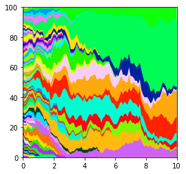

# Storing and Loading Simulations

The most efficient way to store simulation results is probably to output the relevant results array, 
e.g. the sim.population_array or the output of sim.get_mutant_clone_size_distribution(). 

The simulations can also be stored as pickle objects.   
This means they can be reloaded later, giving access to all results and functions.   

This can also be useful for very large/long running simulations. The simulation results can be periodically saved, 
meaning that they can be restarted from these checkpoints if needed.  

-------

Running a simulation and dumping as a pickle


```python
import numpy as np
import matplotlib.pyplot as plt
from clone_competition_simulation import Parameters, TimeParameters, PopulationParameters

np.random.seed(0)
p = Parameters(
    algorithm='Moran',
    times=TimeParameters(max_time=10, division_rate=1),
    population=PopulationParameters(initial_size_array=np.ones(100))
)
s = p.get_simulator()
s.run_sim()

# Dump the simulation as a pickle
s.pickle_dump('sim.pickle.gz')
```
Using the `s.pickle_dump` method instead of simply using `pickle.dump` makes sure that the random state is stored 
and colourscale functions are included.

-------
Load the simulation from the pickle

```python
from clone_competition_simulation import pickle_load
s2 = pickle_load('sim.pickle.gz')
s2.muller_plot(figsize=(4, 4))
plt.show()
```
    



## Saving checkpoints

For very long running simulations that may be interrupted, it can be helpful to store the results at a checkpoint.  
The simulations can then be continued from that point.  

This functionality that was added when the simulations were much slower to run, but has been left in case it is still 
helpful.  

This will store a new file for every sample point. So best used if there is a long simulation time between sample 
points of the storage will be a substantial part of the simulation time.  

Two tmp files are used - the storage alternates between the two files.  
This ensures that if the simulation stops due to issues with the pickle dump, there is still a backup from the 
previous checkpoint.  

------ 
Will set up a long(ish) simulation but stop it before it finishes. 

```python
import signal   # Using signal to stop the simulation after a few seconds

def timeout_handler(signum, frame):
    raise TimeoutError("Function execution exceeded the timeout limit")

signal.signal(signal.SIGALRM, timeout_handler)

np.random.seed(0)
p = Parameters(
    algorithm='Moran',
    times=TimeParameters(
        max_time=500,
        division_rate=1,
        samples=4,  # Only take a few samples so there is a large gap between
    ),
    population=PopulationParameters(initial_size_array=np.ones(5000)),
    tmp_store='tmp_store.pickle.gz',  # Set the file path to the storage at checkpoints
    progress=50000
)
s = p.get_simulator()

signal.alarm(5)  # Interrupt the simulation after 5 seconds

s.run_sim()
```
    Steps completed:
    50000, 100000, 150000, 200000, 250000, 300000, 350000, 400000, 450000, 500000, 550000, 600000,
    ...
    TimeoutError: Function execution exceeded the timeout limit

------
This has placed files called tmp_store.pickle.gz and tmp_store.pickle.gz1 in the current directory 

```python
s_continued = pickle_load('tmp_store.pickle.gz')
s_continued1 = pickle_load('tmp_store.pickle.gz1')

# We can check the number of simulation steps the two stored simulations have reached. 
# (could also check the last modified time of the files instead)
print(f'First pickle step: {s_continued.i}')
print(f'Second pickle step: {s_continued1.i}')
```
    First pickle step: 250000
    Second pickle step: 500000

The second pickle is the most recent backup of the simulation.  
We can continue where that simulation left off:

```python
s_continued1.continue_sim()
```

    Continuing from step 500000
    Steps completed:
    550000, 600000, 650000, 700000, 750000, 800000, 850000, 900000, 950000, 1000000, 1050000, 1100000, 1150000, 1200000, 1250000, Finished 1250000 steps


