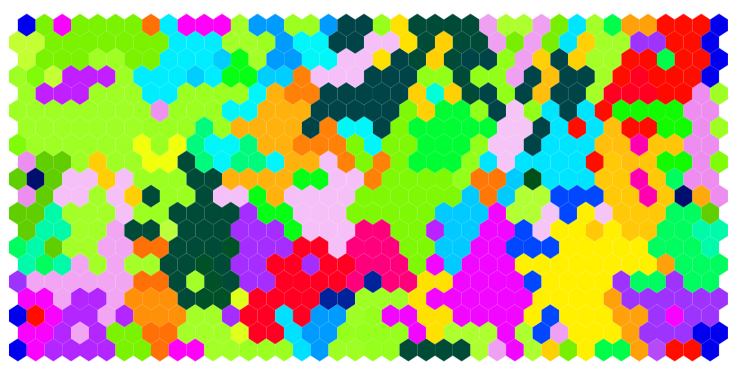
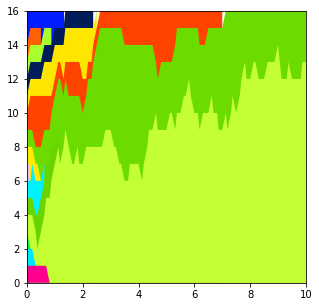

# Defining initial clone sizes

This guide explains how to set up the initial population of clones for a simulation.  
There are a few ways to define the number of cells in each initial clone, and the input required 
depends on whether the algorithm used is on a 2D grid or is non-spatial. 

## Method 1: Define the total initial cell population

This assigns all initial cells to a single clone (clone_id=0) and (if otherwise not specified) gives them all a 
fitness value of 1. It is most useful for simulations with ongoing mutation.  Without new mutations, very little happens.   

This method works for all algorithms.  


```python
from clone_competition_simulation import Parameters, TimeParameters, PopulationParameters

# Define a simulation with 1000 cells
p = Parameters(
    algorithm='Moran',
    times=TimeParameters(samples=10, max_time=10, division_rate=1),
    population=PopulationParameters(initial_cells=1000)
)
s = p.get_simulator()
s.run_sim()

# There is only one clone in the simulation. 
print(s.view_clone_info())
```

<div>
<table border="1" class="dataframe">
  <thead>
    <tr style="text-align: right;">
      <th></th>
      <th>clone id</th>
      <th>label</th>
      <th>fitness</th>
      <th>generation born</th>
      <th>parent clone id</th>
      <th>last gene mutated</th>
    </tr>
  </thead>
  <tbody>
    <tr>
      <th>0</th>
      <td>0</td>
      <td>0</td>
      <td>1</td>
      <td>0</td>
      <td>-1</td>
      <td>None</td>
    </tr>
  </tbody>
</table>
</div>

-----

For all algorithms apart from the "Branching" algorithm, the cell population is fixed. 
This means that there is absolutely no change in the clone sizes. 

```python
print(s.population_array.toarray())
```

    array([[1000., 1000., 1000., 1000., 1000., 1000., 1000., 1000., 1000.,
            1000., 1000.]])

----
If we run the a Branching process with the same settings, we see some random variation in the population size

```python
p = Parameters(
    algorithm='Branching', 
    times=TimeParameters(samples=10, max_time=10, division_rate=1),
    population=PopulationParameters(initial_cells=1000)
)
s = p.get_simulator()
s.run_sim()
print(s.population_array.toarray())
```

    [[1000. 1010. 1018. 1067. 1069. 1031. 1066. 1032. 1008. 1066. 1059.]]


----
To make the simulation more interesting, we'll add a non-zero mutation rate. Later guides will 
explain in more detail how to define mutation fitness.  

```python
from clone_competition_simulation import FitnessParameters, Gene, MutationGenerator, NormalDist
import matplotlib.pyplot as plt

# Define the fitness effects of the mutations
mutation_generator = MutationGenerator(
    genes=[Gene(name="Gene1", mutation_distribution=NormalDist(mean=1.1, var=0.1), 
                synonymous_proportion=0.5)]
)

p = Parameters(
    algorithm='Moran',
    times=TimeParameters(samples=10, max_time=10, division_rate=1),
    population=PopulationParameters(initial_cells=1000), 
    fitness=FitnessParameters(mutation_rates=0.05, mutation_generator=mutation_generator)
)
s = p.get_simulator()
s.run_sim()

# The new mutations form clones which emerge from the initial clone. 
s.muller_plot(figsize=(6, 6), show_mutations_with_x=False)
plt.show()
```
    

    
-----

`initial_cells` can also be used with the 2D algorithms. 
These will create a grid with equal width and height with the requested number of cells. 
The 2D algorithms must have an even number of rows and columns for the periodic boundary conditions.
This means the initial_cells value must be the square of an even number
```python

p = Parameters(
    algorithm='Moran2D', 
    times=TimeParameters(max_time=10, division_rate=1),
    population=PopulationParameters(initial_cells=30**2, cell_in_own_neighbourhood=False) 
)
```


```python
# Trying with a non-square number throws an error
p = Parameters(
    algorithm='Moran2D',
    times=TimeParameters(max_time=10, division_rate=1),
    population=PopulationParameters(initial_cells=1000, cell_in_own_neighbourhood=False)
)
```

    Value error, Square grid not compatible with 1000 cells. To run a rectangular grid provide a grid shape or initial grid


## Method 2: Defining multiple initial clones

If there are multiple initial clones, they can be defined in the non-spatial models using the `initial_size_array`. 

If no further information is given, all initial clones are given a fitness of 1.   

This does not work with the 2D models, because the `initial_size_array` cannot define the spatial locations of the clones. 


```python
# Define a simulation with 10 clones of increasing size
import numpy as np


p = Parameters(
    algorithm='Moran',
    times=TimeParameters(max_time=10, division_rate=1),
    population=PopulationParameters(initial_size_array=np.arange(10, 110, 10))
)
s = p.get_simulator()
s.run_sim()

# There are multiple clones in the simulation
print(s.view_clone_info())
```

<div>
<table border="1" class="dataframe">
  <thead>
    <tr style="text-align: right;">
      <th></th>
      <th>clone id</th>
      <th>label</th>
      <th>fitness</th>
      <th>generation born</th>
      <th>parent clone id</th>
      <th>last gene mutated</th>
    </tr>
  </thead>
  <tbody>
    <tr>
      <th>0</th>
      <td>0</td>
      <td>0</td>
      <td>1</td>
      <td>0</td>
      <td>-1</td>
      <td>None</td>
    </tr>
    <tr>
      <th>1</th>
      <td>1</td>
      <td>0</td>
      <td>1</td>
      <td>0</td>
      <td>-1</td>
      <td>None</td>
    </tr>
    <tr>
      <th>2</th>
      <td>2</td>
      <td>0</td>
      <td>1</td>
      <td>0</td>
      <td>-1</td>
      <td>None</td>
    </tr>
    <tr>
      <th>3</th>
      <td>3</td>
      <td>0</td>
      <td>1</td>
      <td>0</td>
      <td>-1</td>
      <td>None</td>
    </tr>
    <tr>
      <th>4</th>
      <td>4</td>
      <td>0</td>
      <td>1</td>
      <td>0</td>
      <td>-1</td>
      <td>None</td>
    </tr>
    <tr>
      <th>5</th>
      <td>5</td>
      <td>0</td>
      <td>1</td>
      <td>0</td>
      <td>-1</td>
      <td>None</td>
    </tr>
    <tr>
      <th>6</th>
      <td>6</td>
      <td>0</td>
      <td>1</td>
      <td>0</td>
      <td>-1</td>
      <td>None</td>
    </tr>
    <tr>
      <th>7</th>
      <td>7</td>
      <td>0</td>
      <td>1</td>
      <td>0</td>
      <td>-1</td>
      <td>None</td>
    </tr>
    <tr>
      <th>8</th>
      <td>8</td>
      <td>0</td>
      <td>1</td>
      <td>0</td>
      <td>-1</td>
      <td>None</td>
    </tr>
    <tr>
      <th>9</th>
      <td>9</td>
      <td>0</td>
      <td>1</td>
      <td>0</td>
      <td>-1</td>
      <td>None</td>
    </tr>
  </tbody>
</table>
</div>


```python
s.muller_plot(figsize=(5, 5))
plt.show()
```
    

    

## Method 3: Defining a grid shape

This is for the 2D models only. 

Just like defining `initial_cells`, this will create a grid of cells in a single clone (clone_id=0) with fitness1. 
Defining the `grid_shape` instead of `initial_cells` allows non-square dimensions for the grid.   

Both dimensions need to be even numbers for the periodic boundary conditions on the hexagonal grids. 


```python
p = Parameters(
    algorithm="Moran2D",
    times=TimeParameters(max_time=10, division_rate=1),
    population=PopulationParameters(grid_shape=(60, 10), cell_in_own_neighbourhood=False) 
)
s = p.get_simulator()
s.run_sim()
s.plot_grid(figsize=(6, 1))
plt.show()
```

    

    


## Method 4: Defining the initial grid of cells

For the 2D models (Moran2D and WF2D), you can provide a 2D numpy array to define the 
initial clone_id of every cell in the grid.   

If no further information is given, all initial clones are given a fitness of 1. 


```python
# Here we have a grid of two clones with ids 0 and 1. 
initial_grid = np.repeat([0, 1], 50).reshape(10, 10)
print(initial_grid)
```

    [[0, 0, 0, 0, 0, 0, 0, 0, 0, 0],
     [0, 0, 0, 0, 0, 0, 0, 0, 0, 0],
     [0, 0, 0, 0, 0, 0, 0, 0, 0, 0],
     [0, 0, 0, 0, 0, 0, 0, 0, 0, 0],
     [0, 0, 0, 0, 0, 0, 0, 0, 0, 0],
     [1, 1, 1, 1, 1, 1, 1, 1, 1, 1],
     [1, 1, 1, 1, 1, 1, 1, 1, 1, 1],
     [1, 1, 1, 1, 1, 1, 1, 1, 1, 1],
     [1, 1, 1, 1, 1, 1, 1, 1, 1, 1],
     [1, 1, 1, 1, 1, 1, 1, 1, 1, 1]]


```python
p = Parameters(
    algorithm="Moran2D",
    times=TimeParameters(max_time=10, division_rate=1),
    population=PopulationParameters(initial_grid=initial_grid, cell_in_own_neighbourhood=False) 
)
s = p.get_simulator()
s.run_sim()

s.muller_plot(figsize=(5, 5))
plt.show()
```
    

    

-----
The grid does not need to be square as long as there is an even number of rows and columns.   


```python
p = Parameters(
    algorithm="Moran2D",
    times=TimeParameters(max_time=10, division_rate=1),
    population=PopulationParameters(initial_grid=np.arange(800).reshape(40, 20), cell_in_own_neighbourhood=False) 
)
s = p.get_simulator()
s.run_sim()
s.plot_grid(figsize=(8, 4))
plt.show()
```




## Note: different meaning of values in initial_size_array and initial_grid

The initial_size_array defines the number of cells in each clone.  
A set of 16 single-cell clones can be defined using `initial_size_array=np.ones(16)`
This gives each of the 16 initial clones a single cell. 

```python
p = Parameters(
    algorithm='Moran', 
    times=TimeParameters(max_time=10, division_rate=1),
    population=PopulationParameters(initial_size_array=np.ones(16))
)
s = p.get_simulator()
s.run_sim()
s.muller_plot(figsize=(5, 5))
plt.show()
```
    

    

----
The initial_grid defines the clone_id of each cell in the grid.   
A set of 16 single-cell clones in a 4x4 grid can be defined using `initial_grid=np.arange(16).reshape(4, 4)`
This gives each initial cell a different clone number.

```python
p = Parameters(
    algorithm='Moran2D',
    times=TimeParameters(max_time=10, division_rate=1),
    population=PopulationParameters(initial_grid=np.arange(16).reshape(4, 4), cell_in_own_neighbourhood=False) 
)
s = p.get_simulator()
s.run_sim()
s.muller_plot(figsize=(5, 5))
plt.show()
```
    


-----
If you use `initial_size_array=np.arange(16)`, 
this creates 16 clones of increasing size from 0 to 15 (120 cells in total). 

```python

p = Parameters(
    algorithm='Moran',
    times=TimeParameters(max_time=10, division_rate=1),
    population=PopulationParameters(initial_size_array=np.arange(16))
)
print('total cell population', p.population.initial_cells)
s = p.get_simulator()
s.run_sim()
s.muller_plot(figsize=(5, 5))
plt.show()
```

    total cell population 120


    

    
