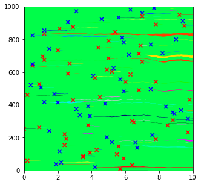

# Mutations (Part 1)

Mutations can be added during the course of a simulation.   
These may change the cell fitness and therefore the cell behaviour. 

There are quite a few mutation-related parameters that can be defined:
- the mutation rate
- the proportions of synonymous and non-synonymous mutations
- the distribution of fitness effects for non-synonymous mutations
- how the effects of multiple mutations combine to produce the overall cell fitness

This last point is can get pretty complicated and is covered in more detail in later guides. 

This guide describes the basics of using mutations in simulations. 

# Setting the mutation rate

If mutation_rates is left undefined or set to zero, no mutations occur

```python
from clone_competition_simulation import Parameters, TimeParameters, PopulationParameters
import matplotlib.pyplot as plt

p = Parameters(
    algorithm='Moran', 
    times=TimeParameters(max_time=10, division_rate=1), 
    population=PopulationParameters(initial_cells=1000)
)
s = p.get_simulator()
s.run_sim()
s.muller_plot(figsize=(5, 5))
plt.show()
```


This plot is just a single colour, because there is a single clone (the initial clone of 1000 cells)


------

Setting a non-zero mutation_rates randomly introduces mutations. The value is the probability of a mutation occurring 
per cell division.  

To introduce mutations, we must also define what effect the mutations will have. This 
is explained further in [Controlling the mutation effects](#Controlling the mutation effects) below.

```python
from clone_competition_simulation import (
    FitnessParameters, 
    Gene, 
    MutationGenerator, 
    NormalDist
)

# We'll add some mutations, so we have to define the fitness of the mutated cells
mutation_generator = MutationGenerator(
    genes=[Gene(name="Gene1", mutation_distribution=NormalDist(mean=1.1, var=0.1), 
                synonymous_proportion=0.5)]
)

p = Parameters(
    algorithm='Moran',
    times=TimeParameters(max_time=10, division_rate=1), 
    population=PopulationParameters(initial_cells=1000),
    fitness=FitnessParameters(
        mutation_rates=0.01, 
        mutation_generator=mutation_generator
    ),
)
s = p.get_simulator()
s.run_sim()
s.muller_plot(figsize=(5, 5))
plt.show()
```
    


The mutations that occur are marked with a X and are followed by the clones they form. 
Red Xs mark non-synonymous mutations and blue Xs mark synonymous mutations

-----

The mutation rate can vary. 
Here we set a high mutation rate from time 1 until time 3 and then a lower mutation rate after that

The mutation_rates are set as a list/array of pairs of `[start_time, mutation_rate]`
The mutation_rate will apply until the next start_time point or until the end of the simulation.
Before the first start_time (if not zero) the mutation_rate is zero.

```python
p = Parameters(
    algorithm='Moran',
    times=TimeParameters(max_time=10, division_rate=1), 
    population=PopulationParameters(initial_cells=1000),
    fitness=FitnessParameters(
        mutation_rates=[
            [1, 0.1],  # At time 1, start a mutation rate of 0.1 per cell division
            [4, 0.01]  # At time 4, start a mutation rate of 0.01 per cell division. This continues until the end.
        ], 
        mutation_generator=mutation_generator
    ),
)
s = p.get_simulator()
s.run_sim()
s.muller_plot(figsize=(5, 5))
plt.show()
```
    


Can see the higher density of mutations between times 1 and 4. 
    


# Controlling the mutation effects

The fitness effects of mutations are defined in two classes: Gene and MutationGenerator.  

Gene is used to define the proportion of non-synonymous and synonymous mutations and the distribution of fitness effects
of the non-synonymous mutations. 

The MutationGenerator is used to define how multiple mutations (which can be from multiple genes) combine to form the 
overall cell fitness.   

In this guide, we will only use the default parameters from the MutationGenerator, which is that all fitness effects 
are multiplied together.  
More options are described in other guides. 

-----

Let's define a new gene


```python
from clone_competition_simulation import Gene, UniformDist

gene1 = Gene(
    name='Gene1',  # This is the name for the gene. 
    mutation_distribution=UniformDist(0.5, 1.5),  # This defines the fitness effects of non-synonymous mutations
    synonymous_proportion=0.4   # This means 40% of the mutations will be synonymous
)
```

nd use that gene in a simulation

```python
from clone_competition_simulation import MutationGenerator
import numpy as np

mut_gen = MutationGenerator(genes=[gene1])
np.random.seed(0)
p = Parameters(
    algorithm='Moran2D',
    times=TimeParameters(max_time=10, division_rate=1),
    population=PopulationParameters(initial_cells=100, cell_in_own_neighbourhood=False),
    fitness=FitnessParameters(
        mutation_rates=0.01,
        mutation_generator=mut_gen
    )
)
s = p.get_simulator()
s.run_sim()
print(s.view_clone_info())
```

<div>
<table border="1" class="dataframe">
  <thead>
    <tr style="text-align: right;">
      <th></th>
      <th>clone id</th>
      <th>label</th>
      <th>fitness</th>
      <th>generation born</th>
      <th>parent clone id</th>
      <th>last gene mutated</th>
    </tr>
  </thead>
  <tbody>
    <tr>
      <th>0</th>
      <td>0</td>
      <td>0</td>
      <td>1.000000</td>
      <td>0</td>
      <td>-1</td>
      <td>None</td>
    </tr>
    <tr>
      <th>1</th>
      <td>1</td>
      <td>0</td>
      <td>1.000000</td>
      <td>15</td>
      <td>0</td>
      <td>Gene1</td>
    </tr>
    <tr>
      <th>2</th>
      <td>2</td>
      <td>0</td>
      <td>1.000000</td>
      <td>21</td>
      <td>0</td>
      <td>Gene1</td>
    </tr>
    <tr>
      <th>3</th>
      <td>3</td>
      <td>0</td>
      <td>1.339029</td>
      <td>42</td>
      <td>0</td>
      <td>Gene1</td>
    </tr>
    <tr>
      <th>4</th>
      <td>4</td>
      <td>0</td>
      <td>0.933265</td>
      <td>45</td>
      <td>0</td>
      <td>Gene1</td>
    </tr>
    <tr>
      <th>5</th>
      <td>5</td>
      <td>0</td>
      <td>0.942416</td>
      <td>48</td>
      <td>0</td>
      <td>Gene1</td>
    </tr>
    <tr>
      <th>6</th>
      <td>6</td>
      <td>0</td>
      <td>0.876017</td>
      <td>60</td>
      <td>0</td>
      <td>Gene1</td>
    </tr>
    <tr>
      <th>7</th>
      <td>7</td>
      <td>0</td>
      <td>1.339029</td>
      <td>62</td>
      <td>3</td>
      <td>Gene1</td>
    </tr>
    <tr>
      <th>8</th>
      <td>8</td>
      <td>0</td>
      <td>0.942416</td>
      <td>76</td>
      <td>5</td>
      <td>Gene1</td>
    </tr>
    <tr>
      <th>9</th>
      <td>9</td>
      <td>0</td>
      <td>0.643681</td>
      <td>97</td>
      <td>0</td>
      <td>Gene1</td>
    </tr>
  </tbody>
</table>
</div>

The fitness values of the new clones are between 0.5 and 1.5, and the gene mutated is Gene1. 
Some mutations will be synonymous and will not change the fitness

-----


There are a few pre-written options for the distribution of fitness effects.  
Custom distribution classes can be used as long as they have:
- a `__call__` function that doesn't take any argument and returns a fitness value
- a `get_mean` function that returns the mean of the distribution  

We can run a simulation with multiple genes showing some of the options already available.   


```python
from clone_competition_simulation import NormalDist, ExponentialDist, FixedValue

# One with a normal distribution
gene_norm = Gene(name='GeneNorm', mutation_distribution=NormalDist(mean=0.6, var=0.1), synonymous_proportion=0.5)

# One with an exponential distribution
gene_exp = Gene(name='GeneExp', mutation_distribution=ExponentialDist(mean=1.05, offset=1), synonymous_proportion=0.4)

# One where every non-synonymous mutation has the same fixed value of fitness
gene_fix = Gene(name='GeneFix', mutation_distribution=FixedValue(value=1.01), synonymous_proportion=0.3)

mut_gen = MutationGenerator(genes=[gene1, gene_norm, gene_exp, gene_fix])
np.random.seed(0)
p = Parameters(
    algorithm='Moran2D',
    times=TimeParameters(max_time=10, division_rate=1),
    population=PopulationParameters(initial_cells=100, cell_in_own_neighbourhood=False),
    fitness=FitnessParameters(
        mutation_rates=0.03,
        mutation_generator=mut_gen
    )
)
s = p.get_simulator()
s.run_sim()
print(s.view_clone_info())
```

<div>
<table border="1" class="dataframe">
  <thead>
    <tr style="text-align: right;">
      <th></th>
      <th>clone id</th>
      <th>label</th>
      <th>fitness</th>
      <th>generation born</th>
      <th>parent clone id</th>
      <th>last gene mutated</th>
    </tr>
  </thead>
  <tbody>
    <tr>
      <th>0</th>
      <td>0</td>
      <td>0</td>
      <td>1.000000</td>
      <td>0</td>
      <td>-1</td>
      <td>None</td>
    </tr>
    <tr>
      <th>1</th>
      <td>1</td>
      <td>0</td>
      <td>1.010000</td>
      <td>3</td>
      <td>0</td>
      <td>GeneFix</td>
    </tr>
    <tr>
      <th>2</th>
      <td>2</td>
      <td>0</td>
      <td>1.000000</td>
      <td>6</td>
      <td>0</td>
      <td>GeneNorm</td>
    </tr>
    <tr>
      <th>3</th>
      <td>3</td>
      <td>0</td>
      <td>1.010000</td>
      <td>7</td>
      <td>0</td>
      <td>GeneFix</td>
    </tr>
    <tr>
      <th>4</th>
      <td>4</td>
      <td>0</td>
      <td>1.034740</td>
      <td>7</td>
      <td>0</td>
      <td>GeneExp</td>
    </tr>
    <tr>
      <th>5</th>
      <td>5</td>
      <td>0</td>
      <td>1.010000</td>
      <td>15</td>
      <td>0</td>
      <td>GeneFix</td>
    </tr>
    <tr>
      <th>6</th>
      <td>6</td>
      <td>0</td>
      <td>0.516414</td>
      <td>16</td>
      <td>0</td>
      <td>GeneNorm</td>
    </tr>
    <tr>
      <th>7</th>
      <td>7</td>
      <td>0</td>
      <td>1.000000</td>
      <td>21</td>
      <td>0</td>
      <td>GeneFix</td>
    </tr>
    <tr>
      <th>8</th>
      <td>8</td>
      <td>0</td>
      <td>1.110256</td>
      <td>27</td>
      <td>0</td>
      <td>GeneExp</td>
    </tr>
    <tr>
      <th>9</th>
      <td>9</td>
      <td>0</td>
      <td>1.000000</td>
      <td>28</td>
      <td>0</td>
      <td>GeneNorm</td>
    </tr>
    <tr>
      <th>10</th>
      <td>10</td>
      <td>0</td>
      <td>0.505791</td>
      <td>29</td>
      <td>0</td>
      <td>GeneNorm</td>
    </tr>
    <tr>
      <th>11</th>
      <td>11</td>
      <td>0</td>
      <td>0.510849</td>
      <td>42</td>
      <td>10</td>
      <td>GeneFix</td>
    </tr>
    <tr>
      <th>12</th>
      <td>12</td>
      <td>0</td>
      <td>1.042249</td>
      <td>42</td>
      <td>0</td>
      <td>GeneExp</td>
    </tr>
    <tr>
      <th>13</th>
      <td>13</td>
      <td>0</td>
      <td>1.000000</td>
      <td>44</td>
      <td>0</td>
      <td>GeneNorm</td>
    </tr>
    <tr>
      <th>14</th>
      <td>14</td>
      <td>0</td>
      <td>1.004789</td>
      <td>44</td>
      <td>0</td>
      <td>GeneExp</td>
    </tr>
    <tr>
      <th>15</th>
      <td>15</td>
      <td>0</td>
      <td>0.994093</td>
      <td>47</td>
      <td>0</td>
      <td>Gene1</td>
    </tr>
    <tr>
      <th>16</th>
      <td>16</td>
      <td>0</td>
      <td>1.000000</td>
      <td>55</td>
      <td>0</td>
      <td>GeneFix</td>
    </tr>
    <tr>
      <th>17</th>
      <td>17</td>
      <td>0</td>
      <td>1.000000</td>
      <td>58</td>
      <td>0</td>
      <td>GeneExp</td>
    </tr>
    <tr>
      <th>18</th>
      <td>18</td>
      <td>0</td>
      <td>1.010000</td>
      <td>59</td>
      <td>0</td>
      <td>GeneFix</td>
    </tr>
    <tr>
      <th>19</th>
      <td>19</td>
      <td>0</td>
      <td>1.010000</td>
      <td>60</td>
      <td>0</td>
      <td>GeneFix</td>
    </tr>
    <tr>
      <th>20</th>
      <td>20</td>
      <td>0</td>
      <td>0.659173</td>
      <td>61</td>
      <td>0</td>
      <td>GeneNorm</td>
    </tr>
    <tr>
      <th>21</th>
      <td>21</td>
      <td>0</td>
      <td>1.038381</td>
      <td>61</td>
      <td>0</td>
      <td>GeneExp</td>
    </tr>
    <tr>
      <th>22</th>
      <td>22</td>
      <td>0</td>
      <td>0.552378</td>
      <td>63</td>
      <td>16</td>
      <td>GeneNorm</td>
    </tr>
    <tr>
      <th>23</th>
      <td>23</td>
      <td>0</td>
      <td>1.010000</td>
      <td>64</td>
      <td>0</td>
      <td>GeneFix</td>
    </tr>
    <tr>
      <th>24</th>
      <td>24</td>
      <td>0</td>
      <td>1.000000</td>
      <td>71</td>
      <td>0</td>
      <td>GeneNorm</td>
    </tr>
    <tr>
      <th>25</th>
      <td>25</td>
      <td>0</td>
      <td>1.000000</td>
      <td>72</td>
      <td>0</td>
      <td>GeneNorm</td>
    </tr>
    <tr>
      <th>26</th>
      <td>26</td>
      <td>0</td>
      <td>1.000000</td>
      <td>75</td>
      <td>0</td>
      <td>GeneFix</td>
    </tr>
    <tr>
      <th>27</th>
      <td>27</td>
      <td>0</td>
      <td>1.015429</td>
      <td>77</td>
      <td>0</td>
      <td>GeneExp</td>
    </tr>
    <tr>
      <th>28</th>
      <td>28</td>
      <td>0</td>
      <td>1.298854</td>
      <td>89</td>
      <td>0</td>
      <td>Gene1</td>
    </tr>
    <tr>
      <th>29</th>
      <td>29</td>
      <td>0</td>
      <td>0.606296</td>
      <td>93</td>
      <td>0</td>
      <td>GeneNorm</td>
    </tr>
    <tr>
      <th>30</th>
      <td>30</td>
      <td>0</td>
      <td>0.512835</td>
      <td>95</td>
      <td>0</td>
      <td>GeneNorm</td>
    </tr>
    <tr>
      <th>31</th>
      <td>31</td>
      <td>0</td>
      <td>1.049568</td>
      <td>100</td>
      <td>0</td>
      <td>GeneExp</td>
    </tr>
  </tbody>
</table>
</div>


------

To give different genes different mutation rates you can use the weight argument in `Gene`.  
The weights can be any non-negative number.  

The overall mutation rate is controlled by the Parameters mutations_rates argument.  
The Gene weight controls the relative mutation rate of the genes.  
By default weight=1, so all genes will have the same mutation rate.   


```python
# Two genes, where gene1 is 3 times more likely to be mutated than gene2
gene1 = Gene(name='Gene1', mutation_distribution=UniformDist(0.5, 1.1), synonymous_proportion=0.4, weight=3)
gene2 = Gene(name='Gene2', mutation_distribution=UniformDist(1.1, 1.5), synonymous_proportion=0.4, weight=1)

mut_gen = MutationGenerator(genes=[gene1, gene2])
p = Parameters(
    algorithm='Moran2D',
    times=TimeParameters(max_time=10, division_rate=1),
    population=PopulationParameters(initial_cells=100, cell_in_own_neighbourhood=False),
    fitness=FitnessParameters(
        mutation_rates=0.1,
        mutation_generator=mut_gen
    )
)
s = p.get_simulator()
s.run_sim()
print(s.view_clone_info()['last gene mutated'].value_counts())
```

    last gene mutated
    Gene1    72
    Gene2    23
    Name: count, dtype: int64


## dN/dS

The use of synonymous and non-synonymous mutations means we can calculate a dN/dS value.   
This can be done for the entire simulation or for each gene. 


```python
gene1 = Gene(name='Gene1', mutation_distribution=UniformDist(0.5, 1.1), synonymous_proportion=0.4, weight=3)
gene2 = Gene(name='Gene2', mutation_distribution=UniformDist(1.1, 1.5), synonymous_proportion=0.5, weight=1)

mut_gen = MutationGenerator(genes=[gene1, gene2])
p = Parameters(
    algorithm='Moran2D',
    times=TimeParameters(max_time=10, division_rate=1),
    population=PopulationParameters(initial_cells=62500, cell_in_own_neighbourhood=False),
    fitness=FitnessParameters(
        mutation_rates=0.01,
        mutation_generator=mut_gen
    )
)
s = p.get_simulator()
s.run_sim()

```

Just running the `sim.get_dnds` function returns the overall dN/dS ratio at the end of the simulation
```python
print(s.get_dnds())
```
    1.0231533250016447

------

Adding a time gets the dN/dS at that time point

```python
print(s.get_dnds(t=5))
```
    0.9779496754690142

-----
You can also get the dN/dS for each gene

```python
print(s.get_dnds(gene='Gene1'), s.get_dnds(gene='Gene2')) 
```
    (0.9395973154362416, 1.3317757009345794)

------
For sequencing experiments, you usually cannot detect very small clones. 
You can calculate the dN/dS for larger clones only
```python
print(s.get_dnds(gene='Gene2', min_size=5)) 
```
    1.8591549295774648

-----

You can plot the dN/dS over time. 
The early time points here are not reliable due to low sample size

```python
s.plot_dnds()
plt.show()
```
    


```python
s.plot_dnds(gene='Gene1')
s.plot_dnds(gene='Gene2', clear_previous=False)
plt.show()
```
    

    


```python
s.plot_dnds(gene='Gene2', min_size=5)
plt.show()
```
    


