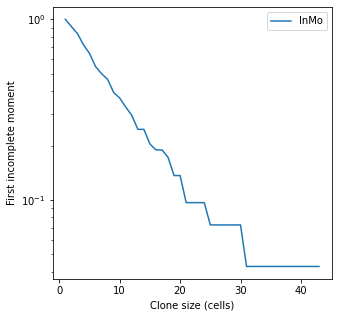

# Mutations (Part 2)

The first guide on mutations explains the basics of setting up simulations to include random mutations.  

This guide goes through extracting the data from a simulation and a couple of plots that can be helpful. 

-----

```python
import matplotlib.pyplot as plt
import numpy as np
from clone_competition_simulation import (
    Parameters,
    TimeParameters, 
    PopulationParameters,
    FitnessParameters,
    Gene, 
    MutationGenerator, 
    FixedValue
)


# Setting up a simulation with a few mutations
gene = Gene(name='Gene1', mutation_distribution=FixedValue(2), synonymous_proportion=0)
mut_gen = MutationGenerator(genes=[gene])

np.random.seed(0)
p = Parameters(
    algorithm='Moran', 
    times=TimeParameters(max_time=10, division_rate=1),
    population=PopulationParameters(initial_cells=50),
    fitness=FitnessParameters(
        mutation_rates=0.01, 
        mutation_generator=mut_gen,     
    )
)
s = p.get_simulator()
s.run_sim()
s.muller_plot(figsize=(5, 5))
plt.show()
```

    


In this simulation, the red clone grows large and develops some subclones (green and orange)   


------

You can see in the parent clone id column that clone 3 is a subclone of clone 1 
and clone 5 is a subclone of clone 3
```python
print(s.view_clone_info())
```

<div>
<table border="1" class="dataframe">
  <thead>
    <tr style="text-align: right;">
      <th></th>
      <th>clone id</th>
      <th>label</th>
      <th>fitness</th>
      <th>generation born</th>
      <th>parent clone id</th>
      <th>last gene mutated</th>
    </tr>
  </thead>
  <tbody>
    <tr>
      <th>0</th>
      <td>0</td>
      <td>0</td>
      <td>1</td>
      <td>0</td>
      <td>-1</td>
      <td>None</td>
    </tr>
    <tr>
      <th>1</th>
      <td>1</td>
      <td>0</td>
      <td>2</td>
      <td>30</td>
      <td>0</td>
      <td>Gene1</td>
    </tr>
    <tr>
      <th>2</th>
      <td>2</td>
      <td>0</td>
      <td>2</td>
      <td>42</td>
      <td>0</td>
      <td>Gene1</td>
    </tr>
    <tr>
      <th>3</th>
      <td>3</td>
      <td>0</td>
      <td>4</td>
      <td>84</td>
      <td>1</td>
      <td>Gene1</td>
    </tr>
    <tr>
      <th>4</th>
      <td>4</td>
      <td>0</td>
      <td>2</td>
      <td>90</td>
      <td>0</td>
      <td>Gene1</td>
    </tr>
    <tr>
      <th>5</th>
      <td>5</td>
      <td>0</td>
      <td>8</td>
      <td>95</td>
      <td>3</td>
      <td>Gene1</td>
    </tr>
  </tbody>
</table>
</div>


## Mutant clone sizes

The population array contains the sizes of each set of unique mutations (and labels if used).  
Each row corresponds to a clone id in s.clones_array (which is shown in s.view_clone_info())

However, if some clones are subclones of others, this array won't represent the true number of cells
containing each mutant, i.e. the mutant clone sizes. 

-----
This is the population array for the last 10 time points in the simulation.

```python
print(s.population_array.toarray()[:, -10:])
```
    [[ 8.,  8.,  8.,  8.,  8.,  7.,  5.,  5.,  5.,  4.],
     [39., 37., 36., 37., 37., 36., 36., 33., 33., 35.],
     [ 0.,  0.,  0.,  0.,  0.,  0.,  0.,  0.,  0.,  0.],
     [ 2.,  3.,  4.,  3.,  3.,  5.,  6.,  7.,  7.,  7.],
     [ 1.,  2.,  2.,  2.,  1.,  1.,  1.,  2.,  2.,  2.],
     [ 0.,  0.,  0.,  0.,  1.,  1.,  2.,  3.,  3.,  2.]])

At the end of the simulation (last column) there are

- 4 wild type cells (clone 0, green in the muller plot)
- 35 cells in clone_id 1, with no further mutations (red)
- 0 cells left  in clone_id 2 (dark pink)
- 7 cells in clone_id 3 (green)
- 2 cells in clone_id 4 (light pink)
- 2 cells in clone_id 5 (orange)  

------

However, if we want to know the total cells that contain the mutation that formed clone 1 (red), we need to add 
the cells in its subclones (clones 3 and 5). 
This is what the function `s.get_mutant_clone_sizes` does. It ignores any clones that existed at the start of the 
simulation, and adds up the total number of cells containing each new mutation. 


```python
print(s.get_mutant_clone_sizes())
```
    [44,  0,  9,  2,  2]

This means 44 cells containing the mutant that founded clone_id 1. 
35 from clone_id 1 itself, + 7 from clone_id 3, + 2 from clone_id 5

Note that clone_id 3 has 9 cells here, 7 from clone_id 3 itself + 2 from its subclone clone_id 5

------
The function lets you further filter the clone sizes:

- non-zero clones only
- from a particular gene
- non-synonymous/synonymous only
- with a particular label  
- at time points other than the end of the simulation.

```python
print(s.get_mutant_clone_sizes(t=9, non_zero_only=True, gene_mutated='Gene1', selection='ns'))
```
    [39,  2,  1]

-----

To get a `np.bincount` version of the of mutant clone sizes run `s.get_mutant_clone_size_distribution`. 
This function can also be used with arguments to show only mutants in certain genes, at different time points, 
and for non-synonymous/synonymous only, or for those with a particular label.  


```python
print(s.get_mutant_clone_size_distribution())
```
    array([1, 0, 2, 0, 0, 0, 0, 0, 0, 1, 0, 0, 0, 0, 0, 0, 0, 0, 0, 0, 0, 0,
           0, 0, 0, 0, 0, 0, 0, 0, 0, 0, 0, 0, 0, 0, 0, 0, 0, 0, 0, 0, 0, 0,
           1])

There is 1 mutant of size 0, 2 clones of size 2, 1 clone of size 9, and one clone of size 44


# Clone ancestors/descendants

The clone lineages are stored in a Tree (`s.tree`).   

You can get a list of the clone ancestors:
```python
print(s.get_clone_ancestors(5))
```
    [5, 3, 1, 0, -1]

Here you can see that clone 5 is descended from 3, then 1, then 0 (the original clone in this simulation) 
and -1 (the root of the tree, this can be ignored)

-----
The descendants of clone 1 are 3 and 5
```python
print(s.get_clone_descendants(1))
```
    [1, 3, 5]

# Muller plots

These plots can be very messy for simulations with a lot of clones, and can also take a long time to plot.   
To reduce the time taken, or to make the plots clearer, you can hide small clones.   


```python
gene = Gene(name='Gene1', mutation_distribution=FixedValue(1.5), synonymous_proportion=0.5)
mut_gen = MutationGenerator(genes=[gene])

np.random.seed(0)
p = Parameters(
    algorithm='Moran', 
    times=TimeParameters(max_time=10, division_rate=1),
    population=PopulationParameters(initial_cells=10000),
    fitness=FitnessParameters(
        mutation_rates=0.01, 
        mutation_generator=mut_gen,     
    )
)
s = p.get_simulator()
s.run_sim()
s.muller_plot(figsize=(5, 5))
plt.show()
```
    

    
The plot is very busy.

-----

The Xs marking the birth of mutant clones can be hidden
```python
s.muller_plot(figsize=(5, 5), show_mutations_with_x=False)
plt.show()
```


-----

And you can only hide small clones. Here we only show clones which reached a size of at least 30 cells
```python
s.muller_plot(figsize=(5, 5), show_mutations_with_x=False, min_size=30)
plt.show()
```


    

# Incomplete moments

There are plots for showing the incomplete moments of the clone sizes. 

```python
fig, ax = plt.subplots(figsize=(5, 5))
s.plot_incomplete_moment(ax=ax)
plt.show()
```
    


-----

and here for a neutral simulation

```python
gene = Gene(name='Gene1', mutation_distribution=FixedValue(1), synonymous_proportion=0.5)
mut_gen = MutationGenerator(genes=[gene])

np.random.seed(0)
p = Parameters(
    algorithm='Moran', 
    times=TimeParameters(max_time=10, division_rate=1),
    population=PopulationParameters(initial_cells=10000),
    fitness=FitnessParameters(
        mutation_rates=0.01, 
        mutation_generator=mut_gen,     
    )
)
s = p.get_simulator()
s.run_sim()

fig, ax = plt.subplots(figsize=(5, 5))
s.plot_incomplete_moment(ax=ax)
plt.show()
```
    

    
