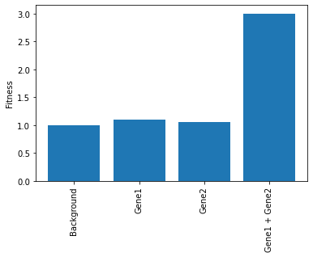

# Mutations (Part 3)

This guide describes some of the more complex options for defining the fitness effects of mutations. 
Most of the complexity comes from defining how the fitness of a cell with multiple mutations should be calculated.    

# multi_gene_array=False

This is the default and simplest option.  
Each new mutation in a cell combines with the previous mutations without any regard for the gene it came from.  

-----
Run a simulation where all new mutations have a fitness of 1.1
These multiply the previous fitness of the cell

```python
import numpy as np
from clone_competition_simulation import (
    Parameters, 
    TimeParameters, 
    PopulationParameters, 
    FitnessParameters,
    Gene, 
    MutationGenerator, 
    FixedValue 
)

mut_gen = MutationGenerator(
    genes=[Gene(name='Gene1', mutation_distribution=FixedValue(1.1), synonymous_proportion=0)], 
    combine_mutations='multiply'  # This is also the default option
)

np.random.seed(1)
p = Parameters(
    algorithm='Moran', 
    times=TimeParameters(max_time=10, division_rate=1),
    population=PopulationParameters(initial_size_array=np.ones(4)),
    fitness=FitnessParameters(
        fitness_array=np.linspace(1, 1.3, 4),  # Giving the initial clones some different fitness values
        mutation_rates=0.1, 
        mutation_generator=mut_gen,     
    )
)
s = p.get_simulator()
s.run_sim()

print(s.view_clone_info())
```

<div>
<table border="1" class="dataframe">
  <thead>
    <tr style="text-align: right;">
      <th></th>
      <th>clone id</th>
      <th>label</th>
      <th>fitness</th>
      <th>generation born</th>
      <th>parent clone id</th>
      <th>last gene mutated</th>
    </tr>
  </thead>
  <tbody>
    <tr>
      <th>0</th>
      <td>0</td>
      <td>0</td>
      <td>1.000</td>
      <td>0</td>
      <td>-1</td>
      <td>None</td>
    </tr>
    <tr>
      <th>1</th>
      <td>1</td>
      <td>0</td>
      <td>1.100</td>
      <td>0</td>
      <td>-1</td>
      <td>None</td>
    </tr>
    <tr>
      <th>2</th>
      <td>2</td>
      <td>0</td>
      <td>1.200</td>
      <td>0</td>
      <td>-1</td>
      <td>None</td>
    </tr>
    <tr>
      <th>3</th>
      <td>3</td>
      <td>0</td>
      <td>1.300</td>
      <td>0</td>
      <td>-1</td>
      <td>None</td>
    </tr>
    <tr>
      <th>4</th>
      <td>4</td>
      <td>0</td>
      <td>1.320</td>
      <td>22</td>
      <td>2</td>
      <td>Gene1</td>
    </tr>
    <tr>
      <th>5</th>
      <td>5</td>
      <td>0</td>
      <td>1.452</td>
      <td>32</td>
      <td>4</td>
      <td>Gene1</td>
    </tr>
    <tr>
      <th>6</th>
      <td>6</td>
      <td>0</td>
      <td>1.452</td>
      <td>39</td>
      <td>4</td>
      <td>Gene1</td>
    </tr>
  </tbody>
</table>
</div>


The fitness of clone_id 4 is 1.32 = 1.2 (the fitness of the parent clone 2) x 1.1 (the fitness of the new mut)
The fitness of clone_id 5 is 1.452 = 1.32 (the fitness of the parent clone 4) x 1.1 (the fitness of the new mut)

------
For comparison with later, this is the raw_fitness_array, used to calculate the overall fitness
With multi_gene_array=False it is not very interesting, just one column


```python
print(s.raw_fitness_array)
```

    [[1.   ],
     [1.1  ],
     [1.2  ],
     [1.3  ],
     [1.32 ],
     [1.452],
     [1.452]])


### Mutation combination options

There are various other options as well as fitness multiplication

```python
from clone_competition_simulation import MutationCombination

print(MutationCombination._member_names_)

```
    ['MULTIPLY', 'ADD', 'REPLACE', 'MAX', 'MIN']

-----
For example, to add fitness values

```python

mut_gen = MutationGenerator(
    genes=[
        Gene(name='Gene1', mutation_distribution=FixedValue(1.1), synonymous_proportion=0)
    ], 
    combine_mutations='add'  # Using add. Could also use MutationCombination.ADD
)

# The simulation is otherwise the same as before
np.random.seed(1)
p = Parameters(
    algorithm='Moran',
    times=TimeParameters(max_time=10, division_rate=1),
    population=PopulationParameters(initial_size_array=np.ones(4)),
    fitness=FitnessParameters(
        fitness_array=np.linspace(1, 1.3, 4),  # Giving the initial clones some different fitness values
        mutation_rates=0.1, 
        mutation_generator=mut_gen,     
    )
)
s = p.get_simulator()
s.run_sim()

print(s.view_clone_info())
```

<div>
<table border="1" class="dataframe">
  <thead>
    <tr style="text-align: right;">
      <th></th>
      <th>clone id</th>
      <th>label</th>
      <th>fitness</th>
      <th>generation born</th>
      <th>parent clone id</th>
      <th>last gene mutated</th>
    </tr>
  </thead>
  <tbody>
    <tr>
      <th>0</th>
      <td>0</td>
      <td>0</td>
      <td>1.0</td>
      <td>0</td>
      <td>-1</td>
      <td>None</td>
    </tr>
    <tr>
      <th>1</th>
      <td>1</td>
      <td>0</td>
      <td>1.1</td>
      <td>0</td>
      <td>-1</td>
      <td>None</td>
    </tr>
    <tr>
      <th>2</th>
      <td>2</td>
      <td>0</td>
      <td>1.2</td>
      <td>0</td>
      <td>-1</td>
      <td>None</td>
    </tr>
    <tr>
      <th>3</th>
      <td>3</td>
      <td>0</td>
      <td>1.3</td>
      <td>0</td>
      <td>-1</td>
      <td>None</td>
    </tr>
    <tr>
      <th>4</th>
      <td>4</td>
      <td>0</td>
      <td>1.3</td>
      <td>22</td>
      <td>2</td>
      <td>Gene1</td>
    </tr>
    <tr>
      <th>5</th>
      <td>5</td>
      <td>0</td>
      <td>1.4</td>
      <td>32</td>
      <td>4</td>
      <td>Gene1</td>
    </tr>
    <tr>
      <th>6</th>
      <td>6</td>
      <td>0</td>
      <td>1.4</td>
      <td>39</td>
      <td>4</td>
      <td>Gene1</td>
    </tr>
  </tbody>
</table>
</div>

Note this adds the fitness *advantage* from the new mutation.  
So if the fitness is 1.1, there is a 0.1 advantage over neutral.  
The fitness of clone_id 4 is now 1.3 = 1.2 + 0.1  

# multi_gene_array=True

This allows much more control on the combination of fitness, but is also more complicated.   

The mutations from each gene are treated separately, and then combined after.  

Mutations within each gene are combined based on MutationGenerator.combine_mutations.   
Fitness from all genes is then combined based on MutationGenerator.combine_array.

-----
This is the same simulation we ran before with multi_gene_array=False.  
Running a simulation where all new mutations have a fitness of 1.1.  These multiply the previous fitness of the cell

```python

mut_gen = MutationGenerator(
    genes=[
        Gene(name='Gene1', mutation_distribution=FixedValue(1.1), synonymous_proportion=0)
    ], 
    multi_gene_array=True,
    combine_mutations='multiply', # This is the default option
    combine_array='multiply',  # This is also the default
)

np.random.seed(1)
p = Parameters(
    algorithm='Moran', 
    times=TimeParameters(max_time=10, division_rate=1),
    population=PopulationParameters(initial_size_array=np.ones(4)),
    fitness=FitnessParameters(
        fitness_array=np.linspace(1, 1.3, 4),  # Giving the initial clones some different fitness values
        mutation_rates=0.1, 
        mutation_generator=mut_gen,     
    )
)
s = p.get_simulator()
s.run_sim()

print(s.view_clone_info())
```

<div>
<table border="1" class="dataframe">
  <thead>
    <tr style="text-align: right;">
      <th></th>
      <th>clone id</th>
      <th>label</th>
      <th>fitness</th>
      <th>generation born</th>
      <th>parent clone id</th>
      <th>last gene mutated</th>
    </tr>
  </thead>
  <tbody>
    <tr>
      <th>0</th>
      <td>0</td>
      <td>0</td>
      <td>1.000</td>
      <td>0</td>
      <td>-1</td>
      <td>None</td>
    </tr>
    <tr>
      <th>1</th>
      <td>1</td>
      <td>0</td>
      <td>1.100</td>
      <td>0</td>
      <td>-1</td>
      <td>None</td>
    </tr>
    <tr>
      <th>2</th>
      <td>2</td>
      <td>0</td>
      <td>1.200</td>
      <td>0</td>
      <td>-1</td>
      <td>None</td>
    </tr>
    <tr>
      <th>3</th>
      <td>3</td>
      <td>0</td>
      <td>1.300</td>
      <td>0</td>
      <td>-1</td>
      <td>None</td>
    </tr>
    <tr>
      <th>4</th>
      <td>4</td>
      <td>0</td>
      <td>1.320</td>
      <td>22</td>
      <td>2</td>
      <td>Gene1</td>
    </tr>
    <tr>
      <th>5</th>
      <td>5</td>
      <td>0</td>
      <td>1.452</td>
      <td>32</td>
      <td>4</td>
      <td>Gene1</td>
    </tr>
    <tr>
      <th>6</th>
      <td>6</td>
      <td>0</td>
      <td>1.452</td>
      <td>39</td>
      <td>4</td>
      <td>Gene1</td>
    </tr>
  </tbody>
</table>
</div>

The clone info results are the same as before

-----

But compare the raw_fitness_array to earlier.  

With multi_gene_array=True, this is now a multidimensional array.   

Each row is for a clone.   
The first column is a fitness from the initial clones (often wild type/neutral fitness).    
The next set of columns contain the fitness from each gene.   
The total fitness for each clone is calculated from all the values in each row.   
Here is it multiplied because MutationGenerator.combine_array='multiply' (any nan values are ignored).

```python
print(s.raw_fitness_array)
```

    [[1.  ,  nan],
     [1.1 ,  nan],
     [1.2 ,  nan],
     [1.3 ,  nan],
     [1.2 , 1.1 ],
     [1.2 , 1.21],
     [1.2 , 1.21]])


-----
To see this along with the clone data, can use the include_raw_fitness argument

```python
print(s.view_clone_info(include_raw_fitness=True))
```

<div>
<table border="1" class="dataframe">
  <thead>
    <tr style="text-align: right;">
      <th></th>
      <th>clone id</th>
      <th>label</th>
      <th>fitness</th>
      <th>generation born</th>
      <th>parent clone id</th>
      <th>last gene mutated</th>
      <th>Initial clone fitness</th>
      <th>Gene1</th>
    </tr>
  </thead>
  <tbody>
    <tr>
      <th>0</th>
      <td>0</td>
      <td>0</td>
      <td>1.000</td>
      <td>0</td>
      <td>-1</td>
      <td>None</td>
      <td>1.0</td>
      <td>NaN</td>
    </tr>
    <tr>
      <th>1</th>
      <td>1</td>
      <td>0</td>
      <td>1.100</td>
      <td>0</td>
      <td>-1</td>
      <td>None</td>
      <td>1.1</td>
      <td>NaN</td>
    </tr>
    <tr>
      <th>2</th>
      <td>2</td>
      <td>0</td>
      <td>1.200</td>
      <td>0</td>
      <td>-1</td>
      <td>None</td>
      <td>1.2</td>
      <td>NaN</td>
    </tr>
    <tr>
      <th>3</th>
      <td>3</td>
      <td>0</td>
      <td>1.300</td>
      <td>0</td>
      <td>-1</td>
      <td>None</td>
      <td>1.3</td>
      <td>NaN</td>
    </tr>
    <tr>
      <th>4</th>
      <td>4</td>
      <td>0</td>
      <td>1.320</td>
      <td>22</td>
      <td>2</td>
      <td>Gene1</td>
      <td>1.2</td>
      <td>1.10</td>
    </tr>
    <tr>
      <th>5</th>
      <td>5</td>
      <td>0</td>
      <td>1.452</td>
      <td>32</td>
      <td>4</td>
      <td>Gene1</td>
      <td>1.2</td>
      <td>1.21</td>
    </tr>
    <tr>
      <th>6</th>
      <td>6</td>
      <td>0</td>
      <td>1.452</td>
      <td>39</td>
      <td>4</td>
      <td>Gene1</td>
      <td>1.2</td>
      <td>1.21</td>
    </tr>
  </tbody>
</table>
</div>

-------
Using multiple genes adds extra columns to the raw_fitness_array.  

You can combine effects between genes in a different way to combining mutations within a gene.  
For example, if further mutations in the same gene have no further effect, we can use 
`combine_mutations='max'`, `'replace'`, or `'min'`.  

But then you can still add the fitness effects from different genes. 

```python
mut_gen = MutationGenerator(
    genes=[
        Gene(name='Gene1', mutation_distribution=FixedValue(1.1), synonymous_proportion=0), 
        Gene(name='Gene2', mutation_distribution=FixedValue(1.05), synonymous_proportion=0)
    ], 
    multi_gene_array=True,
    combine_mutations='replace',   # With FixedValue this means further mutations will do nothing
    combine_array='add',  # Add the effects from the two genes
)

np.random.seed(0)
p = Parameters(
    algorithm='Moran',
    times=TimeParameters(max_time=10, division_rate=1),
    population=PopulationParameters(initial_cells=6),
    fitness=FitnessParameters(
        mutation_rates=0.15, 
        mutation_generator=mut_gen,     
    )
)
s = p.get_simulator()
s.run_sim()

print(s.view_clone_info(include_raw_fitness=True))
```

<div>
<table border="1" class="dataframe">
  <thead>
    <tr style="text-align: right;">
      <th></th>
      <th>clone id</th>
      <th>label</th>
      <th>fitness</th>
      <th>generation born</th>
      <th>parent clone id</th>
      <th>last gene mutated</th>
      <th>Initial clone fitness</th>
      <th>Gene1</th>
      <th>Gene2</th>
    </tr>
  </thead>
  <tbody>
    <tr>
      <th>0</th>
      <td>0</td>
      <td>0</td>
      <td>1.00</td>
      <td>0</td>
      <td>-1</td>
      <td>None</td>
      <td>1.0</td>
      <td>NaN</td>
      <td>NaN</td>
    </tr>
    <tr>
      <th>1</th>
      <td>1</td>
      <td>0</td>
      <td>1.10</td>
      <td>8</td>
      <td>0</td>
      <td>Gene1</td>
      <td>1.0</td>
      <td>1.1</td>
      <td>NaN</td>
    </tr>
    <tr>
      <th>2</th>
      <td>2</td>
      <td>0</td>
      <td>1.10</td>
      <td>13</td>
      <td>0</td>
      <td>Gene1</td>
      <td>1.0</td>
      <td>1.1</td>
      <td>NaN</td>
    </tr>
    <tr>
      <th>3</th>
      <td>3</td>
      <td>0</td>
      <td>1.05</td>
      <td>18</td>
      <td>0</td>
      <td>Gene2</td>
      <td>1.0</td>
      <td>NaN</td>
      <td>1.05</td>
    </tr>
    <tr>
      <th>4</th>
      <td>4</td>
      <td>0</td>
      <td>1.15</td>
      <td>25</td>
      <td>2</td>
      <td>Gene2</td>
      <td>1.0</td>
      <td>1.1</td>
      <td>1.05</td>
    </tr>
    <tr>
      <th>5</th>
      <td>5</td>
      <td>0</td>
      <td>1.15</td>
      <td>35</td>
      <td>2</td>
      <td>Gene2</td>
      <td>1.0</td>
      <td>1.1</td>
      <td>1.05</td>
    </tr>
    <tr>
      <th>6</th>
      <td>6</td>
      <td>0</td>
      <td>1.10</td>
      <td>48</td>
      <td>0</td>
      <td>Gene1</td>
      <td>1.0</td>
      <td>1.1</td>
      <td>NaN</td>
    </tr>
  </tbody>
</table>
</div>

You can see that the overall fitness of each clone is the sum of fitness advantage from the last three columns.  

------

The options for combination across genes are similar to the options within genes.   
`priority` is an odd case, where only the last mutated gene in the list (or the last epistatic effect) is used.  
It might be relevant for cases where the knockout of one gene will override the function of downstream genes. 

```python
from clone_competition_simulation import ArrayCombination
print(ArrayCombination._member_names_)
```

    ['MULTIPLY', 'ADD', 'MAX', 'MIN', 'PRIORITY']


# Epistatic effects

The combination of mutations in different genes may be more complex than simply addition or multiplication.   
Defining epistatic effects allows more control of the combinations of fitness.  

For example, this can be used for haplosufficient or haploinsufficient genes by defining a separate Gene object for each allele and an epistatic effect for when both alleles are mutated.  


```python
from clone_competition_simulation import EpistaticEffect

mut_gen = MutationGenerator(
    genes=[
        Gene(name='Gene1', mutation_distribution=FixedValue(1.1), synonymous_proportion=0), 
        Gene(name='Gene2', mutation_distribution=FixedValue(1.05), synonymous_proportion=0)
    ],                 
    # Add an epistatic effect. 
    # If both Gene1 and Gene2 are mutated, the clone has a fitness of 3
    # This replaces the individual effects of both genes
    epistatics=[
        EpistaticEffect(
            name='Epi1', 
            gene_names=['Gene1', 'Gene2'], 
            fitness_distribution=FixedValue(3)
        )
    ],
    multi_gene_array=True,
    combine_mutations='replace',   # With FixedValue this means further mutations will do nothing
)

np.random.seed(0)
p = Parameters(
    algorithm='Moran',
    times=TimeParameters(max_time=10, division_rate=1),
    population=PopulationParameters(initial_cells=6),
    fitness=FitnessParameters(
        mutation_rates=0.15, 
        mutation_generator=mut_gen,     
    )
)
s = p.get_simulator()
s.run_sim()

print(s.view_clone_info(include_raw_fitness=True))
```

<div>
<table border="1" class="dataframe">
  <thead>
    <tr style="text-align: right;">
      <th></th>
      <th>clone id</th>
      <th>label</th>
      <th>fitness</th>
      <th>generation born</th>
      <th>parent clone id</th>
      <th>last gene mutated</th>
      <th>Initial clone fitness</th>
      <th>Gene1</th>
      <th>Gene2</th>
      <th>Epi1</th>
    </tr>
  </thead>
  <tbody>
    <tr>
      <th>0</th>
      <td>0</td>
      <td>0</td>
      <td>1.00</td>
      <td>0</td>
      <td>-1</td>
      <td>None</td>
      <td>1.0</td>
      <td>NaN</td>
      <td>NaN</td>
      <td>NaN</td>
    </tr>
    <tr>
      <th>1</th>
      <td>1</td>
      <td>0</td>
      <td>1.10</td>
      <td>8</td>
      <td>0</td>
      <td>Gene1</td>
      <td>1.0</td>
      <td>1.1</td>
      <td>NaN</td>
      <td>NaN</td>
    </tr>
    <tr>
      <th>2</th>
      <td>2</td>
      <td>0</td>
      <td>1.10</td>
      <td>13</td>
      <td>0</td>
      <td>Gene1</td>
      <td>1.0</td>
      <td>1.1</td>
      <td>NaN</td>
      <td>NaN</td>
    </tr>
    <tr>
      <th>3</th>
      <td>3</td>
      <td>0</td>
      <td>1.05</td>
      <td>18</td>
      <td>0</td>
      <td>Gene2</td>
      <td>1.0</td>
      <td>NaN</td>
      <td>1.05</td>
      <td>NaN</td>
    </tr>
    <tr>
      <th>4</th>
      <td>4</td>
      <td>0</td>
      <td>3.00</td>
      <td>25</td>
      <td>2</td>
      <td>Gene2</td>
      <td>1.0</td>
      <td>1.1</td>
      <td>1.05</td>
      <td>3.0</td>
    </tr>
    <tr>
      <th>5</th>
      <td>5</td>
      <td>0</td>
      <td>3.00</td>
      <td>35</td>
      <td>4</td>
      <td>Gene2</td>
      <td>1.0</td>
      <td>1.1</td>
      <td>1.05</td>
      <td>3.0</td>
    </tr>
    <tr>
      <th>6</th>
      <td>6</td>
      <td>0</td>
      <td>3.00</td>
      <td>48</td>
      <td>4</td>
      <td>Gene1</td>
      <td>1.0</td>
      <td>1.1</td>
      <td>1.05</td>
      <td>3.0</td>
    </tr>
  </tbody>
</table>
</div>

Note that for the last three clones, their fitness is 3 because both genes are mutated. 

# Checking fitness rules are correct

It can be a complex system for defining the rules for mutation combinations.   
To check that the fitness values are what is intended, you can plot the (mean) fitness of the combination of gene mutations.  
This assumes that there is at most a *single mutation per gene*. 


Use this function from the MutationGenerator to plot the fitness of each combination of mutations. 
This is for the epistatic example above. 

```python
import matplotlib.pyplot as plt

fitness_combinations = mut_gen.plot_fitness_combinations()
print(f"Fitness combinations:  {fitness_combinations}")
plt.show()
```

    Fitness combinations:  [1.   1.1  1.05 3.  ]

    

    

-------

Add an extra gene and change some options and check again
For any non-FixedValue distributions of fitness effects, the mean value is used.

```python
from clone_competition_simulation import UniformDist

mut_gen2 = MutationGenerator(
    genes=[
        Gene(name='Gene1', mutation_distribution=FixedValue(1.1), synonymous_proportion=0), 
        Gene(name='Gene2', mutation_distribution=FixedValue(1.05), synonymous_proportion=0),
        Gene(name='Gene3', mutation_distribution=UniformDist(1, 2), synonymous_proportion=0)],                            
    epistatics=[
        EpistaticEffect(
            name='Epi1', 
            gene_names=['Gene1', 'Gene2'], 
            fitness_distribution=FixedValue(3)
        )
    ],
    multi_gene_array=True,
    combine_array='multiply'
)
fitness_combinations = mut_gen2.plot_fitness_combinations()
print(f"Fitness combinations:  {fitness_combinations}")
plt.show()
```

    Fitness combinations:  [1.    1.1   1.05  3.    1.5   1.65  1.575 4.5  ]


------
Can see the difference using `combine_array='max'` instead of `combine_array='multiply'`

```python
mut_gen2 = MutationGenerator(
    genes=[
        Gene(name='Gene1', mutation_distribution=FixedValue(1.1), synonymous_proportion=0), 
        Gene(name='Gene2', mutation_distribution=FixedValue(1.05), synonymous_proportion=0),
        Gene(name='Gene3', mutation_distribution=UniformDist(1, 2), synonymous_proportion=0)],                            
    epistatics=[
        EpistaticEffect(
            name='Epi1', 
            gene_names=['Gene1', 'Gene2'], 
            fitness_distribution=FixedValue(3)
        )
    ],
    multi_gene_array=True,
    combine_array='max'
)
fitness_combinations = mut_gen2.plot_fitness_combinations()
print(f"Fitness combinations:  {fitness_combinations}")
plt.show()
```

    Fitness combinations:  [1.   1.1  1.05 3.   1.5  1.5  1.5  3.  ]
    

    

# Assigning genes to the initial mutations

You can start a simulation with multiple clones and assign a gene to each of them.    
This may be useful for lineage tracing style simulations in which a mutant is induced (defined at the start), and then subsequent mutations can appear on top of the initial mutations.  

-------

```python
# Have similar epistatic rules as above
# But stop Gene1 from mutating at random by setting weight=0
mut_gen = MutationGenerator(
    genes=[
        Gene(name='Gene1', mutation_distribution=FixedValue(1.1), synonymous_proportion=0, weight=0), 
        Gene(name='Gene2', mutation_distribution=FixedValue(1.05), synonymous_proportion=0)
    ],
    epistatics=[
        EpistaticEffect(
            name='Epi1', 
            gene_names=['Gene1', 'Gene2'], 
            fitness_distribution=FixedValue(2)
        )
    ],
    multi_gene_array=True,
    combine_mutations='replace',   # With FixedValue this means further mutations will do nothing
)

# This time, start with some mutations in Gene1. 
# Then mutate Gene2, which has the epistatic interaction with Gene1
np.random.seed(1)
p = Parameters(
    algorithm='Moran', 
    times=TimeParameters(max_time=10, division_rate=1),
    population=PopulationParameters(
        initial_size_array=[6, 1, 1, 1, 1],   # Set up 4 1-cell clones and 6 WT cells
    ),
    fitness=FitnessParameters(
        mutation_rates=0.08, 
        mutation_generator=mut_gen,     
        
        # The initial_mutant_gene_array defines the genes to be associated with the gene
        # The value is the index of the Gene in MutationGenerator.genes
        # Use -1 for the clones with no mutation/associated gene
        initial_mutant_gene_array=[-1, 0, 0, 0, 0],  
        
        # Also need to define the fitness array or all initial clones will have a fitness=1
        # These fitness values do not have to equal the fitness values from the Gene assigned. 
        fitness_array=[1, 1.1, 1.1, 1.1, 1.1],
    )
)
s = p.get_simulator()
s.run_sim()

print(s.view_clone_info(include_raw_fitness=True))
```

<div>
<table border="1" class="dataframe">
  <thead>
    <tr style="text-align: right;">
      <th></th>
      <th>clone id</th>
      <th>label</th>
      <th>fitness</th>
      <th>generation born</th>
      <th>parent clone id</th>
      <th>last gene mutated</th>
      <th>Initial clone fitness</th>
      <th>Gene1</th>
      <th>Gene2</th>
      <th>Epi1</th>
    </tr>
  </thead>
  <tbody>
    <tr>
      <th>0</th>
      <td>0</td>
      <td>0</td>
      <td>1.00</td>
      <td>0</td>
      <td>-1</td>
      <td>None</td>
      <td>1.0</td>
      <td>NaN</td>
      <td>NaN</td>
      <td>NaN</td>
    </tr>
    <tr>
      <th>1</th>
      <td>1</td>
      <td>0</td>
      <td>1.10</td>
      <td>0</td>
      <td>-1</td>
      <td>Gene1</td>
      <td>1.0</td>
      <td>1.1</td>
      <td>NaN</td>
      <td>NaN</td>
    </tr>
    <tr>
      <th>2</th>
      <td>2</td>
      <td>0</td>
      <td>1.10</td>
      <td>0</td>
      <td>-1</td>
      <td>Gene1</td>
      <td>1.0</td>
      <td>1.1</td>
      <td>NaN</td>
      <td>NaN</td>
    </tr>
    <tr>
      <th>3</th>
      <td>3</td>
      <td>0</td>
      <td>1.10</td>
      <td>0</td>
      <td>-1</td>
      <td>Gene1</td>
      <td>1.0</td>
      <td>1.1</td>
      <td>NaN</td>
      <td>NaN</td>
    </tr>
    <tr>
      <th>4</th>
      <td>4</td>
      <td>0</td>
      <td>1.10</td>
      <td>0</td>
      <td>-1</td>
      <td>Gene1</td>
      <td>1.0</td>
      <td>1.1</td>
      <td>NaN</td>
      <td>NaN</td>
    </tr>
    <tr>
      <th>5</th>
      <td>5</td>
      <td>0</td>
      <td>1.05</td>
      <td>22</td>
      <td>0</td>
      <td>Gene2</td>
      <td>1.0</td>
      <td>NaN</td>
      <td>1.05</td>
      <td>NaN</td>
    </tr>
    <tr>
      <th>6</th>
      <td>6</td>
      <td>0</td>
      <td>2.00</td>
      <td>32</td>
      <td>4</td>
      <td>Gene2</td>
      <td>1.0</td>
      <td>1.1</td>
      <td>1.05</td>
      <td>2.0</td>
    </tr>
    <tr>
      <th>7</th>
      <td>7</td>
      <td>0</td>
      <td>2.00</td>
      <td>39</td>
      <td>3</td>
      <td>Gene2</td>
      <td>1.0</td>
      <td>1.1</td>
      <td>1.05</td>
      <td>2.0</td>
    </tr>
    <tr>
      <th>8</th>
      <td>8</td>
      <td>0</td>
      <td>2.00</td>
      <td>66</td>
      <td>6</td>
      <td>Gene2</td>
      <td>1.0</td>
      <td>1.1</td>
      <td>1.05</td>
      <td>2.0</td>
    </tr>
    <tr>
      <th>9</th>
      <td>9</td>
      <td>0</td>
      <td>2.00</td>
      <td>73</td>
      <td>8</td>
      <td>Gene2</td>
      <td>1.0</td>
      <td>1.1</td>
      <td>1.05</td>
      <td>2.0</td>
    </tr>
    <tr>
      <th>10</th>
      <td>10</td>
      <td>0</td>
      <td>2.00</td>
      <td>83</td>
      <td>8</td>
      <td>Gene2</td>
      <td>1.0</td>
      <td>1.1</td>
      <td>1.05</td>
      <td>2.0</td>
    </tr>
    <tr>
      <th>11</th>
      <td>11</td>
      <td>0</td>
      <td>2.00</td>
      <td>86</td>
      <td>8</td>
      <td>Gene2</td>
      <td>1.0</td>
      <td>1.1</td>
      <td>1.05</td>
      <td>2.0</td>
    </tr>
  </tbody>
</table>
</div>

The initial clones (generation_born=0) now can have epistatic interactions. 

# Diminishing returns

As a clone gains more mutations and becomes fitter, there may be less and less room for improvement.  
You can apply a transformation of the combined fitness effects of all mutations to introduce diminishing returns 
(or other function).    

-------

```python
# Run a simulation with loads of mutations that multiply in fitness
mut_gen = MutationGenerator(
    genes=[Gene(name='Gene1', mutation_distribution=FixedValue(1.4), synonymous_proportion=0)], 
    combine_mutations='multiply' 
)

np.random.seed(0)
p = Parameters(
    algorithm='Moran',
    times=TimeParameters(max_time=10, division_rate=1),
    population=PopulationParameters(
        initial_cells=1000
    ),
    fitness=FitnessParameters(
        mutation_rates=0.1, 
        mutation_generator=mut_gen
    )
)
s = p.get_simulator()
s.run_sim()

print(s.view_clone_info()[-10:])
```

<div>
<table border="1" class="dataframe">
  <thead>
    <tr style="text-align: right;">
      <th></th>
      <th>clone id</th>
      <th>label</th>
      <th>fitness</th>
      <th>generation born</th>
      <th>parent clone id</th>
      <th>last gene mutated</th>
    </tr>
  </thead>
  <tbody>
    <tr>
      <th>1000</th>
      <td>1000</td>
      <td>0</td>
      <td>2295.856929</td>
      <td>99</td>
      <td>985</td>
      <td>Gene1</td>
    </tr>
    <tr>
      <th>1001</th>
      <td>1001</td>
      <td>0</td>
      <td>426.878854</td>
      <td>99</td>
      <td>806</td>
      <td>Gene1</td>
    </tr>
    <tr>
      <th>1002</th>
      <td>1002</td>
      <td>0</td>
      <td>304.913467</td>
      <td>100</td>
      <td>860</td>
      <td>Gene1</td>
    </tr>
    <tr>
      <th>1003</th>
      <td>1003</td>
      <td>0</td>
      <td>1639.897806</td>
      <td>100</td>
      <td>930</td>
      <td>Gene1</td>
    </tr>
    <tr>
      <th>1004</th>
      <td>1004</td>
      <td>0</td>
      <td>304.913467</td>
      <td>100</td>
      <td>841</td>
      <td>Gene1</td>
    </tr>
    <tr>
      <th>1005</th>
      <td>1005</td>
      <td>0</td>
      <td>1639.897806</td>
      <td>100</td>
      <td>930</td>
      <td>Gene1</td>
    </tr>
    <tr>
      <th>1006</th>
      <td>1006</td>
      <td>0</td>
      <td>1171.355576</td>
      <td>100</td>
      <td>886</td>
      <td>Gene1</td>
    </tr>
    <tr>
      <th>1007</th>
      <td>1007</td>
      <td>0</td>
      <td>1171.355576</td>
      <td>100</td>
      <td>891</td>
      <td>Gene1</td>
    </tr>
    <tr>
      <th>1008</th>
      <td>1008</td>
      <td>0</td>
      <td>597.630396</td>
      <td>100</td>
      <td>863</td>
      <td>Gene1</td>
    </tr>
    <tr>
      <th>1009</th>
      <td>1009</td>
      <td>0</td>
      <td>2295.856929</td>
      <td>100</td>
      <td>985</td>
      <td>Gene1</td>
    </tr>
  </tbody>
</table>
</div>

You can see that the fitness values of the clones has become very high!

------

The final clones have many mutations, each multiplying the fitness by 1.4.  
This compound interest of mutations can lead to very high fitness 

```python
print(s.get_clone_ancestors(1009))
```

    [1009,985,984,886,848,847,791,790,786,735,620,483,470,464,405,390,346,340,339,319,198,116,115,0,-1]


One (extreme) option to limit to growth of fitness values is to use the 'max' option - for this simulation, 
this would limit the fitness for clones at 1.4.    

However, there is another option that enables diminishing returns to be applied.  

-----

The `BoundedLogisticFitness` class places an upper bound on fitness. Here fitness cannot get above 3. 

```python
from clone_competition_simulation import BoundedLogisticFitness

b = BoundedLogisticFitness(3)
plt.plot(np.linspace(0, 10, 100), b.fitness(np.linspace(0, 10, 100)))
plt.xlabel('Raw fitness')
plt.ylabel('Transformed fitness')
plt.show()
```
    


-------

The shape of the fitness transformation can also be altered.

```python

b = BoundedLogisticFitness(3)
plt.plot(np.linspace(0, 10, 100), b.fitness(np.linspace(0, 10, 100)))
b2 = BoundedLogisticFitness(3, 10)
plt.plot(np.linspace(0, 10, 100), b2.fitness(np.linspace(0, 10, 100)))
plt.xlabel('Raw fitness')
plt.ylabel('Transformed fitness')
plt.show()
```
    

    
------

Running a simulation again, but limiting the max fitness. 

```python
mut_gen = MutationGenerator(
    genes=[Gene(name='Gene1', mutation_distribution=FixedValue(1.4), synonymous_proportion=0)], 
    combine_mutations='multiply', 
    mutation_combination_class=BoundedLogisticFitness(3)   # This limits fitness to 3
)

np.random.seed(0)
p = Parameters(
    algorithm='Moran',
    times=TimeParameters(max_time=10, division_rate=1),
    population=PopulationParameters(
        initial_cells=1000
    ),
    fitness=FitnessParameters(
        mutation_rates=0.1, 
        mutation_generator=mut_gen
    )
)
s = p.get_simulator()
s.run_sim()

print(s.view_clone_info(include_raw_fitness=True)[-10:])
```

<div>
<table border="1" class="dataframe">
  <thead>
    <tr style="text-align: right;">
      <th></th>
      <th>clone id</th>
      <th>label</th>
      <th>fitness</th>
      <th>generation born</th>
      <th>parent clone id</th>
      <th>last gene mutated</th>
      <th>Gene1</th>
    </tr>
  </thead>
  <tbody>
    <tr>
      <th>1000</th>
      <td>1000</td>
      <td>0</td>
      <td>2.926558</td>
      <td>99</td>
      <td>964</td>
      <td>Gene1</td>
      <td>5.378240</td>
    </tr>
    <tr>
      <th>1001</th>
      <td>1001</td>
      <td>0</td>
      <td>2.926558</td>
      <td>99</td>
      <td>357</td>
      <td>Gene1</td>
      <td>5.378240</td>
    </tr>
    <tr>
      <th>1002</th>
      <td>1002</td>
      <td>0</td>
      <td>2.999569</td>
      <td>100</td>
      <td>464</td>
      <td>Gene1</td>
      <td>10.541350</td>
    </tr>
    <tr>
      <th>1003</th>
      <td>1003</td>
      <td>0</td>
      <td>2.926558</td>
      <td>100</td>
      <td>716</td>
      <td>Gene1</td>
      <td>5.378240</td>
    </tr>
    <tr>
      <th>1004</th>
      <td>1004</td>
      <td>0</td>
      <td>2.926558</td>
      <td>100</td>
      <td>360</td>
      <td>Gene1</td>
      <td>5.378240</td>
    </tr>
    <tr>
      <th>1005</th>
      <td>1005</td>
      <td>0</td>
      <td>2.926558</td>
      <td>100</td>
      <td>691</td>
      <td>Gene1</td>
      <td>5.378240</td>
    </tr>
    <tr>
      <th>1006</th>
      <td>1006</td>
      <td>0</td>
      <td>2.222816</td>
      <td>100</td>
      <td>586</td>
      <td>Gene1</td>
      <td>2.744000</td>
    </tr>
    <tr>
      <th>1007</th>
      <td>1007</td>
      <td>0</td>
      <td>2.999994</td>
      <td>100</td>
      <td>611</td>
      <td>Gene1</td>
      <td>14.757891</td>
    </tr>
    <tr>
      <th>1008</th>
      <td>1008</td>
      <td>0</td>
      <td>2.991267</td>
      <td>100</td>
      <td>454</td>
      <td>Gene1</td>
      <td>7.529536</td>
    </tr>
    <tr>
      <th>1009</th>
      <td>1009</td>
      <td>0</td>
      <td>2.999569</td>
      <td>100</td>
      <td>953</td>
      <td>Gene1</td>
      <td>10.541350</td>
    </tr>
  </tbody>
</table>
</div>


Now those final clones have their fitness capped.   
The raw fitness is also lower, since the fitness reduction also reduces the advantage of the fittest clones 
(which through expansion would gain more subclones and become even fitter)