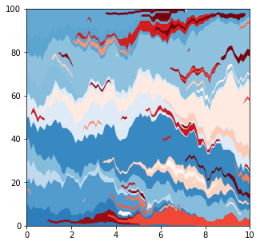
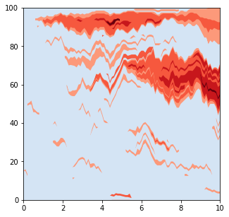
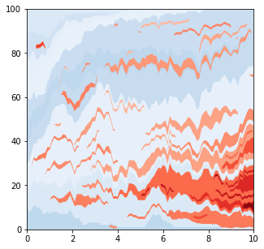
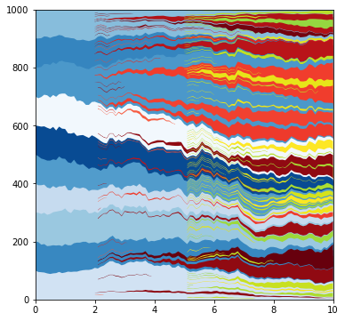
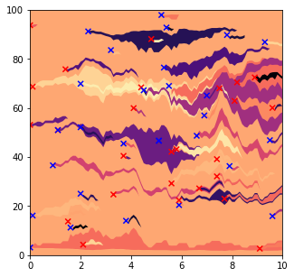

# Colours

This guide explains how to specify the colours used in the Muller plots and animations.  

The colours can be based on the clone fitness, any labels or genes mutated, 
whether the clone existed at the start of the simulation, and whether the mutation is non-syonymous or synonymous. 


```python
import numpy as np
from clone_competition_simulation import Parameters, ColourScale, get_CS_random_colours_from_colourmap
from clone_competition_simulation import Gene, MutationGenerator, FixedValue
import matplotlib.cm as cm
from matplotlib.colors import Normalize
from collections import namedtuple
```

## Random colours

The default colour scale applies a random colour to each clone (from the matplotlib colormap gist_ncar), 
regardless of any properties of that clone.  


```python
import numpy as np
import matplotlib.pyplot as plt
from clone_competition_simulation import (
    Parameters, 
    TimeParameters, 
    PopulationParameters, 
    FitnessParameters, 
    NormalDist,
    Gene, 
    MutationGenerator
)

mut_gen = MutationGenerator(
    genes=[Gene(name="Gene1", mutation_distribution=NormalDist(0.1), synonymous_proportion=0.5)],
)

np.random.seed(4)
p = Parameters(
    algorithm='Moran',
    times=TimeParameters(max_time=10, division_rate=1), 
    population=PopulationParameters(initial_cells=100),
    fitness=FitnessParameters(mutation_rates=0.05, mutation_generator=mut_gen)
)
s = p.get_simulator()
s.run_sim()
s.muller_plot(figsize=(5, 5))
plt.show()
```


-------

To use random colours from a different colourmap, but still ignore any clone properties, 
you can use the `get_CS_random_colours_from_colourmap` function.


```python
import matplotlib.cm as cm
from clone_competition_simulation import PlottingParameters, get_CS_random_colours_from_colourmap

# Plot using the viridis colormap
np.random.seed(4)
p = Parameters(
    algorithm='Moran',
    times=TimeParameters(max_time=10, division_rate=1), 
    population=PopulationParameters(initial_cells=100),
    fitness=FitnessParameters(mutation_rates=0.05, mutation_generator=mut_gen), 
    plotting=PlottingParameters(colourscales=get_CS_random_colours_from_colourmap(cm.viridis))
)
s = p.get_simulator()
s.run_sim()
s.muller_plot(figsize=(5, 5))
plt.show()
```


## Colour based on clone properties

For assigning colours that depend on the clone properties you can use the ColourScales class.  

This can specify different colormaps based on any combination of the following clone properties:

- 'label' - any label applied to a clone
- 'ns' - whether the last mutation is synonymous or non-synonymous
- 'initial'  - whether the clone existed at the start of the simulation
- 'last_mutated_gene'  - the gene the last mutation was in
- 'genes_mutated'  - based on the combination of mutations in the clone
- fitness. This is treated a bit differently.  

------
A colourscale where the fitter clones are darker red:  

```python
from clone_competition_simulation import ColourScale, FixedValue
# Set up a colourscale where the fitter clones are darker red.  
cs0 = ColourScale(
    colourmaps=cm.Reds,
    use_fitness=True
)

# Set up some mutations that will increase fitness
mut_gen = MutationGenerator(
    genes=[Gene(name='Gene1', mutation_distribution=FixedValue(1.05), synonymous_proportion=0)]
)
np.random.seed(0)
p = Parameters(
    algorithm='Moran',
    times=TimeParameters(max_time=10, division_rate=1), 
    population=PopulationParameters(initial_cells=1000),
    fitness=FitnessParameters(mutation_rates=0.2, mutation_generator=mut_gen), 
    plotting=PlottingParameters(colourscales=cs0)
)
s = p.get_simulator()
s.run_sim()
s.muller_plot(figsize=(5, 5), show_mutations_with_x=False)
plt.show()
```


    
-----
A colourscale where the initial clones are blue, and subsequent mutations are red
Within those colours, the clones will be assigned random shades

```python
from collections import namedtuple

# First, define a namedtuple for the key
Key1 = namedtuple('key1', ['initial', ])

# Then define the colourscale with the colormaps used for each possible value of the key
cs1 = ColourScale(
    colourmaps={
        Key1(initial=True): cm.Blues,  # Initial clones are blue
        Key1(initial=False): cm.Reds   # Later clones are red
    }
)

mut_gen = MutationGenerator(
    genes=[Gene(name="Gene1", mutation_distribution=NormalDist(0.1), synonymous_proportion=0.5)],
)

np.random.seed(0)
p = Parameters(
    algorithm='Moran', 
    times=TimeParameters(max_time=10, division_rate=1), 
    population=PopulationParameters(initial_size_array=np.full(10, 10)),   # 10 initial clones
    fitness=FitnessParameters(mutation_rates=0.05, mutation_generator=mut_gen), 
    plotting=PlottingParameters(colourscales=cs1)
)
s = p.get_simulator()
s.run_sim()
s.muller_plot(figsize=(5, 5), show_mutations_with_x=False)
plt.show()
```
    


-------

Similar to above, a colourscale where the initial clones are blue, and subsequent mutations are red. 
But this time the colours also depend on the clone fitness (instead of picking random colours).

```python
# First, define a namedtuple for the key
Key1 = namedtuple('key1', ['initial', ])

# Then define the colourscale with the colormaps used for each possible value of the key
cs1 = ColourScale(
    colourmaps={
        Key1(initial=True): cm.Blues,  # Initial clones are blue
        Key1(initial=False): cm.Reds   # Later clones are red
    }, 
    use_fitness=True
)

mut_gen = MutationGenerator(genes=[Gene(name='Gene1', mutation_distribution=FixedValue(1.1), synonymous_proportion=0)])
np.random.seed(0)
p = Parameters(
    algorithm='Moran',
    times=TimeParameters(max_time=10, division_rate=1), 
    population=PopulationParameters(initial_size_array=np.full(10, 10)), 
    fitness=FitnessParameters(mutation_rates=0.05, mutation_generator=mut_gen), 
    plotting=PlottingParameters(colourscales=cs1)
)
s = p.get_simulator()
s.run_sim()
s.muller_plot(figsize=(5, 5), show_mutations_with_x=False)
plt.show()
```
    


-------
To depend on fitness, but also a little random noise (to distinguish clones with identical fitness), 
Use all_clones_noisy=True

```python
# First, define a namedtuple for the key
Key1 = namedtuple('key1', ['initial', ])

# Then define the colourscale with the colormaps used for each possible value of the key
cs1 = ColourScale(
    all_clones_noisy=True,
    colourmaps={
        Key1(initial=True): cm.Blues,  # Initial clones are blue
        Key1(initial=False): cm.Reds   # Later clones are red
    }, 
    use_fitness=True
)

mut_gen = MutationGenerator(genes=[Gene(name='Gene1', mutation_distribution=FixedValue(1.1), synonymous_proportion=0)])
np.random.seed(1)
p = Parameters(
    algorithm='Moran',
    times=TimeParameters(max_time=10, division_rate=1), 
    population=PopulationParameters(initial_size_array=np.full(10, 10)), 
    fitness=FitnessParameters(mutation_rates=0.05, mutation_generator=mut_gen), 
    plotting=PlottingParameters(colourscales=cs1)
)
s = p.get_simulator()
s.run_sim()
s.muller_plot(figsize=(5, 5), show_mutations_with_x=False)
plt.show()
```
    


---------

A more complex colourscale.   
Initial clones are blue, cells with label 1 are red, cells with label 2 are yellow/green


```python
from matplotlib.colors import Normalize
from clone_competition_simulation import LabelParameters

# First, define a namedtuple for the key
Key2 = namedtuple('key1', ['initial', 'label' ])

# Then define the colourscale with the colormaps used for each possible value of the key
cs2 = ColourScale(
    colourmaps={
        Key2(initial=True, label=0): cm.Blues,  # Initial clones are blue
        
        # Label 1 clones are red. This scales the map so the values used (between 0 and 1) are all brighter reds
        Key2(initial=False, label=1): cm.ScalarMappable(norm=Normalize(vmin=-1, vmax=1), cmap=cm.Reds).to_rgba, 
        
        # Label 2 clones are yellow/green. Scaling the viridis colourmap to use those colours
        Key2(initial=False, label=2): cm.ScalarMappable(norm=Normalize(vmin=-5, vmax=1), cmap=cm.viridis).to_rgba 
    }
)

mut_gen = MutationGenerator(genes=[])

np.random.seed(0)
p = Parameters(
    algorithm='Moran', 
    times=TimeParameters(max_time=10, division_rate=1), 
    population=PopulationParameters(initial_size_array=np.full(10, 100)), 
    fitness=FitnessParameters(mutation_rates=0, mutation_generator=mut_gen),
    labels=LabelParameters(
        label_times=[2, 5], 
        label_frequencies=[0.05, 0.1],
        label_values=[1, 2], 
        label_fitness=[1.5, 1.5],
    ),
    plotting=PlottingParameters(colourscales=cs2)
)
s = p.get_simulator()
s.run_sim()
s.muller_plot(figsize=(6, 6), show_mutations_with_x=False)
plt.show()
```
    


--------

Colouring based on the combination of genes mutated in the clone

```python
# Define two genes
mut_gen = MutationGenerator(
    genes=[
        Gene(name='Gene1', mutation_distribution=FixedValue(1.1), synonymous_proportion=0),
        Gene(name='Gene2', mutation_distribution=FixedValue(1.2), synonymous_proportion=0)
    ], 
    multi_gene_array=True   # This must be set to True
)

# Define the key
Key3 = namedtuple('key1', ['genes_mutated',])

# Then define the colourscale with the colormaps used for each possible value of the key
cs3 = ColourScale(
    colourmaps={
        # No genes mutated, light blue colour
        Key3(genes_mutated=(0,)): cm.ScalarMappable(norm=Normalize(vmin=0, vmax=2), cmap=cm.Blues).to_rgba,  
        
        # First gene mutated, dark Red
        Key3(genes_mutated=(0, 1,)): cm.ScalarMappable(norm=Normalize(vmin=-2, vmax=1), cmap=cm.Reds).to_rgba, 
        
        # Second gene mutated, yellow
        Key3(genes_mutated=(0, 2,)): cm.ScalarMappable(norm=Normalize(vmin=-20, vmax=2), cmap=cm.inferno).to_rgba,
        
        # Both genes mutated, purple
        Key3(genes_mutated=(0, 1, 2)): cm.ScalarMappable(norm=Normalize(vmin=-5, vmax=1), cmap=cm.Purples).to_rgba
    }
)

np.random.seed(0)
p = Parameters(
    algorithm='Moran', 
    times=TimeParameters(max_time=10, division_rate=1), 
    population=PopulationParameters(initial_size_array=np.full(10, 20)), 
    fitness=FitnessParameters(mutation_rates=0.05, mutation_generator=mut_gen),
    plotting=PlottingParameters(colourscales=cs3)
)
s = p.get_simulator()
s.run_sim()
s.muller_plot(figsize=(6, 6), show_mutations_with_x=False)
plt.show()
```
    

    


# Changing colours

If you change your mind about the colours or forget to define the colours when setting up the Parameters, 
you can change them after the simulation has run.  


```python
# Run with a viridis colourmap

mut_gen = MutationGenerator(
    genes=[Gene(name="Gene1", mutation_distribution=NormalDist(0.1), synonymous_proportion=0.5)],
)

np.random.seed(4)
p = Parameters(
    algorithm='Moran', 
    times=TimeParameters(max_time=10, division_rate=1), 
    population=PopulationParameters(initial_cells=100), 
    fitness=FitnessParameters(mutation_rates=0.05, mutation_generator=mut_gen),
    plotting=PlottingParameters(colourscales=get_CS_random_colours_from_colourmap(cm.viridis))
)
s = p.get_simulator()
s.run_sim()
s.muller_plot(figsize=(5, 5))
plt.show()
```
    


-------
Change to a magma colourmap by using `set_colourscale`.  This will regenerate all of the clone colours

```python
s.set_colourscale(get_CS_random_colours_from_colourmap(cm.magma))
s.muller_plot(figsize=(5, 5))
plt.show()
```
    

    

