# Plot and Animation Colours

This guide explains how to specify the colours used in the Muller plots and animations.  

The colours can be based on the clone fitness, any labels or genes mutated, 
whether the clone existed at the start of the simulation, and whether the mutation is non-syonymous or synonymous. 

The colours are set by defining list of rules and colour maps. If clone matches a rule, it is assigned a colour from the associated colour map. 

## Default Colours

The default colour scale applies a random colour to every clone (from the matplotlib colormap gist_ncar), regardless of any properties of that clone.  


```python
import matplotlib.pyplot as plt
from clone_competition_simulation import (
    Parameters, 
    TimeParameters, 
    PopulationParameters, 
    FitnessParameters, 
    NormalDist,
    Gene, 
    FitnessCalculator
)

mut_gen = FitnessCalculator(
    genes=[Gene(name="Gene1", mutation_distribution=NormalDist(0.1), synonymous_proportion=0.5)],
)

p = Parameters(
    algorithm='Moran',
    times=TimeParameters(max_time=10, division_rate=1), 
    population=PopulationParameters(initial_cells=100),
    fitness=FitnessParameters(mutation_rates=0.05, mutation_generator=mut_gen)
)
s = p.get_simulator()
s.run_sim()
s.muller_plot(figsize=(5, 5))
plt.show()
```

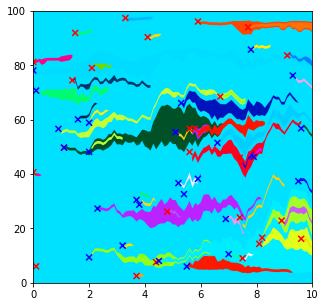


## Setting a single colour map for all clones
 
If you want all clones to be given colours from the same colourmap (but not the default one), you need to define a rule that selects all clones, and associate that 
rule with the colourmap you want to use. 

`ColourRule` is the class used to link a rule with a colourmap. 

```python
import matplotlib.pyplot as plt
import matplotlib.cm as cm
from clone_competition_simulation import (
    Parameters, 
    TimeParameters, 
    PopulationParameters, 
    FitnessParameters, 
    NormalDist,
    Gene, 
    FitnessCalculator, 
    PlottingParameters, 
    ColourRule, 
    PlotColourMaps
)

# Define the colour map. 
# We will see later how to assign different colour maps to different clones.
colour_rule = ColourRule(
    colourmap=cm.viridis
)
# And create a PlotColourMaps object using the colour rule
plot_colour_maps = PlotColourMaps(colour_rules=[colour_rule])

mut_gen = FitnessCalculator(
    genes=[Gene(name="Gene1", mutation_distribution=NormalDist(0.1), synonymous_proportion=0.5)],
)
# Plot using the viridis colormap
p = Parameters(
    algorithm='Moran',
    times=TimeParameters(max_time=10, division_rate=1), 
    population=PopulationParameters(initial_cells=100),
    fitness=FitnessParameters(mutation_rates=0.05, mutation_generator=mut_gen), 
    plotting=PlottingParameters(plot_colour_maps=plot_colour_maps)
)
s = p.get_simulator()
s.run_sim()
s.muller_plot(figsize=(5, 5))
plt.show()
```

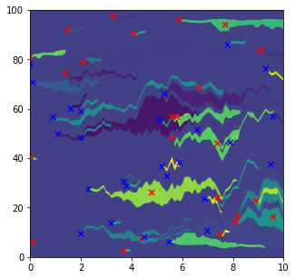


## Colour based on clone fitness

The previous examples assigned each clone a random colour. We can instead use the clone fitness to select the colour. 

Here, fitter clones will be darker red

```python
import matplotlib.pyplot as plt
import matplotlib.cm as cm
from clone_competition_simulation import (
    Parameters, 
    TimeParameters, 
    PopulationParameters, 
    FitnessParameters, 
    NormalDist,
    Gene, 
    FitnessCalculator, 
    PlottingParameters, 
    ColourRule, 
    PlotColourMaps
)

# Define the colour map. 
# We will see later how to assign different colour maps to different clones.
colour_rule = ColourRule(
    colourmap=cm.Reds
)
# And create a PlotColourMaps object using the colour rule
plot_colour_maps = PlotColourMaps(
    colour_rules=[colour_rule], 
    use_fitness=True
)

mut_gen = FitnessCalculator(
    genes=[Gene(name="Gene1", mutation_distribution=NormalDist(0.1), synonymous_proportion=0.5)],
)
# Plot using the viridis colormap
p = Parameters(
    algorithm='Moran',
    times=TimeParameters(max_time=10, division_rate=1), 
    population=PopulationParameters(initial_cells=100),
    fitness=FitnessParameters(mutation_rates=0.05, mutation_generator=mut_gen), 
    plotting=PlottingParameters(plot_colour_maps=plot_colour_maps)
)
s = p.get_simulator()
s.run_sim()
s.muller_plot(figsize=(5, 5))
plt.show()
```

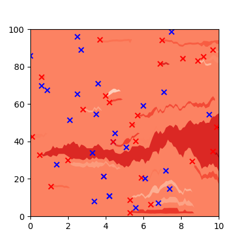


### Adding some random noise

You may notice in the above plot that you can't see any of the neutral clones (which should follow from the blue Xs). Because these neutral mutations do not alter fitness, they will be shown as the same colour as the parent clone.

You can add a small amount of random noise so that clones with identical fitness are shown with slighty different colours. 

To do this, set `all_clones_noisy=True` when setting up the `PlotColourMaps` object:

```python
plot_colour_maps = PlotColourMaps(
    colour_rules=[colour_rule], 
    use_fitness=True, 
    all_clones_noisy=True
)
```

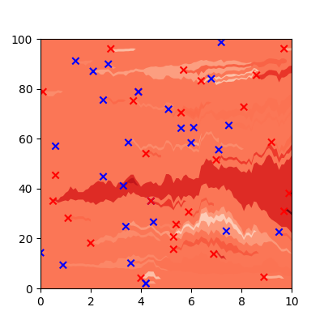

----

By default the random noise is drawn from a uniform distribution between -0.1 and 0.1. This might not give enough (or give too much) constrast between clones. To change the distribution of the random noise, you can set the `random_noise_fn` with a function that takes no arguments and returns a float. 

E.g. 
```python
def my_noise():
    return np.random.normal(scale=0.3)

plot_colour_maps = PlotColourMaps(
    colour_rules=[colour_rule], 
    use_fitness=True, 
    all_clones_noisy=True, 
    random_noise_fn=my_noise
)
```

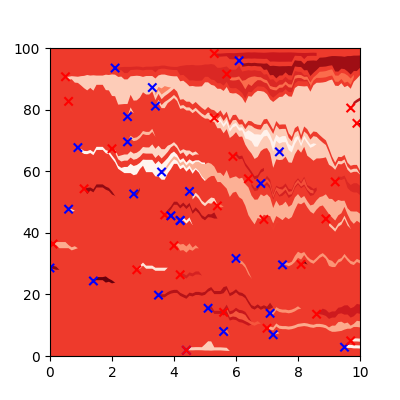

Of course, the more random noise you add, the more unreliable the relationship between colour and fitness. 


## Colour based on clone properties

For assigning colours that depend on the clone properties (other than fitness) you can use multiple ColourRules. Each will match a subset of the clones and assign different colours to them.   

This can select clone subsets based on any combination of the following clone properties:

- 'label' - any label applied to a clone. Will be a single integer. 
- 'ns' - whether the last mutation is synonymous or non-synonymous. A boolean. 
- 'initial' - whether the clone existed at the start of the simulation. A boolean. 
- 'last_mutated_gene' - the gene the last mutation was in. The name of the gene (string). 
- 'genes_mutated' - based on the combination of mutations in the clone. A set of gene names (set/iterable of strings). 

Any clones that are not included in any of the subsets will be given a beige colour from the default "background" colour map.

To define these rules, we need to import a couple of new classes:

- `CloneFeature` - an enum with all the allowed features
- `FeatureValue` - links a feature with the value of that feature being selected

-----

A colourscale where the clones born from mutations are blue. Any other clones (i.e) 
the initial clones, will be given a beige colour from the default background colour map. 

```python
import numpy as np
import matplotlib.pyplot as plt
import matplotlib.cm as cm
from clone_competition_simulation import (
    Parameters, 
    TimeParameters, 
    PopulationParameters, 
    FitnessParameters, 
    NormalDist,
    Gene, 
    FitnessCalculator, 
    PlottingParameters, 
    ColourRule, 
    PlotColourMaps, 
    FeatureValue, 
    CloneFeature
)

# Define the rule that selects mutant clones and gives them a blue colour
colour_rule = ColourRule(
    rule_filter=[  # Define the rule(s) for this clone subset
        FeatureValue(  # This defines a feature and a value
            clone_feature=CloneFeature.INITIAL,   # Whether the clones are initial or not
            value=False  # Here we select the clones that are not initial, i.e. are born from mutations
        )
    ], 
    colourmap=cm.Blues  # Assign a colour map for this clone subset
)

# Then define the Plot colours. We are not setting use_fitess=True, so clones will # be given a random colour from the assigned colourmap
plot_colour_maps = PlotColourMaps(
    colour_rules=[colour_rule], 
)

mut_gen = FitnessCalculator(
    genes=[Gene(name="Gene1", mutation_distribution=NormalDist(0.1), synonymous_proportion=0.5)],
)

np.random.seed(0)
p = Parameters(
    algorithm='Moran', 
    times=TimeParameters(max_time=10, division_rate=1), 
    population=PopulationParameters(initial_size_array=np.full(10, 10)),   # 10 initial clones
    fitness=FitnessParameters(mutation_rates=0.05, mutation_generator=mut_gen), 
    plotting=PlottingParameters(plot_colour_maps=plot_colour_maps)
)
s = p.get_simulator()
s.run_sim()
s.muller_plot(figsize=(5, 5), show_mutations_with_x=False)
plt.show()
```
    
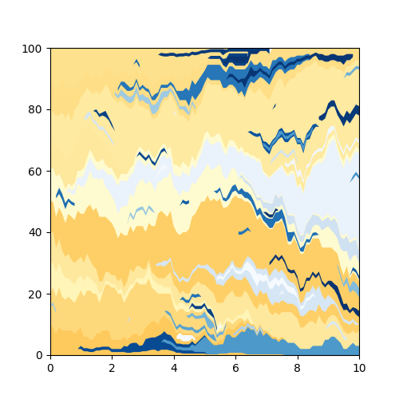


-------

We can use more than one rule. This is same as before, but we define the colour map for the initial clones too. 
Using the same code as above, apart from:

```python
# Define the rule that selects mutant clones and gives them a blue colour
colour_rule1 = ColourRule(
    rule_filter=[  # Define the rule(s) for this clone subset
        FeatureValue(  # This defines a feature and a value
            clone_feature=CloneFeature.INITIAL,   # Whether the clones are initial or not
            value=False  # Here we select the clones that are not initial, i.e. are born from mutations
        )
    ], 
    colourmap=cm.Blues  # Assign a colour map for this clone subset
)
# And now also select non-mutant (initial) clones and given them a red colour
colour_rule2 = ColourRule(
    rule_filter=[  # Define the rule(s) for this clone subset
        FeatureValue(  # This defines a feature and a value
            clone_feature=CloneFeature.INITIAL,   # Whether the clones are initial or not
            value=True  # Here we select the clones that *are* initial
        )
    ], 
    colourmap=cm.Reds  # Assign a colour map for this clone subset
)

# Then define the Plot colours. We are not setting use_fitess=True, so clones will # be given a random colour from the assigned colourmap
plot_colour_maps = PlotColourMaps(
    colour_rules=[colour_rule1, colour_rule2], 
)
```

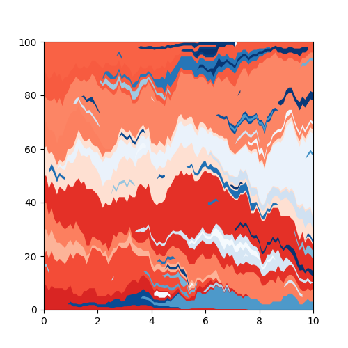


-------

The clone subsets selected by the rules are allowed to overlap. In these cases, the colour for a clone will come from the *first matching rule*.  

Running the same example as above, we can assign a rule for mutant clones and then a rule for all clones. In practice, this rule for all clones actually means "all clones that are not selected by previous rules".  

```python
# Define the rule that selects mutant clones and gives them a blue colour
colour_rule1 = ColourRule(
    rule_filter=[  # Define the rule(s) for this clone subset
        FeatureValue(  # This defines a feature and a value
            clone_feature=CloneFeature.INITIAL,   # Whether the clones are initial or not
            value=False  # Here we select the clones that are not initial, i.e. are born from mutations
        )
    ], 
    colourmap=cm.Blues  # Assign a colour map for this clone subset
)
# And now select all (remaining) clones
colour_rule2 = ColourRule(
    # Do not assign a rule_filter to include all clones 
    colourmap=cm.Reds  # Assign a colour map for this clone subset
)

plot_colour_maps = PlotColourMaps(
    colour_rules=[colour_rule1, colour_rule2], 
)
```


We get the same colours as before. 

-------

Colours can be based on clone features and on fitness. This is the same as above, but the colours within each subset are based on the clone fitness. 

All we need to change from the code above is setting `use_fitness=True`

```python
plot_colour_maps = PlotColourMaps(
    colour_rules=[colour_rule1, colour_rule2], 
    use_fitness=True
)
```
    
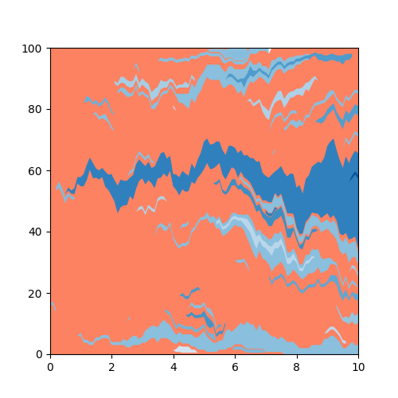


If desired, we could add random noise to these colours, as shown above. 

---------

A more complex colourscale.   
Initial clones are blue, cells with label 1 are red, cells with label 2 are yellow/green


```python
from matplotlib.colors import Normalize
from clone_competition_simulation import LabelParameters, FitnessParameters, FitnessCalculator

# Define the list of rules
rules = [
    ColourRule(  # Initial clones are blue
        rule_filter=[ 
                FeatureValue(  
                    clone_feature=CloneFeature.INITIAL,   
                    value=True  
            )
        ], 
        colourmap=cm.Blues 
    ), 
    ColourRule(  # Label 1 clones are red
        rule_filter=[ 
                FeatureValue(  
                    clone_feature=CloneFeature.LABEL,   
                    value=1
            )
        ], 
        # This scales the map so the values used (between 0 and 1) are all brighter reds
        colourmap=cm.ScalarMappable(norm=Normalize(vmin=-1, vmax=1), cmap=cm.Reds).to_rgba
    ), 
    ColourRule(  # Label 2 clones are yellow/green
        rule_filter=[
                FeatureValue(  
                    clone_feature=CloneFeature.LABEL,   
                    value=2
            )
        ], 
        # Scaling the viridis colourmap to use yellow/green colours
        colourmap=cm.ScalarMappable(norm=Normalize(vmin=-5, vmax=1), cmap=cm.viridis).to_rgba
    )
]

plot_colour_maps = PlotColourMaps(
    colour_rules=rules
)

np.random.seed(0)
p = Parameters(
    algorithm='Moran', 
    times=TimeParameters(max_time=10, division_rate=1), 
    population=PopulationParameters(initial_size_array=np.full(10, 100)), 
    labels=LabelParameters(
        label_times=[2, 5], 
        label_frequencies=[0.05, 0.1],
        label_values=[1, 2], 
        label_fitness=[1.5, 1.5],
    ),
    # We are combining label fitness, so need to supply a FitnessCalculator which defines how the fitnesses will be combined.
    fitness=FitnessParameters(mutation_generator=FitnessCalculator(genes=[])),   
    plotting=PlottingParameters(plot_colour_maps=plot_colour_maps)
)
s = p.get_simulator()
s.run_sim()
s.muller_plot(figsize=(6, 6), show_mutations_with_x=False)
plt.show()
```
    
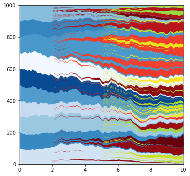

--------

Colouring based on the combination of genes mutated in the clone. 

```python
# Define two genes
mut_gen = FitnessCalculator(
    genes=[
        Gene(name='Gene1', mutation_distribution=FixedValue(1.1), synonymous_proportion=0),
        Gene(name='Gene2', mutation_distribution=FixedValue(1.2), synonymous_proportion=0)
    ], 
    multi_gene_array=True   # This must be set to True
)

rules = [
    ColourRule(  # No genes mutated, light blue colour
        rule_filter=[ 
                FeatureValue(  
                    clone_feature=CloneFeature.GENES_MUTATED,   
                    value=set()  # Empty set for "no genes mutated"
            )
        ], 
        colourmap=cm.ScalarMappable(norm=Normalize(vmin=0, vmax=2), cmap=cm.Blues).to_rgba
    ), 
    ColourRule(  # First gene mutated, dark Red
        rule_filter=[ 
                FeatureValue(  
                    clone_feature=CloneFeature.GENES_MUTATED,   
                    value="Gene1"   # This will not match clones if other genes are mutated too! 
            )
        ], 
        colourmap=cm.ScalarMappable(norm=Normalize(vmin=-2, vmax=1), cmap=cm.Reds).to_rgba,
    ),
    ColourRule(  # Second gene mutated, yellow
        rule_filter=[ 
                FeatureValue(  
                    clone_feature=CloneFeature.GENES_MUTATED,   
                    value="Gene2"
            )
        ], 
        colourmap=cm.ScalarMappable(norm=Normalize(vmin=-20, vmax=2), cmap=cm.inferno).to_rgba,
    ), 
    ColourRule(  # Both genes mutated, purple
        rule_filter=[ 
                FeatureValue(  
                    clone_feature=CloneFeature.GENES_MUTATED,   
                    value={"Gene1", "Gene2"}  # This will match clones with both Gene1 and Gene2 mutated
            )
        ], 
        colourmap=cm.ScalarMappable(norm=Normalize(vmin=-5, vmax=1), cmap=cm.Purples).to_rgba
    )
]


plot_colour_maps = PlotColourMaps(
    colour_rules=rules
)

np.random.seed(0)
p = Parameters(
    algorithm='Moran', 
    times=TimeParameters(max_time=10, division_rate=1), 
    population=PopulationParameters(initial_size_array=np.full(10, 20)), 
    fitness=FitnessParameters(mutation_rates=0.05, mutation_generator=mut_gen),
    plotting=PlottingParameters(plot_colour_maps=plot_colour_maps)
)
s = p.get_simulator()
s.run_sim()
s.muller_plot(figsize=(6, 6), show_mutations_with_x=False)
plt.show()
```
    
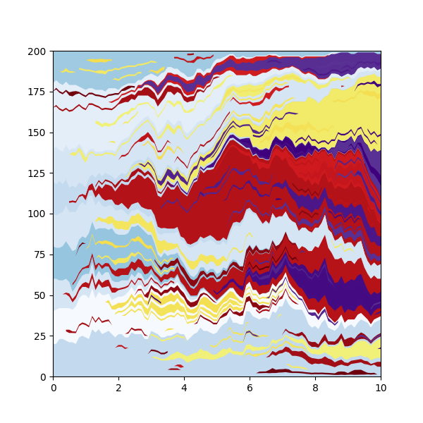
    

## Filtering on multiple features

So far, each rule has just involved a single feature, but rules can combine filters for multiple gene features.  

For example, here we colour clones based on the label and the last gene mutated.

```python
# Define the genes
mut_gen = FitnessCalculator(
    genes=[
        Gene(name='Gene1', mutation_distribution=FixedValue(1.1), synonymous_proportion=0),
        Gene(name='Gene2', mutation_distribution=FixedValue(1.2), synonymous_proportion=0)
    ], 
    multi_gene_array=True   # This must be set to True
)

# Define the list of rules
rules = [
    ColourRule(  # Clones with label 0 and last mutated with Gene1 are Blue
        rule_filter=[ 
            FeatureValue(  
                clone_feature=CloneFeature.LAST_MUTATED_GENE,   
                value="Gene1"  
            ), 
            FeatureValue(  
                clone_feature=CloneFeature.LABEL,   
                value=0
            )
        ], 
        colourmap=cm.Blues 
    ), 
    ColourRule(  # Clones with label 1 and last mutated with Gene2 are Red
        rule_filter=[ 
            FeatureValue(  
                clone_feature=CloneFeature.LAST_MUTATED_GENE,   
                value="Gene2"    
            ),
            FeatureValue(  
                clone_feature=CloneFeature.LABEL,   
                value=1
            )
        ], 
        colourmap=cm.Reds,
    ),
    ColourRule(  # Other clones with label 0 are white
        rule_filter=[
            FeatureValue(  
                clone_feature=CloneFeature.LABEL,   
                value=0
            )
        ], 
        # Any function that returns a valid colour can be used for the colourmap:
        colourmap=lambda x: "#FFFFFF"  
    ), 
    ColourRule(  # Other clones with label 1 are grey
        rule_filter=[
            FeatureValue(  
                clone_feature=CloneFeature.LABEL,   
                value=1
            )
        ], 
        colourmap=cm.Greys
    )
]

plot_colour_maps = PlotColourMaps(
    colour_rules=rules
)

np.random.seed(0)
p = Parameters(
    algorithm='Moran', 
    times=TimeParameters(max_time=10, division_rate=1), 
    population=PopulationParameters(initial_size_array=[500, 500]), 
    labels=LabelParameters(
        initial_label_array=[0, 1]  # Apply some labels
    ),
    fitness=FitnessParameters(mutation_rates=0.05, mutation_generator=mut_gen),
    plotting=PlottingParameters(plot_colour_maps=plot_colour_maps)
)
s = p.get_simulator()
s.run_sim()
s.muller_plot(figsize=(6, 6), show_mutations_with_x=False)
plt.show()
```

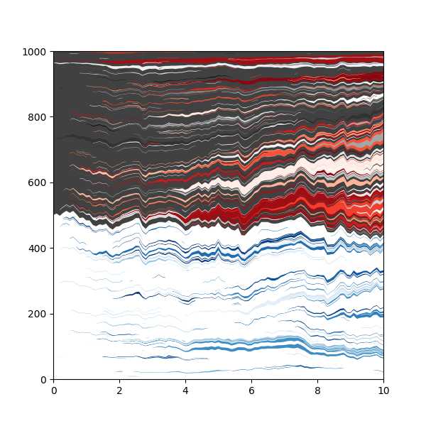

# Changing colours

If you change your mind about the colours or forget to define the colours when setting up the Parameters, you can change them after the simulation has run.  


```python
from clone_competition_simulation import NormalDist

# Run without setting a colour map. It will use the default one (random colours)

mut_gen = FitnessCalculator(
    genes=[Gene(name="Gene1", mutation_distribution=NormalDist(0.1), synonymous_proportion=0.5)],
)

np.random.seed(4)
p = Parameters(
    algorithm='Moran', 
    times=TimeParameters(max_time=10, division_rate=1), 
    population=PopulationParameters(initial_cells=100), 
    fitness=FitnessParameters(mutation_rates=0.05, mutation_generator=mut_gen),
)
s = p.get_simulator()
s.run_sim()
s.muller_plot(figsize=(5, 5))
plt.show()
```
    
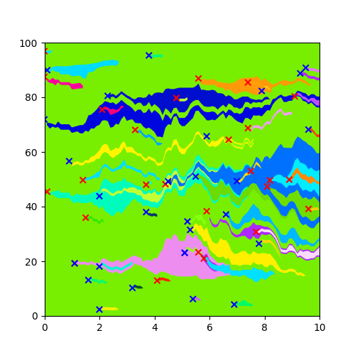

-------
Change to a magma colourmap by using `set_colour_maps`.  This will regenerate all of the clone colours

```python
new_colour_maps = PlotColourMaps(
    colour_rules=[
        ColourRule(
            colourmap=cm.magma,
        )
    ]
)

s.set_colour_maps(new_colour_maps)
s.muller_plot(figsize=(5, 5))
plt.show()
```
    
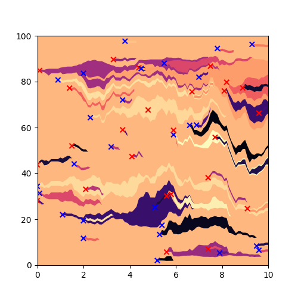
    

