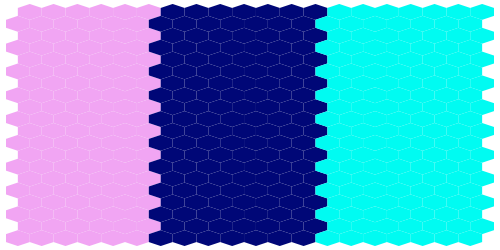
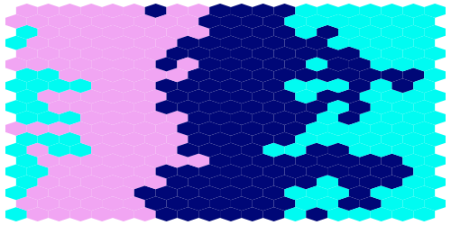

# Custom Rules

This guide explains how to customise the rules of clones competition within the frameworks of the main simulation algorithms. It also describes some of the inner workings of the algorithms, which may be useful when writing custom rules. 

There are 5 algorithms that can be run as a default: 

 - Moran
 - Moran 2D
 - Wright-Fisher
 - Wright-Fisher 2D
 - Branching

Each of these algorithms contain functions which determine how clone fitness controls cell fate, and therefore how clone sizes change in each step of the simulation.  

Variations of these algorithms can be made by creating subclasses and overwriting a few key functions (which vary by algorithm).  

In general, custom cell competition rules can be implemented as follows:

```python

# Define the custom class
class MyCustomAlgorithm([Inherit from an existing simulation class]): 

    # Customise the init function if any additional data or objects need to be 
    # accessed by the custom functions
    def __init__(self, parameters: Parameters, 
                # ...any additional arguments needed for the custom code
                ):
        super().__init__(parameters)
        # add any attributes here as needed


    # Customise some class methods. 
    # These vary depending on which type of algorithm is being customised. See below. 


# Run the custom simulation

# Define the simulation parameters, same as usual
params = Parameters(
    algorithm="Whichever algorithm type was inherited from", 
    ...
)
# Instead of running params.get_simulator() to create the simulation object, 
# pass the parameters to your custom class along with any extra arguments.
sim = MyCustomAlgorithm(parameters=params)

# Then run the simulation as normal. 
sim.run_sim()
```

## Custom Moran (non-spatial) simulations

At every step in Moran algorithms (`Moran` and `Moran2D`), one cell is removed (it differentiates/dies) and another cell duplicates (it divides). 
There are two functions that can be overwriten to customise the algorithm: `get_differentiating_cell` and `get_dividing_cell`. 

The input to these functions is `current_data`, a `NonSpatialCurrentData` object. 
This represents the current cell population in a simulation and is an object with two attributes:

- `current_data.current_population` is a 1D array of integers. It is the cell count for all non-extinct clones.  
- `current_data.non_zero_clones` is also a 1D array of integers. It is the clone ids of the non-extinct clones.  

For example, if clones with ids 1, 3 and 5 have 10, 20 and 30 cells respectively, and all other clones have zero cells, then `current_data.current_population = [10, 20, 30]` and `current_data.non_zero_clones = [1, 3, 5]`.   

Both functions also have access to [any attributes of the simulation object](#other-potential-input-data), like the clone fitness. 

### get_differentiating_cell

This function selects the clone which will lose a cell. It returns the index of the clone *relative to other surviving clones*. So if only clones 3, 5 and 8 are alive at the current time, and clone 8 is selected, then the function should return 2, i.e. the index of 8 in the list of clones [3, 5, 8]. 

### get_dividing_cell

This function selects the clone that will gain a cell. Same as `get_differentiating_cell`, it returns the index of the clone *relative to other surviving clones*. So if only clones 3, 5 and 8 are alive at the current time, and clone 8 is selected, then the function should return 2, i.e. the index of 8 in the list of clones [3, 5, 8]. 

### Custom Moran example

Here is an example where the dividing cell will always come from the non-extinct clone with the highest id, and the dying cell will always come from the non-extinct clone with the lowest id. 

```python
from clone_competition_simulation import (
    Moran, 
    NonSpatialCurrentData, 
    Parameters, 
    TimeParameters, 
    PopulationParameters
)


class MyCustomMoran(Moran):  # Inherit from the Moran class
    """Custom rule: Always take from the lowest id clone and add to the highest"""

    def get_dividing_cell(self, current_data: NonSpatialCurrentData) -> int:
        """
        This function determines which clone will divide.  

        This should return the index of the clone that will divide.  
        NOTE: this is *not* the clone_id, this is the index of the 
         clone in the current_data.current_population array.
        """
        # Select the last clone in the current_population array
        return len(current_data.current_population) - 1
    
    def get_differentiating_cell(self, current_data: NonSpatialCurrentData) -> int:
        """
        This function determines which cell will die.  

        This should return the index of the clone that will lose a cell.  
        NOTE: this is *not* the clone_id, this is the index of the 
         clone in the current_data.current_population array.
        """
        # Select the first clone in the current_population array
        return 0
        
# Set up the parameters as if you are running a normal Moran simulation
params = Parameters(
    algorithm="Moran", 
    times=TimeParameters(max_time=1, division_rate=1, samples=6), 
    population=PopulationParameters(initial_size_array=np.ones(5, dtype=int))
)
# Instead of running params.get_simulator() to create the simulation object, pass the parameters to your custom class.
sim = MyCustomMoran(parameters=params)

# Then continue as normal. 
sim.run_sim()

# View the clone population over time
print(sim.population_array.toarray())
```
    array([[1., 0., 0., 0., 0., 0.],
          [1., 1., 0., 0., 0., 0.],
          [1., 1., 1., 0., 0., 0.],
          [1., 1., 1., 1., 0., 0.],
          [1., 2., 3., 4., 5., 5.]])


Here, the last clone grows, while the other clones die off in order. 


## Custom Moran2D simulations

Just like the non-spatial `Moran` simulations, at each step in a `Moran2D` simulation one cell dies and one cell survives. To customise how those cells are selected, the functions `get_differentiating_cell` and `get_dividing_cell` can be overwritten. However, the input and output of these functions is different to the `Moran` simulation because the competition occurs on a 2D grid of cells. 

### 2D grid representations

The current state of the cells in the grid is tracked by a `SpatialCurrentData` object. This has one attribute:

- `current_data.grid_array` is a 1D array of integers representing the 2D grid. Each index in the 1D array maps to a particular cell in the 2D grid. 

For example, for a 2x2 grid containing the cells from clones 1, 2, 3 and 4, in this hexagonal layout:

```
   / \ / \  
  | 1 | 2 |
   \ / \ / \
    | 3 | 4 |
     \ / \ /
```

`current_data.grid_array = [1, 2, 3, 4]`, with the first two values representing the top row, and the next two values representing the next row.  

Normally the cell competition in the 2D simulations is based on immediate cell neighbours. Since the grid layout is rigid, all the indices for the cell neighbourhoods can be calculated just once, at the start of the simulation.   
This is available through `self.neighbour_map`. 

To get the neighbours for a particular (1D) position index, use `self.neighour_map[idx]`. This will return a 1D array of the indices of the 6 or 7 neighbouring cells (7 if the central cell is included in the neighbourhood).  
To get the neighbour coords for multiple positions at once (useful for the Wright-Fisher 2D algorithm), use `self.neighour_map[idxs]`, which will return a 2D array, with each row containing the neighbour coords for each input position.   

### get_differentiating_cell

This function returns the coordinate (in the 1D array representation) of the cell that will die at this step. 

By default, every cell has an equal chance of dying. To implement this efficiently, the coordinates of the dying cells are all random selected at the start of the simulation in the init line `self.death_coords = np.random.randint(0, self.total_pop, size=self.parameters.times.simulation_steps)`. 

The `get_differentiating_cell` function is passed the current simulation step count (`i`) and the current_data, and returns the coordinate of the dying cell (from `self.death_coords`).

To change the rules for dying, you could either: 

- overwrite the calculation of `self.death_coords` in the init function of the custom class, if the dying cell does not depend on the current simulation state. 
- overwrite `get_differentiating_cell` 

### get_dividing_cell

This function gets given the coordinate of the dying cell and the `current_data`, and returns the clone id of the cell that will divide. Unlike in the non-spatial `Moran` simulations, here `get_dividing_cell`returns the clone id directly, instead of the index of the clone relative to only surviving clones. So if clone 8 is selected to divide, then the function should return 8, regardless of any other surviving clones.

By default, the dividing cell is selected from the cells in the neighbourhood of the dying cell, with the division chance in proportion to the cell fitness.  


### Custom Moran2D example

Here is an example where the dividing cell will always come from the non-extinct clone with the highest id in the neighbourhood, and the cells will die in order of grid position. 

```python
from clone_competition_simulation import (
    Moran2D, 
    SpatialCurrentData, 
    Parameters,
    TimeParameters,
    PopulationParameters
)


class MyCustomMoran2D(Moran2D):
    """Cells die in grid position order, and the highest number clone will divide"""

    def __init__(self, parameters: Parameters):
        super().__init__(parameters)

        # We could replace the death coordinates here if they do not depend on 
        # the current state of the simulation (other than the simulation step)
        # self.death_coords = ...

    def get_differentiating_cell(self, i: int, current_data: SpatialCurrentData) -> int:
        """
        If the dying cell depends on the current state of the simulation, 
        this function needs to be overwritten
        Needs to return coordinate of the dying cell.
        """
        coord = i % self.total_pop  # The dying cell goes in order across the grid
        
        return  coord

    def get_dividing_cell(self, coord: int, current_data: SpatialCurrentData) -> int:
        """
        This function determines which clone will divide and should return the clone_id.

        For this custom class, it will return the highest clone id in the neighbourhood.
        """
        # get the clone ids in the neighbourhood using the grid array and the neighbour map
        neighbour_clones = current_data.grid_array[self.neighbour_map[coord]]

        # Select the highest clone in the neighbourhood
        return neighbour_clones.max()
    
    
# Set up the parameters as if you are running a normal Moran2D simulation
params = Parameters(
    algorithm="Moran2D", 
    times=TimeParameters(max_time=1, division_rate=1, samples=16), 
    population=PopulationParameters(initial_grid=np.arange(16).reshape(4, 4), cell_in_own_neighbourhood=False)
)
# Instead of running params.get_simulator() to create the simulation object, 
# pass the parameters to your custom class.
sim = MyCustomMoran2D(parameters=params)

# Then continue as normal. 
sim.run_sim()

# View the grids over time
print(sim.grid_results[0])
print(sim.grid_results[1])
print(sim.grid_results[5])
```
    array([[ 0,  1,  2,  3],
           [ 4,  5,  6,  7],
           [ 8,  9, 10, 11],
           [12, 13, 14, 15]])


    array([[15,  1,  2,  3],
           [ 4,  5,  6,  7],
           [ 8,  9, 10, 11],
           [12, 13, 14, 15]])

    array([[15, 15, 15, 15],
           [15,  5,  6,  7],
           [ 8,  9, 10, 11],
           [12, 13, 14, 15]])


The cells are replaced from the top left onwards, with the largest clone id (15 for all of these neighbourhoods) dividing into the position of the dying cell. 


## Custom Wright-Fisher simulations

Each step in the Wright-Fisher algorithms (`WF` and `WF2D`) replaces the entire cell population to produce a new cell generation. 
It therefore has just one function to overwrite: `get_next_generation`.  

This function input is the current cell count of each suriving clone (in the same format as for the [non-spatial Moran simulations](#custom-moran-non-spatial-simulations)), and returns an array of updated cell counts for those clones. Cell counts can drop to zero (and will be tidied up after this function), but new clones should not be added here - mutations are added prior to this function. 

### Custom Wright-Fisher example

An example where at each generation, the surviving clone with the lowest id loses all cells and the clone with the highest id gains the same number of cells. 

```python
from clone_competition_simulation import (
    WF, 
    NonSpatialCurrentData, 
    Parameters,
    TimeParameters,
    PopulationParameters
)


class MyCustomWF(WF):
    """Always take from the lowest id clone and add to the highest"""

    def get_next_generation(self, current_data: NonSpatialCurrentData) -> np.ndarray[tuple[int], np.dtype[np.int_]]:
        """This function should return the cell counts for the new generation of clones

        Args:
            current_data (NonSpatialCurrentData): Current clone cell counts (an array of clone sizes and an array of clone ids)

        Returns:
            np.ndarray[tuple[int], np.dtype[np.int_]]: The new clone cell counts (for the same clone ids as the current_data input)
        """

        # Kill off the first clone and add the cells to the last
        input_clone_counts = current_data.current_population

        output_clone_counts = input_clone_counts.copy()
        # Take the first surviving clone cells and add to the last clone
        output_clone_counts[-1] += output_clone_counts[0]
        output_clone_counts[0] = 0
        return output_clone_counts
    

# Set up the parameters as if for a normal Wright-Fisher simulation
params = Parameters(
    algorithm="WF", 
    times=TimeParameters(max_time=4, division_rate=1, samples=6), 
    population=PopulationParameters(initial_size_array=np.array([1, 2, 3, 4, 1]))
)
# Pass the parameters to the custom class
sim = MyCustomWF(parameters=params)
# Run the sim as normal
sim.run_sim()

# We can see the last clone takes the cells from the other clones, one clone at each step
print(sim.population_array.toarray())
```
    array([[1, 0, 0, 0, 0], 
          [2, 2, 0, 0, 0], 
          [3, 3, 3, 0, 0], 
          [4, 4, 4, 4, 0], 
          [1, 2, 4, 7, 11]])


## Custom Wright-Fisher2D simulations

Like the non-spatial Wright-Fisher simulations, this just has the one function (`get_next_generation`) to overwrite. But the current clone data is stored in the same 
format as for the [Moran2D](#2d-grid-representations) simulations. 

The function `get_next_generation` is given the clone id of every cell in the grid as part of `current_data`, and returns a new grid array. The new grid should only contain clones that existed in the input grid (mutations are added prior to this function). 


### Custom Wright-Fisher 2D example

In this example we just rotate the cells around the grid. 

```python
from clone_competition_simulation import (
    WF2D, 
    SpatialCurrentData, 
    Parameters,
    TimeParameters,
    PopulationParameters
)

class MyCustomWF2D(WF2D):
        """All cells just rotate along the grid by one position each step"""

    def get_next_generation(self, current_data: SpatialCurrentData) -> np.ndarray[tuple[int], np.dtype[np.int_]]:
        """This function needs to return the new grid (in a 1D array representing the 2D grid).  
        Each value in the array is the clone id of the cell in that location. 

        Here we move each cell along one position in the grid
        :return:
        """
        # Get the grid array from the last generation
        current_grid_array = current_data.grid_array

        # Create the new grid array and return it
        new_grid_array = np.concat([current_grid_array[-1:], current_grid_array[:-1]])

        return new_grid_array
        
# Set up the parameters as if for a normal WF2D simulation.
params = Parameters(
    algorithm="WF2D", 
    times=TimeParameters(max_time=3, division_rate=1, samples=4), 
    population=PopulationParameters(initial_grid=np.arange(4).reshape(2, 2), cell_in_own_neighbourhood=False)
)

# Pass the parameters to the custom class
sim = MyCustomWF2D(parameters=params)

# Run the simulation as normal
sim.run_sim()

# View the grids over time. We can see the clone ids are rotating.
print(sim.grid_results[0])
print(sim.grid_results[1])
print(sim.grid_results[2])
print(sim.grid_results[3])
```
    array([[ 0,  1],
           [2,  3]])

    array([[ 3,  0],
           [1,  2]])

    array([[ 2,  3],
           [0,  1]])

    array([[ 1,  2],
           [3,  0]])


## Custom Branching simulations

This algorithm works in an very different way to the other algorithms. Each clone and cell is simulated independently. At each step there is a decision as to whether the cell will divide or die. 

To change the rule, overwrite the function `does_cell_divide`, which takes the clone id as input, and returns True if the cell will divide and False if the cell will die. 

### Custom Branching example

```python
from clone_competition_simulation import (
    Branching, 
    Parameters,
    TimeParameters,
    PopulationParameters
)

class MyCustomBranching(Branching):
        """The cell division probability depends on the clone id"""

    def does_cell_divide(self, clone_id: int) -> bool:
        # If the clone id is larger than 3 it divides, otherwise it dies
        return clone_id > 3
        
# Set up the parameters for a normal Branching simulation
params = Parameters(
    algorithm="Branching", 
    times=TimeParameters(max_time=3, division_rate=1, samples=4), 
    population=PopulationParameters(initial_size_array=np.array([5, 4, 3, 2, 1]))
)

# Pass the parameters to the custom class
sim = MyCustomBranching(parameters=params)

# And run the simulation as normal
sim.run_sim()

print(sim.population_array.toarray())
```
    array([[5, 1, 0, 0, 0], 
          [4, 2, 1, 1, 0], 
          [3, 1, 0, 0, 0], 
          [2, 1, 1, 0, 0], 
          [1, 7, 26, 141, 629]])


All cells in the first 4 clones die (any surviving cells just haven't reached a death/division event yet), and the last always divides. 


## Other potential input data

As well as the current clone ids of all cells in the population, other data in the simulation may be relevant to the clonal competition and can be accessed in the simulation functions through `self`.

### Clone array

The simulation stores information about the clones in `self.clones_array`.  
This is an array with one row per clone and the following columns:

- id. The id of the clone. 
- label. An inheritable label for the clone (set up using `LabelParameters`). E.g. GFP. 
- fitness. The fitness of the clone. This can change over time depending on any treatments. 
- generation born. The index of the sample point the clone first appeared in. 
- parent id. The id of the parent clone. 
- gene mutated id. If there are multiple genes in the FitnessCalculator, this records the index of the gene 
  mutated to create this new clone. 

The array indices are recorded in the simulation class and can be accessed using `self.id_idx`, `self.label_idx`, 
`self.fitness_idx`, `self.generation_born_idx`, `self.parent_idx`, and `self.gene_mutated_idx` respectively.  

For example, if you have an array of clone ids and want an array of the fitness of those clones, use 

`clone_fitnesses = self.clones_array[clone_ids, self.fitness_idx]`

### Raw fitness array

The fitness value recorded in `self.clones_array` is the overall fitness calculated from all mutations and any epistatic effects. 
If you are using multiple genes, you can see the breakdown of individual fitmess effects conveyed by mutations and epistatics in 
`self.raw_fitness_array`. This can be useful if your competition rules do not just depend on the relative fitness of cells. 

`self.raw_fitness_array` has one row per clone, and a variable number of columns, depending on the number of genes and epistatic effects.  

For a set of N genes and M epistatic effects, the columns are:
 
- First column (0) is for the initial fitness of clones. This will be 1 unless otherwise specified in the Parameters.   

- Columns 1 to N. One column for the fitness effect of mutations in each gene. NaN if the gene is not mutated in this clone.   

- Columns N+1 to N+M+1. One column for each epistatic combination. NaN if the epistatic is not in effect on this clone.  

To get the raw fitness values for an array of clone ids, use:

`clones_raw_fitness = self.raw_fitness_array[clone_ids_array]`


## More complex 2D example

This example has paper-scissors-rock style competition between cells. 

It passes a new object during the simulation initialisation, and makes use of the 
grid neighbours. 

```python

# Define the competition rules that we will apply at each step. 
class CompetitionRules:
    """
    These are rules for how clones change the fitness of other clones in their vicinity. 
    The interaction_effects are a list of (clone A, clone B, fitness multiplier) tuples. 
    If cells from clone A and clone B are both present in a cell neighbourhood, then the 
    fitness of clone B will be multiplied by the fitness multiplier. 
    """

    def __init__(self, interaction_effects: list[tuple[int, int, float]]):
        self.interaction_effects = interaction_effects

    @staticmethod
    def apply_interaction_effect(clone_a: int, clone_b: int, multiplier: float,
                                    neighbour_clones: np.ndarray[tuple[int], np.dtype[np.int_]], 
                                    weights: np.ndarray[tuple[int], np.dtype[np.float64]]) \
                                    -> None:
        """If the two clones both exist in the same neighbourhood, alter the fitness of the cells in the second clone
        by updating the weights array. 

        If cells from clone a and clone b are both in the neighbourhood, multiply the fitness of the clone b cells by 
        the multiplier. 

        Returns:
            None
        """
        if clone_a in neighbour_clones and clone_b in neighbour_clones:
            # Alter the fitness of the cells from clone_b
            np.multiply(weights, multiplier, where=(neighbour_clones == clone_b), out=weights)

    def select_dividing_cell(self, neighbour_clones: np.ndarray[tuple[int], np.dtype[np.int_]], 
                                weights: np.ndarray[tuple[int], np.dtype[np.float64]]) -> int:
        """Apply any custom rules to the input weights

        Args:
            neighbour_clones (np.ndarray[tuple[int], np.dtype[np.int_]]): The clone ids in the cell neighbourhood.
            weights (np.ndarray[tuple[int], np.dtype[np.int_]]): The fitness of the cells (prior to these rules). 
                This array will be overwritten, so make sure it is a copy, not a view of the original fitness values. 

        Returns:
            int: The clone id of the cell that will divide
        """
        if len(np.unique(neighbour_clones)) == 1:
            # Only one clone in the neighbourhood, so a cell from that clone must divide. We can skip the calculations
            return neighbour_clones[0]
        
        # Update the cell fitness based on the clones in the neighbourhood
        for clone_a, clone_b, multiplier in self.interaction_effects:
            self.apply_interaction_effect(clone_a, clone_b, multiplier, 
                                            neighbour_clones, weights)
            
        # Calculate the relative fitness of the cells
        weights_sum = weights.sum()
        rel_weights = weights / weights_sum

        # Randomly select a neighbour, with the probabilities weighted by the relative fitness
        selected_clone = neighbour_clones[np.random.multinomial(1, rel_weights).argmax()]
        return selected_clone
        
    
# Create a custom algorithm class using those rules
class MyCustomMoran2D(Moran2D):

    # Overwrite the init function to include our new rules
    def __init__(self, parameters: Parameters, custom_rules: CompetitionRules):
        super().__init__(parameters)
        self.custom_rules = custom_rules 

    def get_dividing_cell(self, coord: int, current_data: SpatialCurrentData) -> int:
        """
        This function determines which clone will divide.  
        We will use our custom rules class. 

        """
        # get the clone ids in the neighbourhood using the grid array and the neighbour map
        neighbour_clones = current_data.grid_array[self.neighbour_map[coord]]
        # Get the fitness of those cells (prior to the custom rules being applied)
        weights = self.clones_array[neighbour_clones, self.fitness_idx].copy()

        # Use the custom rules to select the dividing cell
        return self.custom_rules.select_dividing_cell(neighbour_clones=neighbour_clones, weights=weights)
    
# Set up parameters as usual for a Moran2D simulation
params = Parameters(
    algorithm="Moran2D", 
    times=TimeParameters(max_time=5, division_rate=1), 
    population=PopulationParameters(
        # We will have 3 different clones, with ids 0, 1 and 2
        initial_grid=np.concatenate([np.zeros(shape=120, dtype=int), 
                                        np.ones(shape=140, dtype=int), 
                                        np.full(shape=140, fill_value=2)]).reshape(20, 20),
        cell_in_own_neighbourhood=False
    ), 
)

# Define the rules object
# 0 beats 1, 1 beats 2, 2 beats 0
custom_rules = CompetitionRules(
    interaction_effects=[
        (0, 1, 0.25),  # The presence of clone 0 will quarter the fitness of clone 1
        (1, 2, 0.25),  # The presence of clone 1 will quarter the fitness of clone 2
        (2, 0, 0.25),  # The presence of clone 2 will quarter the fitness of clone 0
    ]
)

# Initialise the custom algorithm class
sim = MyCustomMoran2D(parameters=params, custom_rules=custom_rules)

# Run the simulation as usual
sim.run_sim()
```

We can see the clones move across the grid, as clone 0 out competes clone 1, clone 1 out competes clone 2, 
and clone 2 out competes clone 0. 

Start:  


T=2:  

