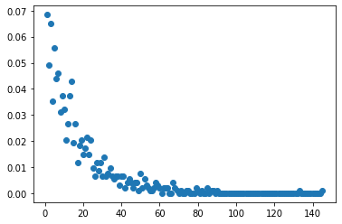
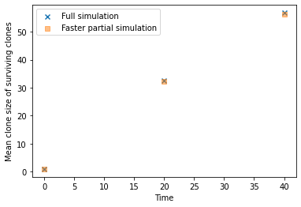

# Differentiated Cells

In the single progenitor model from Clayton et al, there are two types of basal cells: progenitor cells and differentiated cells.  
The differentiated cells no longer divide, and are just temporarily in the basal layer until they stratify into the suprabasal layers.   
The total clone size distribution (including both progenitor and differentiated cells) can be approximated by scaling 
the progenitor-only clone sizes.   

Most of the simulations run by this software can be thought of as either:

- ignoring the differentiated cells (and the full clone sizes can be obtained by scaling)
- or can be considered as a simulation of the whole of the basal layer, but with less control over the relative rates 
 of division and stratification.   

There is also an option in the Branching, Moran and Moran2D simulations to explicitly simulate the number of differentiated cells. 
It is important to note though that the differentiated cells do not in any way affect the behaviour of the progenitor 
cells. They have no physical position on the 2D grids for example.   


There are two new parameters to define to simulate the differentiated cells: `r` and `gamma`.  

`r` is the proportion of cell divisions that are symmetrical, i.e. that produce either two progenitor cells or two 
differentiated cells. The simulations of differentiated cells essentially 

- track the differentiated cells produced by the symmetric differentiation divisions
- additionally simulate the asymmetric divisions (that produce one progenitor and one differentiated cell).

`gamma` is the stratification rate of the differentiated cells.  

All simulations start with proliferative cells only. 

Not all features/plots are adapted to include the differentiated cells.   

If in doubt, you can calculate the results you need from the sim.population_array (which contains the proliferative cell counts) 
and the sim.diff_cell_population array (which contains the differentiated cell counts). 

-------
To explicitly simulate the differentiated cells, define the `r` and `gamma` parameters

```python
import numpy as np
from clone_competition_simulation import Parameters, TimeParameters, PopulationParameters, DifferentiatedCellsParameters

np.random.seed(0)
p = Parameters(
    algorithm='Moran',
    times=TimeParameters(max_time=10, division_rate=1),
    population=PopulationParameters(initial_size_array=np.ones(5000)),
    differentiated_cells=DifferentiatedCellsParameters(r=0.15, gamma=3)
)
s = p.get_simulator()
s.run_sim()
```

The clone sizes are stored in two arrays, one for the progenitor cells (same as before), 
and one for the differentiated cells

These two sparse matrices hold the cell numbers. 
They have the same dimensions, and can be added to get the total basal clone sizes. 

```python
print(s.population_array, s.diff_cell_population) 
```

    (<5000x101 sparse matrix of type '<class 'numpy.float64'>'
     	with 122355 stored elements in List of Lists format>,
     <5000x101 sparse matrix of type '<class 'numpy.float64'>'
     	with 136369 stored elements in List of Lists format>)

-------
For example, to get the clone sizes for clone_id=4 over time, use row 4 of the arrays.  

```python
a_cells = s.population_array[4].toarray().astype(int)[0]
b_cells = s.diff_cell_population[4].toarray().astype(int)[0]
total_cells = a_cells + b_cells

# Show the clone size (proliferative only, differentiated only, and total) at the first few sample times
print('Proliferative cells :', a_cells[:8])
print('Differentiated cells:', b_cells[:8])
print('Total cells         :', total_cells[:8])
```

    Proliferative cells : [1 1 2 2 2 2 4 5]
    Differentiated cells: [0 0 1 2 2 2 1 1]
    Total cells         : [1 1 3 4 4 4 5 6]

------

You can get the non-mutant clone size distributions (lineage tracing-style) for the clones with and without the 
differentiated cells using the include_diff_cells option.  


```python
csd_without_diff_cells = s.get_clone_size_distribution_for_non_mutation(include_diff_cells=False, t=2)
csd_with_diff_cells = s.get_clone_size_distribution_for_non_mutation(include_diff_cells=True, t=2)
print(csd_without_diff_cells)
print(csd_with_diff_cells)
```


    [3308  564  376  254  177  107   76   47   36   14   17    8    6    3
     2    2    0    2    0    1]
    [2725  393  244  227  202  165  127  119  126   86   86   73   55   45
     52   36   37   32   17   23   18   16   13    9    8    6    9   10
     7    5    3    3    4    2    3    1    3    0    3    0    0    1
     0    0    1    0    0    0    1    0    0    0    0    0    2    0
     0    0    0    0    0    1    0    0    0    1]


-------
There is also an `include_diff_cells` option in some of the plotting functions

```python
import matplotlib.pyplot as plt
s.plot_mean_clone_size_graph_for_non_mutation(include_diff_cells=False, show_spm_fit=False, 
                                              legend_label='Progenitor only')
s.plot_mean_clone_size_graph_for_non_mutation(include_diff_cells=True, show_spm_fit=False, ax=plt.gca(), 
                                             legend_label='Progenitor + differentiated')
plt.legend()
plt.show()
```


```python
s.plot_clone_size_distribution_for_non_mutation(include_diff_cells=True, t=5)
plt.show()
```
    


-------
Same goes for simulations with ongoing mutations.  

```python
from clone_competition_simulation import (
    FitnessParameters, 
    Gene, 
    MutationGenerator, 
    NormalDist
)

mutation_generator = MutationGenerator(
    genes=[Gene(name="Gene1", mutation_distribution=NormalDist(mean=1.1, var=0.1), 
                synonymous_proportion=0.5)]
)

np.random.seed(0)
p = Parameters(
    algorithm='Moran', 
    times=TimeParameters(max_time=10, division_rate=1),
    population=PopulationParameters(initial_cells=5000),
    fitness=FitnessParameters(mutation_rates=0.01, mutation_generator=mutation_generator),
    differentiated_cells=DifferentiatedCellsParameters(r=0.15, gamma=3)
)
s = p.get_simulator()
s.run_sim()

# Get the mutant clone sizes
print(s.get_mutant_clone_sizes(include_diff_cells=True, t=3, non_zero_only=True))
# Or the distribution of clone sizes (np.bincount)
print(s.get_mutant_clone_size_distribution(include_diff_cells=True, t=3))
```

    [21  1  3 11  1  3 23  1  4  2 17  3  1  8  1  8 10 13 18 35  2  4  5  3
     2  1  1 16 12 11  8  4  3  3  2  9  2  1  3  1 37  3  1  6  5  6 12  8
     3  8  4 13 10  3  2  4  6  2 10  1  8  3  5  2  1  1  1  1  2  1  2  3
     1  1  1  3  1  2  1  1  1  1  1]
    [402  25  11  13   5   3   3   0   6   1   3   2   2   2   0   0   1   1
     1   0   0   1   0   1   0   0   0   0   0   0   0   0   0   0   0   1
     0   1]


## Speeding up simulations

The creation and death/stratification of many differentiated cells have to simulated.  
For simulations with long gaps between sampling points, many of the differentiated cells may be born and die without 
being 'observed' at a sampling point. Since the differentiated cells in the simulations have no affect on any other cells, 
this means the 'unobserved' differentiated cells use computational resources but have no impact on the results at all.   

It is possible to skip the simulation of the differentiated cells that are born a long time before the next sampling 
point and are very likely to die without being recorded. In some cases, this can substantially reduce the simulation time.  

The stratification times are drawn from an exponential distribution, meaning there is no upper limit and we cannot 
guarantee that a cell won't survive until the next sampling point unless we simulate it (draw that random stratification
time). Instead, we can set the probability that the simulated differentiated cells will be observed. This means that 
cells with, say, a greater than 99.9% chance of dying before the next sampling point will not be simulated. 
This may lead to a very slight underestimate of the clone sizes.

------
Time a simulation with no differentiated cells simulated. 
Only record clone sizes at a couple of widely spaced time points. 

```python
import time
np.random.seed(0)
start_time = time.time()
p = Parameters(
    algorithm='Moran2D',
    times=TimeParameters(times=[0, 20, 40], division_rate=1),
    population=PopulationParameters(initial_grid=np.arange(10000).reshape(100, 100), cell_in_own_neighbourhood=False),
)
s = p.get_simulator()
s.run_sim()
end_time = time.time()

print(f'Total time: {end_time - start_time} s')
```

    Total time: 1.8447387218475342 s

------

Now adding differentiated cells. This takes quite a bit longer because of all the extra differentiated cells that 
need to be simulated

```python
np.random.seed(0)
start_time = time.time()
p = Parameters(
    algorithm='Moran2D',
    times=TimeParameters(times=[0, 20, 40], division_rate=1),
    population=PopulationParameters(initial_grid=np.arange(10000).reshape(100, 100), cell_in_own_neighbourhood=False),
    differentiated_cells=DifferentiatedCellsParameters(r=0.15, gamma=3)
)
s = p.get_simulator()
s.run_sim()
end_time = time.time()

print(f'Total time: {end_time - start_time} s')
```

    Total time: 14.19722580909729 s

--------
This time we only simulate the differentiated cells with a 99.9% chance of being 'observed' 
This substantially speeds up the simulation.  

```python
np.random.seed(0)
start_time = time.time()
p = Parameters(
    algorithm='Moran2D',
    times=TimeParameters(times=[0, 20, 40], division_rate=1),
    population=PopulationParameters(initial_grid=np.arange(10000).reshape(100, 100), cell_in_own_neighbourhood=False),
    differentiated_cells=DifferentiatedCellsParameters(
        r=0.15, gamma=3, 
        stratification_sim_percentile=0.999   # This means simulating diff cells with a 99.9% chance of being observed
    )
)
s2 = p.get_simulator()
s2.run_sim()
end_time = time.time()

print(f'Total time: {end_time - start_time} s')
```

    Total time: 2.7063920497894287 s

------
The partial simulation of differentiated cells is far faster, and still quite similar to the full simulation
(stochasticity also causes some differences here)

```python
s.plot_mean_clone_size_graph_for_non_mutation(include_diff_cells=True, show_spm_fit=False, 
                                              legend_label='Full simulation', 
                                              plot_kwargs={'marker': 'x'})
s2.plot_mean_clone_size_graph_for_non_mutation(include_diff_cells=True, ax=plt.gca(), show_spm_fit=False, 
                                              legend_label='Faster partial simulation', 
                                              plot_kwargs={'marker': 's', 'alpha': 0.5})
plt.legend()
plt.show()
```


    
