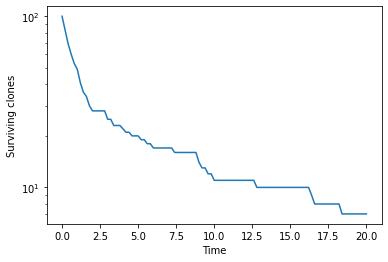
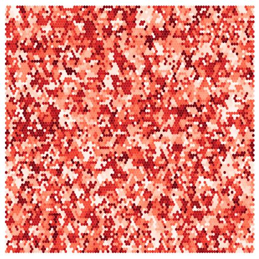
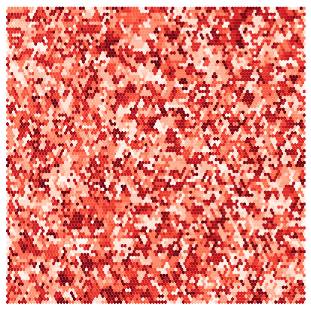
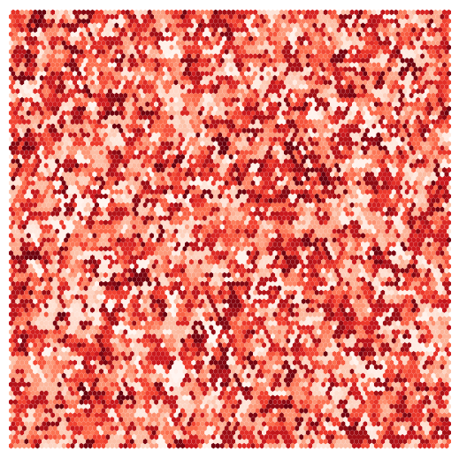
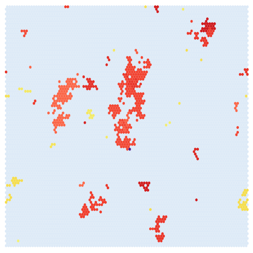

# Early Stopping Conditions

Sometimes you may be interested in how long it takes until a certain event occurs, e.g. the first time a certain 
combination of mutations appears in the same cell. In these cases, it can be a waste of computational resources to 
continue running the simulation after this event has occurred.  

Early stopping cannot be used with the branching algorithm or in simulations with differentiated cells.  

This guide describes how to define early stopping conditions for simulations.  


Note:  
Many of the results arrays are left empty or full of zeros at the times that have not been simulated.  
Be careful not to analyse the simulations after the point they have stopped and to ensure that the empty/zeroed parts 
of the arrays are not accidentally included in the analysis.   

--------

To use the early stopping feature, you need to pass a function to the `end_condition_function` argument of the 
Parameters class.   

This function must take a simulation as the only argument. If the function determines the stop condition has been met, 
then the function should raise an `EndConditionError`.  

The functions to use will depend on the project and will likely have to be written yourself.   
Here I'll demonstrate the use of these functions with a few examples.  

## Example 1: Surviving clone numbers


First, here is a simulation without a stopping condition, run to the end. 
Run a simulation of neutral competition, starting from 100 single-cell clones

```python
import numpy as np
from clone_competition_simulation import Parameters, TimeParameters, PopulationParameters
import matplotlib.pyplot as plt


np.random.seed(1)
p = Parameters(
    algorithm='Moran',
    times=TimeParameters(max_time=20, division_rate=1),
    population=PopulationParameters(initial_size_array=np.ones(100)),
    progress=100, 
)
s = p.get_simulator()
s.run_sim()
s.plot_surviving_clones_for_non_mutation()
plt.show()
```
    Steps completed:
    100, 200, 300, 400, 500, 600, 700, 800, 900, 1000, 1100, 1200, 1300, 1400, 1500, 1600, 1700, 1800, 1900, 2000, Finished 2000 steps
 


------

Now we add a stopping condition to that simulation.   
Say we want to stop where there are only 10 surviving clones left.  

```python
from clone_competition_simulation import EndConditionError

# Define the stopping condition function. 
# This should raise the EndConditionError is the stopping condition is met.
def stop_when_10_clones_left(sim):
    """
    Stop the simulations when there are only 10 suriviving clones.  
    """
    # Get the slice of the population_array at the current time
    # plot_idx is the *next* column index of the population array, 
    # so plot_idx-1 holds the latest index 
    current_clones = sim.population_array[:, sim.plot_idx-1]
    
    # Count the number of clones with at least one cell alive
    num_surviving = (current_clones > 0).sum()
    
    if num_surviving <= 10:  # If ten or fewer clones left, stop the simulation. 
        # If you want to save some feature of the simulation for later access, you can assign it to 
        # the sim.stop_condition_result attribute
        # Here we'll record the number of clones at the point the simulation stopped
        sim.stop_condition_result = num_surviving
        raise EndConditionError()
        
        
# Run a simulation of neutral competition, starting from 100 single-cell clones
np.random.seed(1)
p = Parameters(
    algorithm='Moran',
    times=TimeParameters(max_time=20, division_rate=1),
    population=PopulationParameters(initial_size_array=np.ones(100)),
    progress=100, 
    end_condition_function=stop_when_10_clones_left  # Pass the stop function in
)
s = p.get_simulator()
s.run_sim()
```
    0 mutations to add
    Steps completed:
    100, 200, 300, 400, 500, 600, 700, 800, 900, 1000, 1100, 1200, 

The simulation has stopped early. 

```python
s.plot_surviving_clones_for_non_mutation()
plt.show()
```


Note the surviving clones drops to zero after the simulation is stopped. 
Make sure not to analyse after the stopping point

You can check the time the simulation stopped:
```python
print(f"Stopping time: {s.stop_time}")
```
    Stopping time: 12.8

And you can access the `stop_condition_result`, if used
```python
print(f"Number of clones at stopping time: {s.stop_condition_result}")
```
    Number of clones at stopping time: 10


## Example 2: Sweeping clone

A similar example to above. 

Simulations to see how long mutants take to entirely cover a tissue.    

If the simulation time is fixed, then we risk either stopping the simulation before the mutants fully sweep the tissue 
or needlessly continuing the simulation for a long time after the sweep has occurred.   

Instead, we can use the early stopping conditions to halt the simulation as soon as there are no wild type cells left. 

-----

```python

from collections import namedtuple
import matplotlib.cm as cm
from matplotlib.colors import Normalize
from clone_competition_simulation import ColourScale

# I'll set up a colour scale here to plot the wild type (initial clones) and mutant clones in different colours
# See the Colours guide for an explanation

Key1 = namedtuple('key1', ['initial', ])

cs1 = ColourScale(
    colourmaps={
        Key1(initial=True): cm.Blues,  # Initial clones are blue
        Key1(initial=False): cm.Reds   # Later clones are red
    }, 
    use_fitness=False
)

```

Run a simulation with ongoing mutation. 

```python
from clone_competition_simulation import FitnessParameters, MutationGenerator, Gene, NormalDist, PlottingParameters

mutation_generator = MutationGenerator(
    genes=[Gene(name="Gene1", mutation_distribution=NormalDist(mean=1.1, var=0.1), 
                synonymous_proportion=0.5)]
)

np.random.seed(0)
p = Parameters(
    algorithm='Moran2D',
    times=TimeParameters(
        max_time=50,  # Run up to time 50.
        division_rate=1
    ),
    population=PopulationParameters(initial_cells=10000, cell_in_own_neighbourhood=False),
    fitness=FitnessParameters(
        mutation_generator=mutation_generator, 
        mutation_rates=0.2
    ),
    plotting=PlottingParameters(colourscales=cs1),
    progress=100000
)
s = p.get_simulator()
s.run_sim()
```

    100184 mutations to add
    Steps completed:
    100000, 200000, 300000, 400000, 500000, Finished 500000 steps

-----
At the end of the simulation, t=50, there are no wild type (blue) cells left in the grid.  

```python
s.plot_grid(figsize=(5, 5))
plt.show()
```
    


------
But at t=40, there were also no wild type cells left in the grid. 
We didn't have to run the simulation for so long.  

```python
s.plot_grid(figsize=(5, 5), t=40)
plt.show()
```



------

Define the end condition function to stop when the grid is fully mutant

```python
def stop_when_fully_mutant(sim):
    """
    Stops the simulation when the entire tissue is mutant.
    """
    # The initial clones are at the top of the population array
    # For this simulation, there is a single initial clone, and it is the first row of the array
    WT_pop = sim.population_array[0, sim.plot_idx-1]
    if WT_pop == 0:
        raise EndConditionError()
        
        
# Run again with the stop condition.  
np.random.seed(0)
p = Parameters(
    algorithm='Moran2D', 
    times=TimeParameters(
        max_time=50,  # Run up to time 50.
        division_rate=1
    ),
    population=PopulationParameters(initial_cells=10000, cell_in_own_neighbourhood=False),
    fitness=FitnessParameters(
        mutation_generator=mutation_generator, 
        mutation_rates=0.2
    ),
    plotting=PlottingParameters(colourscales=cs1),
    end_condition_function=stop_when_fully_mutant,
    progress=100000
)
s = p.get_simulator()
s.run_sim()
# Print the time the simulation stopped
print(f"\nEnd time: {s.stop_time}")
```

    100184 mutations to add
    Steps completed:
    100000, 200000, 300000, 
    End time: 33.5


At the last recorded time point, there are no wild type cells left. 
```python
# This function will by default show the last recorded grid, even if the simulation stopped before max_time
s.plot_grid(figsize=(5, 5))
plt.show()
```



-------
At the previous time point (we select the second last grid produced during the simulation),
you can see there is a single wild type cell left in this grid (if you look closely)

```python

s.plot_grid(figsize=(5, 5), t=-2, index_given=True)
plt.show()
```
    


## Example 3: double mutants

Say we have two genes. We are interested in how long it takes until the first occurrence of a double mutant cell.   

-----
Set up the genes
Use a multi_gene_array=True so we can easily tell which genes are mutated in which clones. 
```python
mut_gen = MutationGenerator(
    genes=[
        Gene(name='Gene1', mutation_distribution=NormalDist(mean=1.1, var=0.1), synonymous_proportion=0),
        Gene(name='Gene2', mutation_distribution=NormalDist(mean=1, var=0.01), synonymous_proportion=0)
    ], 
    multi_gene_array=True
)
```
------
Define the early stopping function

```python


def stop_when_both_genes_mutated(sim):
    
    # The columns of the raw_fitness_array will be [WT fitness, Gene1 fitness, Gene2 fitness]
    # If Gene1 or Gene2 are not mutated, the value will be NaN. WT_fitness will never be NaN.
    # Therefore, rows with no NaN values will have both genes mutated. 
    
    # This one-line checks for any rows with no NaN values. 
    # 1. Check if each value in the array is NaN with np.isnan(sim.raw_fitness_array)
    # 2. Check if each row contains any NaN values with np.isnan(sim.raw_fitness_array).any(axis=1)
    # 3. Then reverse that with ~ to set rows without any NaN values to True
    # 4. Then check if any rows have a True value with np.any(~np.isnan(sim.raw_fitness_array).any(axis=1))
    if np.any(~np.isnan(sim.raw_fitness_array).any(axis=1)):
        
        # Save the clone id(s) of the double mutant(s)
        sim.stop_condition_result = np.where(~np.isnan(sim.raw_fitness_array).any(axis=1))[0]
        raise EndConditionError()
```

-------
Set up a colourscale to highlight the double mutants

```python
Key2 = namedtuple('key1', ['genes_mutated', ])

cs2 = ColourScale(
    colourmaps={
        # No genes mutated, light blue colour
        Key2(genes_mutated=(0,)): cm.ScalarMappable(norm=Normalize(vmin=0, vmax=2), cmap=cm.Blues).to_rgba,  
        
        # First gene mutated, Red
        Key2(genes_mutated=(0, 1,)): cm.ScalarMappable(norm=Normalize(vmin=-2, vmax=2), cmap=cm.Reds).to_rgba, 
        
        # Second gene mutated, yellow
        Key2(genes_mutated=(0, 2,)): cm.ScalarMappable(norm=Normalize(vmin=-20, vmax=2), cmap=cm.inferno).to_rgba,
        
        # Both genes mutated, purple
        Key2(genes_mutated=(0, 1, 2)): cm.ScalarMappable(norm=Normalize(vmin=-5, vmax=1), cmap=cm.Purples).to_rgba
    }, 
    use_fitness=False
)
```
-------
Run a simulation with the stop condition.  

```python
np.random.seed(1)
p = Parameters(
    algorithm='Moran2D',
    times=TimeParameters(max_time=50, division_rate=1),
    population=PopulationParameters(initial_cells=10000, cell_in_own_neighbourhood=False),
    fitness=FitnessParameters(
        mutation_generator=mut_gen, 
        mutation_rates=0.001
    ),
    plotting=PlottingParameters(colourscales=cs2),
    end_condition_function=stop_when_both_genes_mutated,
    progress=100000
)
s = p.get_simulator()
s.run_sim()
# Print the time the simulation stopped
print('\nEnd time:', s.stop_time)
```

    468 mutations to add
    Steps completed:
    100000, 200000, 300000, 
    End time: 32.5


-----
Can see the single cell with the double mutation in purple (middle, just below centre)

```python
s.plot_grid(figsize=(5, 5))
plt.show()
```



------
We can fetch the info about the clone with the double mutant

```python
clone_info = s.view_clone_info(include_raw_fitness=True)
print(
    clone_info[clone_info['clone id'].isin(s.stop_condition_result)][
          ['clone id', 'fitness', 'Gene1', 'Gene2', 
           'generation born', 'parent clone id']]
)
```

<div>
<table border="1" class="dataframe">
  <thead>
    <tr style="text-align: right;">
      <th></th>
      <th>clone id</th>
      <th>fitness</th>
      <th>Gene1</th>
      <th>Gene2</th>
      <th>generation born</th>
      <th>parent clone id</th>
    </tr>
  </thead>
  <tbody>
    <tr>
      <th>297</th>
      <td>297</td>
      <td>1.133605</td>
      <td>1.128475</td>
      <td>1.004545</td>
      <td>65</td>
      <td>46</td>
    </tr>
  </tbody>
</table>
</div>