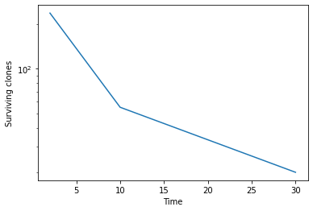

# Simulation Length

This guide runs through a few of the ways you can define the length of a simulation.   


## Simulation length, cell division rate and sampling times

These settings are all defined by the TimeParameters. 

The length of a simulation is defined by the final time and the cell division rate. There are a few different parameters
that can be used to define the time. 


### Max time and division rate

The simplest way is to define the `max_time` and `division_rate`.
These two sets of parameters both set up simulations that run for 10 average cell divisions:

```python
from clone_competition_simulation import Parameters, TimeParameters, PopulationParameters

p = Parameters(
    algorithm='Moran', 
    times=TimeParameters(max_time=10, division_rate=1),
    population=PopulationParameters(initial_cells=100)
)

p = Parameters(
    algorithm='Moran', 
    times=TimeParameters(max_time=20, division_rate=0.5),
    population=PopulationParameters(initial_cells=100)
)
```

These two simulations run for the same amount of "time", but the second simulation includes 
more cell divisions (and a faster rate of drift - as seen in the plot)

```python
import numpy as np
import matplotlib.pyplot as plt

p = Parameters(
    algorithm='Moran', 
    times=TimeParameters(max_time=10, division_rate=1),
    population=PopulationParameters(initial_size_array=np.ones(1000))
)  
s = p.get_simulator()
s.run_sim()

# Increase the division_rate
p = Parameters(
    algorithm='Moran', 
    times=TimeParameters(max_time=10, division_rate=1.7),
    population=PopulationParameters(initial_size_array=np.ones(1000))
)  
s2 = p.get_simulator()
s2.run_sim()

s.plot_mean_clone_size_graph_for_non_mutation(show_spm_fit=False, legend_label=1)
s2.plot_mean_clone_size_graph_for_non_mutation(ax=plt.gca(), show_spm_fit=False, legend_label=1.7)
plt.legend(title='Division rate')
plt.show()
```


### Simulation steps
The number of simulation steps can be set instead of the max_time  

The relationship between time and steps will depend on the division_rate and the algorithm.  


```python
p = Parameters(
    algorithm='Moran', 
    times=TimeParameters(simulation_steps=15000, division_rate=1),
    population=PopulationParameters(initial_size_array=np.ones(1000))
)
s15 = p.get_simulator()
s15.run_sim()

s.plot_mean_clone_size_graph_for_non_mutation(show_spm_fit=False, legend_label='Max time=10')
s15.plot_mean_clone_size_graph_for_non_mutation(ax=plt.gca(), show_spm_fit=False, legend_label='15000 steps')
plt.legend()
plt.show()
```
    

    

### Sampling times

For many experiments, there are particular times that samples are taken/data is measured.   

The sampling times (`times` parameter) can be set for a simulation. The simulation will run up until the last time in the list.  
The `times` must be in increasing order. 


```python
# Say there is an experiment with cells dividing 1.6 times per week, and samples take after 2, 10, and 30 weeks. 
# You can simulate this scenario by setting the `division_rate` and the `times`
p = Parameters(
    algorithm='Moran',
    times=TimeParameters(times=[2,10,30], division_rate=1.6),
    population=PopulationParameters(initial_size_array=np.ones(1000))
)
s = p.get_simulator()
s.run_sim()
s.plot_surviving_clones_for_non_mutation()
plt.show()
```
    

    

-----

By default, there are 100 'samples' taken during a simulation (the initial conditions are also recorded).    
If `times` is defined, then one sample is taken per time.  
Otherwise, you can set the number of samples to take by setting `samples` 


```python
# A simulation with two clones
# Take 5 samples
p = Parameters(
    algorithm='Moran', 
    times=TimeParameters(max_time=10, samples=5, division_rate=1),
    population=PopulationParameters(initial_size_array=[500, 500])
)
s = p.get_simulator()
s.run_sim()

# There are 5 samples plus the initial condition. 
print(s.times)
print(s.population_array.toarray())
```

    [ 0.  2.  4.  6.  8. 10.]
    [[500. 453. 444. 437. 405. 404.]
     [500. 547. 556. 563. 595. 596.]]


----

If the requested samples/times do not align with a simulation step, then the sampling times will be slightly shifted.  

Only unique sample points are kept, so if two requested time points are rounded to the same simulation step, then the 
number of sample points is reduced.   

This is most likely to happen in the WF/WF2D algorithms, where there is a much larger time between simulation steps.


```python
# Requesting 500 samples in this simulation. 
# Only 10 (plus initial condition) will be used, since only 10 simulation steps are run. 
p = Parameters(
    algorithm='WF', 
    times=TimeParameters(samples=500, max_time=10, division_rate=1),
    population=PopulationParameters(initial_size_array=[500, 500])
)
s = p.get_simulator()
s.run_sim()

# There are 10 samples plus the initial condition. 
print(s.times)
print(s.population_array.toarray())
```

    [ 0.  1.  2.  3.  4.  5.  6.  7.  8.  9. 10.]
    [[500. 513. 493. 500. 516. 503. 492. 504. 506. 521. 535.]
     [500. 487. 507. 500. 484. 497. 508. 496. 494. 479. 465.]]


----

```python
# Requesting time points that don't align perfectly with the simulation steps. 
# They will be rounded to the closest simulation step.  
p = Parameters(
    algorithm='WF', 
    times=TimeParameters(times=[2.3, 4.3, 8.7], division_rate=1),
    population=PopulationParameters(initial_size_array=[500, 500])
)
s = p.get_simulator()
print(s.times)
```
    [2. 4. 9.]

```python
# This is much less of a problem with Moran/Moran2D simulations, since there are many more simulation steps
# with much smaller time increments between them
p = Parameters(
    algorithm='Moran', 
    times=TimeParameters(times=[2.3, 4.3, 8.7], division_rate=1),
    population=PopulationParameters(initial_size_array=[500, 500])
)
s = p.get_simulator()
print(s.times)
```
     [2.3 4.3 8.7]


## Simulation progress

Some larger simulations can be slow to run.  
To keep track of how far through a simulation has reached, use the `progress` option.   

This does not work for the Branching algorithm.   
For the other algorithms, setting progress=X will print every X simulation steps.   

For the Moran and Moran2D algorithms, each step is a single cell birth/cell death pair. Set progress to a high number 
to prevent too much printing.   
For the WF and WF2D algorithms, each step is a cell generation.   


```python
p = Parameters(
    algorithm='Moran2D', 
    times=TimeParameters(max_time=10, division_rate=1),
    population=PopulationParameters(initial_cells=40000, cell_in_own_neighbourhood=False),
    progress=50000
)
s = p.get_simulator()
s.run_sim()
```
    Steps completed:
    50000, 100000, 150000, 200000, 250000, 300000, 350000, 400000, Finished 400000 steps


```python
p = Parameters(
    algorithm='WF2D', 
    times=TimeParameters(max_time=10, division_rate=1),
    population=PopulationParameters(initial_cells=40000, cell_in_own_neighbourhood=False),
    progress=2
)
s = p.get_simulator()
s.run_sim()
```
    Steps completed:
    2, 4, 6, 8, 10, Finished 10 steps

