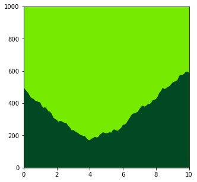
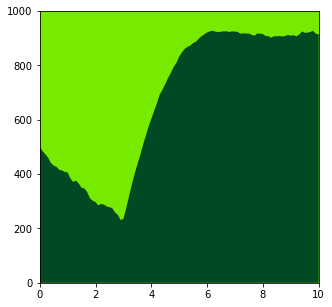
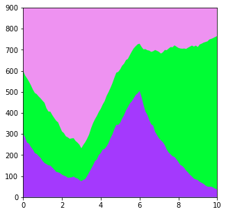
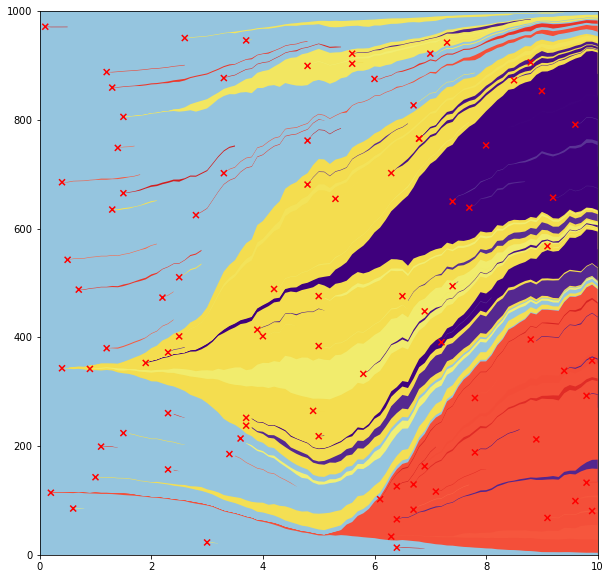

from tests.conftest import mutation_generator

# Treatments 

The cells in the simulations have a fitness value that determines their behaviour.   
Usually these fitness values are fixed until a new mutation appears (although in most of the algorithms it is the 
*relative fitness* that is used to determine cell fate).  

It is possible to apply "treatments" that alter the fitness effects of genes.  
This could be used to simulate the competition of mutants with intermittent application of a drug that alters the 
competitive environment.   
For example, *NOTCH1* loss of function mutants are highly fit in normal oesophagus and a *NOTCH1* inhibitor would 
therefore alter the fitness of cells.   

We usually want to examine treatments that would alter only a subset of clones.  

There are therefore two scenarios in which treatments can be applied: 
1. Lineage tracing simulations. Define multiple initial clones. The treatment can then act differently on each initial clone. 
2. Mutations from multiple genes. The treatment can act differently on the non-synonymous mutations of each gene.

## Treatments to the initial clones 

I'll start with the simplest case: two competing clones.


```python
import numpy as np
import matplotlib.pyplot as plt
from clone_competition_simulation import Parameters, TimeParameters, PopulationParameters, FitnessParameters

np.random.seed(0)
p = Parameters(
    algorithm='Moran', 
    times=TimeParameters(max_time=10, division_rate=1), 
    population=PopulationParameters(initial_size_array=[500, 500]),  # Start with equal clone sizes
    fitness=FitnessParameters(fitness_array=[1, 1.5])  # The second clone is fitter than the first
)
s = p.get_simulator()
s.run_sim()
s.muller_plot(figsize=(5, 5))
plt.show()
```


    
The fitter clone (light green) easily wins

------
Running the simulation again, but this time we will introduce a treatment that alters the cell fitness

```python
from clone_competition_simulation import TreatmentParameters
np.random.seed(0)
p = Parameters(
    algorithm='Moran', 
    times=TimeParameters(max_time=10, division_rate=1), 
    population=PopulationParameters(initial_size_array=[500, 500]),  # Start with equal clone sizes
    fitness=FitnessParameters(fitness_array=[1, 1.5]),  # The second clone is fitter than the first (at the start)
    treatment=TreatmentParameters(
        # Define the treatment. 
        treatment_timings=[4],  # Start the treatment at time 4
        treatment_effects=[
            [1, 0.5]  # One value per initial clone. 
        ],  
        treatment_replace_fitness=False   # The `treatment_effects` will multiply the fitness
    )
)
s = p.get_simulator()
s.run_sim()
s.muller_plot(figsize=(5, 5))
plt.show()
```
    



After the treatment, the fitness of the second clone is 1.5*0.5=0.75.   
The fitness of the first clone remains the same (multiplied by 1).  
Can see the reversal of the competition trend from the time of the treatment. 

-------

You can have multiple treatment changes 

```python
np.random.seed(0)
p = Parameters(
    algorithm='Moran',
    times=TimeParameters(max_time=10, division_rate=1), 
    population=PopulationParameters(initial_size_array=[500, 500]),  # Start with equal clone sizes
    fitness=FitnessParameters(fitness_array=[1, 1.5]),  # The second clone is fitter than the first (at the start)
    treatment=TreatmentParameters(
        # Define the treatment. 
        treatment_timings=[3, 5, 8],  # Change the treatments at these times
        treatment_effects=[
            # One list per treatment, each with one value per initial clone. 
            [1, 0.5],  # Lower the fitness of the second clone
            [3, 0.5],  # Raise the fitness of the first clone, keep the second clone with lower fitness
            [1, 1]   # Return to the original fitness values
        ],  
        treatment_replace_fitness=False   # The `treatment_effects` will multiply the fitness
    )
)
s = p.get_simulator()
s.run_sim()
s.muller_plot(figsize=(5, 5))
plt.show()
```


-------
In the previous examples, the `treatment_effects` multiply the original fitness of each clone.   
Alternatively, you can replace the clone fitness values with the ones given in the `treatment_effects`
to do this, set `treatment_replace_fitness=True`.  

```python
np.random.seed(0)
p = Parameters(
    algorithm='Moran', 
    times=TimeParameters(max_time=10, division_rate=1), 
    population=PopulationParameters(initial_size_array=[500, 500]),  # Start with equal clone sizes
    fitness=FitnessParameters(fitness_array=[1, 1.5]),  # The second clone is fitter than the first (at the start)
    treatment=TreatmentParameters(
        # Define the treatment. 
        treatment_timings=[3, 6],  # Change the treatments at these times
        treatment_effects=[
            # One list per treatment, each with one value per initial clone. 
            [3, 0.5],  # Raise the fitness of the first clone, keep the second clone with lower fitness
            [1, 1]   # Make the competition neutral
        ],  
        treatment_replace_fitness=True   # The `treatment_effects` will now replace the fitness
    )
)
s = p.get_simulator()
s.run_sim()
s.muller_plot(figsize=(5, 5))
plt.show()
```
    



## Treatments affecting genes

To have treatment effects that depend on the gene mutated, run simulations with `MutationGenerator.multi_gene_array=True`.

This can also be used with the initial clones if `initial_mutant_gene_array` is used.  

### Initial clones (again)

If there are mutant genes associated with each of the initial clones, then the treatment can be based on those genes 
instead of the clone_id. 


```python
from clone_competition_simulation import MutationGenerator, Gene, FixedValue
# Define a MutationGenerator with a few genes
mut_gen = MutationGenerator(
    genes=[
        Gene(name='Gene1', mutation_distribution=FixedValue(1), synonymous_proportion=0), 
        Gene(name='Gene2', mutation_distribution=FixedValue(2), synonymous_proportion=0), 
        Gene(name='Gene3', mutation_distribution=FixedValue(3), synonymous_proportion=0)
    ], 
    multi_gene_array=True,   # This is the key argument for using treatment with genes
)
# Lets run with three initial clones, one mutant for each gene
np.random.seed(0)
p = Parameters(
    algorithm='Moran', 
    times=TimeParameters(max_time=10, division_rate=1), 
    population=PopulationParameters(initial_size_array=[300, 300, 300]),  # Start with equal clone sizes
    fitness=FitnessParameters(
        fitness_array=[1, 2, 3],  # Have to define the initial fitness values
        initial_mutant_gene_array=[0, 1, 2],   # And define the genes mutated for each clone
        mutation_generator=mut_gen
    )
)
s = p.get_simulator()
s.run_sim()
s.muller_plot(figsize=(5, 5))
plt.show()
```
    


-------
Like before, we can introduce treatments that can alter the clone fitness.  
For each treatment, there should be a value applied to the background fitness (this will affect all cells), 
plus a value for each gene defined in the MutationGenerator

```python
np.random.seed(0)
p = Parameters(
    algorithm='Moran', 
    times=TimeParameters(max_time=10, division_rate=1), 
    population=PopulationParameters(initial_size_array=[300, 300, 300]),  # Start with equal clone sizes
    fitness=FitnessParameters(
        fitness_array=[1, 2, 3],  # Have to define the initial fitness values
        initial_mutant_gene_array=[0, 1, 2],   # And define the genes mutated for each clone
        mutation_generator=mut_gen
    ), 
    treatment=TreatmentParameters(
        # Define the treatment. 
        treatment_timings=[3, 6],  # Change the treatments at these times
        treatment_effects=[
            # One list per treatment, each with one value per gene plus one for the background fitness
            [1, 3, 1, 1/3],  # Reverse the fitness values. New clone fitnesses [3, 2, 1]
            [1, 1, 2, 1]   # Make the second clone the fittest. New clone fitnesses [1, 4, 3]
        ],  
        treatment_replace_fitness=False   # The `treatment_effects` will multiply fitness
    )
)
s = p.get_simulator()
s.run_sim()
s.muller_plot(figsize=(5, 5))
plt.show()
```
    



### Random ongoing mutations

To apply treatments to mutations that appear after the start of the simulation, treatment must be based on the genes mutated. 


```python
from collections import namedtuple
import matplotlib.cm as cm
from matplotlib.colors import Normalize
from clone_competition_simulation import ColourScale, PlottingParameters

# Setting up a MutationGenerator and a ColourScale for two genes. 
mut_gen = MutationGenerator(
    genes=[
        Gene(name='Gene1', mutation_distribution=FixedValue(1), synonymous_proportion=0),
        Gene(name='Gene2', mutation_distribution=FixedValue(3), synonymous_proportion=0)
    ], 
    multi_gene_array=True, 
    combine_mutations='replace',  # Further mutations in the same gene won't increase cell fitness
    combine_array='add'   # Add the fitness values from different genes
)

Key = namedtuple('key', ['genes_mutated', ])

cs = ColourScale(
    colourmaps={
        # No genes mutated, light blue colour
        Key(genes_mutated=(0,)): cm.ScalarMappable(norm=Normalize(vmin=0, vmax=2), cmap=cm.Blues).to_rgba,  
        
        # First gene mutated, Red
        Key(genes_mutated=(0, 1,)): cm.ScalarMappable(norm=Normalize(vmin=-2, vmax=2), cmap=cm.Reds).to_rgba, 
        
        # Second gene mutated, yellow
        Key(genes_mutated=(0, 2,)): cm.ScalarMappable(norm=Normalize(vmin=-20, vmax=2), cmap=cm.inferno).to_rgba,
        
        # Both genes mutated, purple
        Key(genes_mutated=(0, 1, 2)): cm.ScalarMappable(norm=Normalize(vmin=-5, vmax=1), cmap=cm.Purples).to_rgba
    }, 
    use_fitness=False
)

# Now start from a single wild type clone and introduce mutations at random.  
np.random.seed(0)
p = Parameters(
    algorithm='Moran',
    times=TimeParameters(max_time=10, division_rate=1), 
    population=PopulationParameters(initial_cells=1000), 
    fitness=FitnessParameters(
        mutation_generator=mut_gen, 
        mutation_rates=0.01
    ), 
    treatment=TreatmentParameters(
        # Define the treatment. 
        treatment_timings=[5],  # Change the treatment at this time
        treatment_effects=[
            [1, 3, 1],  # Make mutants in the first gene fitter, and mutants in the second gene neutral
        ],  
        treatment_replace_fitness=True   # The `treatment_effects` will replace the previous fitness
    ), 
    plotting=PlottingParameters(colourscales=cs)
)
s = p.get_simulator()
s.run_sim()

s.muller_plot(figsize=(10, 10))
plt.show()
```
    

    
At the start, the mutants in the first gene (yellow) are highly fit and expand.  
The mutants in the second gene (red) are neutral, and do not grow much or die out. 

After the treatment starts (t=5), the yellow clones are neutral, and stop expanding.  
The red clones are now fitter and spread.   
The purple clones have both mutations, and are highly fit both before and during the treatment. 
